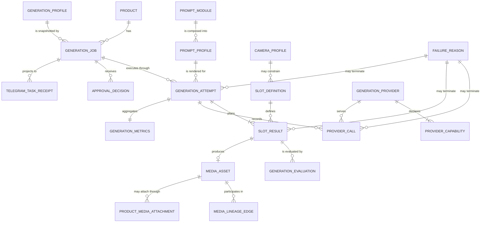
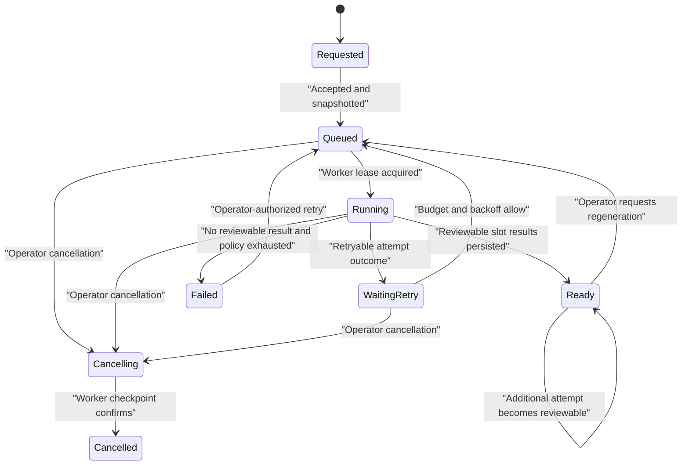
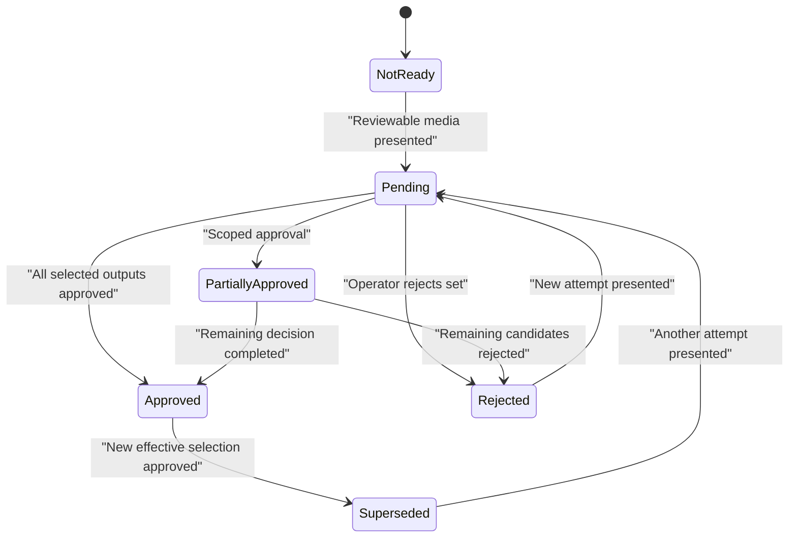
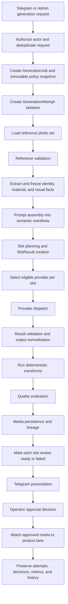
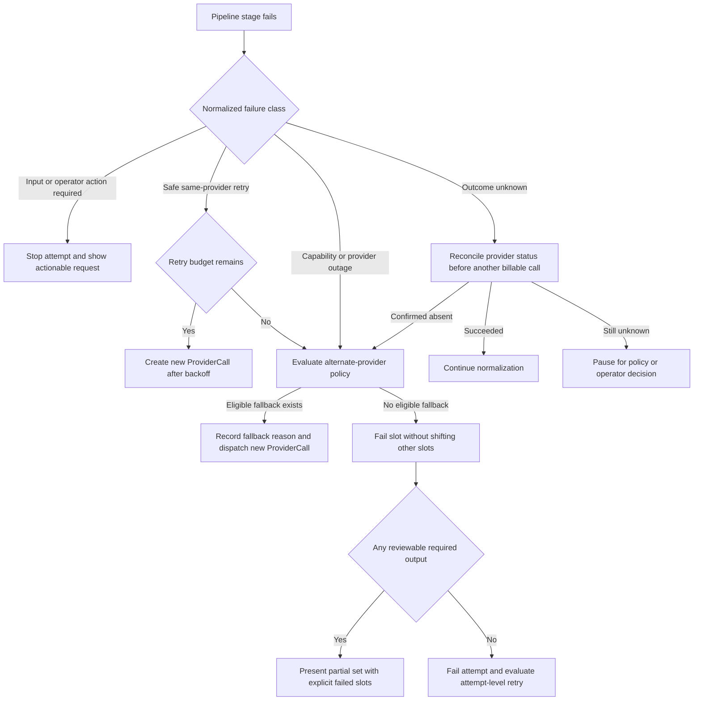
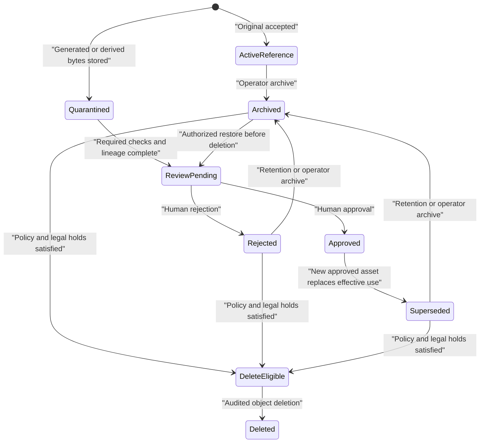

# UygunAyakkabi AI Image Generation Platform Blueprint V1

Blueprint ID: `uygunayakkabi.image-platform.v1`

Blueprint version: `1.0.0`

Status: canonical target architecture
Decision date: 2026-07-26

This document is the canonical technical specification for future UygunAyakkabi image-generation work. It defines the target platform, not the current implementation. It does not authorize implementation, schema migration, prompt changes, camera selection, slot-angle selection, provider replacement, production mutation, deployment, commit, or push.

The keywords **MUST**, **MUST NOT**, **SHOULD**, **SHOULD NOT**, and **MAY** are normative.

## Scope and authority

The platform turns operator-owned product references into traceable generated media through a provider-neutral, Telegram-first, human-approved workflow. Payload/Next remains the source of truth. Providers are stateless execution dependencies. Telegram is the primary operator interface, not a persistence layer.

This blueprint governs:

- generation intent, jobs, attempts, slots, provider calls, and retries;
- prompt-engine structure and versioning, but not prompt wording;
- provider discovery, dispatch, fallback, and normalized results;
- generated-media storage, lineage, retention, and attachment;
- machine evaluation and human approval boundaries;
- Telegram receipts, progress, review, regeneration, cancellation, and recovery;
- compatibility, migration, metrics, and future extension points.

Current behavior remains documented by the code and the dated subsystem audits. If current behavior conflicts with this blueprint, the conflict is migration work; it is not permission to silently reinterpret historical records.

## Non-negotiable platform invariants

1. A protected-brand classification MUST NOT block image generation. Brand safety remains downstream at claims, human approval, activation, publishing, advertising, Shopier, and external dispatch.
2. Every provider call MUST belong to exactly one immutable attempt and, when applicable, exactly one slot result.
3. Every requested slot MUST retain a durable result record, including failures and cancellations. Successful results MUST NOT be compacted into positional arrays.
4. Slot identity MUST use a stable key and version. Numeric position MAY be display metadata only.
5. Regeneration MUST create a new attempt. It MUST NOT erase or rewrite a prior attempt.
6. Provider choice MUST NOT define the operator workflow or durable product identity.
7. Provider credentials and secrets MUST NOT be persisted in jobs, prompts, metrics, Telegram messages, or audit records.
8. Generated bytes MUST be immutable. A changed image is a new media asset or derivative, never an overwrite.
9. Machine evaluation MUST NOT equal human approval. Missing or failed required evaluation MUST be `unknown` or `failed`, never silently `pass`.
10. Approval, product confirmation, Image QC, activation approval, and publishing approval MUST remain separate decisions.
11. A callback token or Telegram message payload MUST NOT be trusted as current state or authorization. The server MUST reload authoritative state and authorize the actor before mutation.
12. Retry, fallback, cancellation, recovery, and notification delivery MUST be idempotent and auditable.
13. The platform MUST record expected and actual provider cost and latency when the provider makes that information available.
14. Public visibility MUST be independent from media origin and approval state.
15. Historical attempts MUST remain understandable after providers, profiles, prompts, slots, transforms, and evaluators evolve.

# Section 1 — System Principles

## 1.1 Operator-first

The primary success measure is safe operator throughput: the operator can start work, understand progress, compare results, make scoped decisions, recover interrupted work, and see the effect of each action without knowing provider internals.

## 1.2 Payload-authoritative

Payload stores durable state, relationships, policies, decisions, and audit history. Telegram messages are projections of that state. Provider responses are evidence captured by the platform, not authoritative workflow state.

## 1.3 Provider-neutral and stateless

The domain model uses platform concepts—reference, slot, attempt, capability, output, evaluation, cost—not provider-specific modes. An adapter receives a self-contained request and returns a normalized outcome. It MUST NOT own durable job state.

## 1.4 Modular prompts without hidden concatenation

Prompt behavior is expressed as ordered, typed, versioned modules with explicit inheritance and precedence. The platform records the semantic manifest and hashes the rendered payload. Provider syntax is an adapter concern.

## 1.5 Immutable history, mutable projections

Jobs may expose current summaries, but attempts, provider calls, decisions, and versioned definitions are append-only. Derived current state MAY be materialized for efficient reads and MUST be rebuildable from durable records.

## 1.6 Deterministic metadata, nondeterministic generation

The same input may produce different images. Metadata must not. IDs, reference hashes, version references, slot keys, policies, timestamps, transitions, and lineage are deterministic and auditable.

## 1.7 Retryable and recoverable

Retries occur at explicit layers with budgets and recorded causes. Workers use leases, heartbeats, checkpoints, and idempotent writes so interrupted work can resume without losing history or silently duplicating billable calls.

## 1.8 Quality-aware, human-approved

Quality is a vector of evidence, not a single unexplained score. Evaluation can recommend retry or flag risk. A human decision remains required before generated media becomes approved product media or is eligible for external publishing.

## 1.9 Cost-aware and latency-aware

Profiles declare budgets. Selection considers capability, health, expected cost, expected latency, and operator policy. Actual usage is recorded per provider call and aggregated by slot, attempt, job, product, profile, and provider.

## 1.10 Secure and privacy-conscious

Reference media, staging outputs, callback actions, provider request IDs, and raw diagnostics receive least-privilege access. Operator-facing failures are actionable but secret-safe. Raw provider payload retention is bounded and redacted.

## 1.11 Version-first evolution

Behavior changes create new immutable versions. Existing attempts keep their original version references. No definition is edited in place after use.

## 1.12 Explicit automation

Automation is policy-driven, bounded, observable, reversible where possible, and disabled by default for new mutation classes. It never bypasses human image approval or downstream publishing gates.

# Section 2 — Domain Model

## 2.1 Aggregate boundaries

- **GenerationJob** is the operator's durable intent and review aggregate.
- **GenerationAttempt** is one immutable execution of all or part of that intent.
- **SlotResult** is the durable outcome for one planned slot in one attempt.
- **ProviderCall** is one billable or potentially billable interaction with one provider endpoint.
- **MediaAsset** represents immutable stored bytes and their derivatives.
- **ApprovalDecision** is an immutable human decision event.
- Versioned definitions—profiles, slots, prompt modules, transforms, evaluators, and provider policies—are configuration artifacts referenced by immutable version.

## 2.2 Relationship model



## 2.3 Identifier rules

- Durable entities use opaque UUID or ULID identifiers.
- Telegram callback payloads use short-lived opaque action-token IDs, not embedded mutable state.
- Provider request IDs are external correlation fields and never primary keys.
- Slot ordinal is presentation metadata. `slotDefinitionId + slotVersion + slotKey` is semantic identity.
- Media content receives a cryptographic content hash in addition to its record ID.
- Idempotency keys are unique within a declared scope and stored with the resulting transition.

## 2.4 Core entities

### GenerationJob

Represents the operator request across any number of attempts.

Required logical fields:

- `id`, `schemaVersion`, `productId`;
- `origin`: Telegram command, Telegram callback, photo intake, Admin, API, batch, or future automation;
- `requestedByActorId`, `requestedFromChatId`, `requestedAt`;
- `idempotencyKey` and origin delivery/update identifiers;
- `generationProfileId`, immutable `generationProfileVersion`, and `profileSnapshotHash`;
- ordered requested `slotKeys` for presentation only, plus immutable slot-version references;
- immutable `referenceSetId` and reference content hashes;
- `runState`, `reviewState`, and `recordState` as separate dimensions;
- active attempt ID, latest completed attempt ID, and attempt count;
- budget snapshot: currency, maximum provider cost, maximum calls, maximum retries, and deadline;
- cancellation request metadata;
- current summary and timestamps derived from events.

`runState` values:

- `requested`, `queued`, `running`, `waiting_retry`, `ready`, `failed`, `cancelling`, `cancelled`.

`reviewState` values:

- `not_ready`, `pending`, `partially_approved`, `approved`, `rejected`, `superseded`.

`recordState` values:

- `active`, `archived`.

These dimensions MUST NOT be collapsed into one overloaded status field.

### GenerationAttempt

Represents one immutable run for a selected slot set. Operator regeneration, automatic attempt retry, provider fallback across the full attempt, and migration import each create a new attempt.

Required logical fields:

- `id`, `jobId`, `attemptNumber`, `reason`;
- `parentAttemptId` and `supersedesAttemptId` when applicable;
- exact reference-set snapshot;
- exact profile, prompt profile, slot definitions, camera/background/lighting profiles, transform policy, quality policy, and provider-selection policy versions;
- `promptManifestHash` and provider-rendered payload hashes per slot;
- `status`: `planned`, `running`, `waiting_retry`, `completed`, `failed`, `cancelling`, `cancelled`, or `abandoned`;
- `currentStage` and last durable checkpoint;
- lease owner, lease expiry, heartbeat, deadline, and cancellation observation time;
- start/end timestamps, failure reason, warnings, and metrics relation.

An attempt is immutable after terminal state except for append-only audit links and a repair annotation that cannot alter original facts.

### GenerationProfile

A versioned aggregate that selects behavior without containing provider secrets or prompt prose directly.

It references:

- slot-set version;
- prompt-profile version;
- provider-selection policy version;
- reference-validation policy version;
- transform-profile version;
- quality-policy version;
- retry/fallback policy version;
- media-retention policy version;
- Telegram-presentation policy version;
- cost, latency, concurrency, and deadline budgets;
- compatible product/reference constraints;
- optional style pack or preset versions.

Published profile versions are immutable. A profile alias such as `default` resolves to a concrete version before a job is accepted; the job stores the resolved version.

### GenerationProvider

A registry record for a provider adapter implementation, not an account credential.

Required fields:

- stable provider key and adapter protocol version;
- adapter implementation version;
- enabled environments and feature flags;
- model/endpoint descriptors;
- static capabilities and health-discovery strategy;
- supported regions and data-handling classification;
- pricing catalog version and currency;
- secret-resolver key names, never secret values;
- operational state: enabled, degraded, disabled, or maintenance.

### ProviderCapability

Capabilities are typed and queryable:

- operation kind: generate, edit, variation, evaluate, upscale, or background operation;
- accepted reference count, formats, sizes, masks, and maximum payload;
- output formats, dimensions, aspect constraints, transparency, and batch limits;
- seed/determinism support;
- async polling and cancellation support;
- safety/refusal semantics;
- expected latency class and rate-limit model;
- usage/cost reporting fidelity;
- regional/data-retention constraints.

Capability discovery produces a timestamped snapshot used by provider selection. Dynamic discovery MUST NOT retroactively change an accepted attempt.

### PromptModule

An immutable, typed unit in the semantic prompt manifest.

Required fields:

- stable key, semantic version, module type, schema version;
- declared inputs and outputs;
- precedence tier and allowed parents;
- compatibility constraints;
- canonical content hash;
- lifecycle state: draft, published, deprecated, retired;
- change rationale and validation evidence.

Prompt text/content may be stored by the implementation, but this blueprint defines structure only.

### PromptProfile

An immutable ordered composition of PromptModules with inheritance and merge rules. It declares required layers, optional layers, provider serializers, compatibility, and unresolved-input behavior. It MUST produce a canonical semantic manifest before provider rendering.

### CameraProfile

A versioned semantic contract for framing and composition behavior. It identifies purpose, allowed composition family, orientation policy, framing/coverage expectations, subject-count expectations, crop tolerance, and evaluation hooks. It MUST NOT depend on hardcoded provider language. This blueprint selects no angle or degree value.

### SlotDefinition

An immutable versioned contract for one output role.

Required fields:

- stable namespaced `slotKey`, version, human label, and purpose;
- required/optional status within a slot set;
- subject/layout semantics without provider-specific instructions;
- input/reference requirements;
- compatible camera/background/lighting/profile types;
- output MIME, aspect, dimension, and transparency requirements;
- deterministic transform policy reference;
- quality expectation and evaluator-policy references;
- presentation order hint;
- compatibility and deprecation metadata.

### SlotPlanItem

The attempt-specific snapshot of one requested slot. It binds the slot definition version, prompt manifest inputs, provider capability requirements, retry budget, fallback eligibility, and dependencies. It exists before dispatch.

### SlotResult

One durable record exists for every SlotPlanItem, including unsuccessful items.

Required fields:

- `id`, `attemptId`, `slotPlanItemId`, stable slot key/version;
- status: `planned`, `running`, `received`, `normalized`, `evaluated`, `persisted`, `review_ready`, `failed`, `cancelled`, or `superseded`;
- ordered provider call IDs;
- normalized output metadata;
- media asset ID when persistence succeeds;
- transform-chain records and output content hash;
- evaluation IDs and current quality vector;
- warning and failure reason IDs;
- current effective operator decision derived from ApprovalDecision events;
- timestamps and stage durations.

There is a uniqueness constraint on `(attemptId, slotPlanItemId)`. Failed slots remain in place and MUST NOT shift the identity of later slots.

### ProviderCall

Records every external request, including retries, fallbacks, evaluators, and ambiguous timeouts.

Required fields:

- attempt and optional slot result IDs;
- provider, adapter, model/endpoint, capability-snapshot, and pricing versions;
- call purpose and ordinal;
- request/payload hash and redacted request summary;
- external request ID, submission state, and reconciliation data;
- status: `prepared`, `submitted`, `accepted`, `succeeded`, `failed`, `timed_out`, `outcome_unknown`, or `cancelled`;
- expected/actual cost, usage units, latency, retry-after value, and timestamps;
- normalized failure reason and raw-response hash;
- normalized output descriptor.

### GenerationEvaluation

An immutable evaluation result for a reference set, attempt, slot result, media asset, or comparison set.

Required fields:

- evaluator key/version and quality-policy version;
- target entity and evidence-media hashes;
- dimension: composition, centering, consistency, material, identity, artifacts, background, output integrity, operator rating, or future dimension;
- typed measurement, confidence, and evidence locator;
- decision: `pass`, `warn`, `fail`, or `unknown`;
- recommended action: none, review, retry, reject, or operator decision;
- required/advisory classification;
- evaluator cost, latency, and failure reason.

### MediaAsset and MediaLifecycle

`originKind` and `lifecycleState` are separate concepts.

`originKind` values:

- `original`, `generated`, `enhanced`, `derived`.

`lifecycleState` values:

- `active_reference`, `quarantined`, `review_pending`, `approved`, `rejected`, `superseded`, `archived`, `delete_eligible`, `deleted`.

Required fields include immutable content hash, storage locator, MIME, dimensions, byte count, visibility, product relationship, source/derivative lineage, owning attempt/slot, retention policy version, lifecycle timestamps, and deletion tombstone.

### MediaLineageEdge

An immutable directed relationship such as `referenced_by`, `generated_from`, `normalized_from`, `transformed_from`, `derived_from`, `supersedes`, or `comparison_of`. Lineage is many-to-many and MUST support multiple reference photos.

### ProductMediaAttachment

Represents the explicit attachment of an approved MediaAsset to a product lane. It records lane, order, source ApprovalDecision, attached/revoked timestamps, and actor. Product gallery arrays MAY remain materialized projections during migration.

### ApprovalDecision

An immutable human decision with:

- actor identity and authorization context;
- job, attempt, slot, media, or comparison scope;
- decision: approve, reject, request regeneration, revoke approval, archive, or restore;
- selected slot keys/media IDs, structured reason codes, optional note;
- observed version/ETag used for optimistic concurrency;
- Telegram action token, update ID, and idempotency key;
- timestamp and resulting transition IDs.

A decision never deletes prior decisions. Current effective approval is derived from the ordered valid decisions.

### FailureReason

FailureReason is a normalized taxonomy, not an arbitrary error string.

Required categories:

- `input_invalid`, `reference_unavailable`, `capability_mismatch`;
- `authentication`, `permission`, `quota`, `rate_limited`;
- `provider_unavailable`, `timeout_before_accept`, `outcome_unknown`;
- `provider_refusal`, `malformed_response`, `missing_output`, `unsupported_output`;
- `normalization_failed`, `transform_failed`, `evaluation_failed`, `storage_failed`;
- `notification_failed`, `cancelled`, `lease_expired`, `internal_error`.

Each reason declares retry class: `never`, `same_provider`, `alternate_provider`, `operator_action`, or `reconcile_first`; safe operator message; diagnostic severity; and whether a billable outcome may exist.

### GenerationMetrics

Aggregates counts and distributions without replacing source records:

- queue, execution, provider, transform, evaluation, persistence, presentation, and review duration;
- expected and actual cost by currency/provider/call purpose;
- calls, retries, fallbacks, timeouts, unknown outcomes, and cancellations;
- requested/completed/failed/approved slot counts;
- input/output byte and dimension statistics;
- evaluator results and operator outcomes;
- profile/provider/prompt/slot/transform/evaluator version dimensions.

### TelegramTaskReceipt

Links one job to an operator-facing receipt message. It stores bot/chat/message IDs, rendering version, last projected job version, delivery state, last delivery error, retry count, timestamps, and allowed action-token IDs. Notification failure does not change generation truth.

## 2.5 Job and attempt lifecycle



Review state evolves independently:



# Section 3 — Complete Pipeline

## 3.1 Happy path



## 3.2 Stage contract

| Stage | Input | Durable output | Must be idempotent by |
|---|---|---|---|
| Request acceptance | authorized operator action | GenerationJob and receipt | origin update/action idempotency key |
| Attempt creation | job policy snapshot | GenerationAttempt skeleton | job + attempt number |
| Reference validation | immutable reference set | validation evaluations/facts snapshot | attempt + reference-set hash |
| Prompt assembly | facts and version references | semantic manifest and rendered hashes | attempt + slot result + manifest version |
| Slot planning | semantic manifests and slot-set snapshot | SlotPlanItems and placeholder SlotResults | attempt + slot definition version |
| Provider selection | capability snapshot and budgets | ordered eligible-provider plan | attempt + slot result + selection policy version |
| Provider dispatch | normalized request | ProviderCall | provider call ID; never inferred from array position |
| Result validation and output normalization | raw provider outcome | validated normalized output descriptor | provider call ID + raw response hash |
| Deterministic transform | normalized media | versioned derivative chain | source hash + transform manifest hash |
| Quality evaluation | media/facts/policy | GenerationEvaluations | target hash + evaluator version + policy version |
| Media persistence | validated bytes and lineage | MediaAsset and lineage edges | content hash + ownership scope |
| Telegram presentation | durable review model | TelegramTaskReceipt projection | receipt ID + projected job version |
| Approval | authorized current-state action | ApprovalDecision and attachment | action token + actor + observed version |

## 3.3 Failure and retry branches



Rules:

- Transport retry before confirmed provider acceptance MAY reuse the logical call but MUST record each network transmission when observable.
- Every new billable generation invocation is a new ProviderCall.
- Automatic slot retry stays inside the same attempt only when input/profile versions are unchanged and policy permits it.
- Attempt retry or operator regeneration creates a new GenerationAttempt.
- Provider fallback MUST be visible in history and comparison metadata.
- A provider timeout after acceptance is `outcome_unknown` until reconciled or explicitly abandoned. The platform MUST NOT automatically create a duplicate billable request when reconciliation is possible.
- Partial success is reviewable only if profile policy permits it. Missing slots remain explicit failed SlotResults.

## 3.4 Cancellation

1. An authorized operator records a cancellation request on the job.
2. The job moves to `cancelling`; workers observe cancellation at every durable checkpoint.
3. Queued provider calls are not submitted.
4. In-flight calls receive cancellation through the adapter when supported.
5. If the provider cannot cancel, returned outputs are recorded but remain quarantined and are not automatically presented or attached.
6. Persisted review-pending media keeps its history and follows the cancellation retention policy.
7. The attempt becomes `cancelled` only after all owned slot/call states are terminal or explicitly `outcome_unknown` with reconciliation scheduled.
8. Repeating cancellation is idempotent.

## 3.5 Recovery

- Workers acquire time-bounded attempt leases and emit heartbeats.
- Each stage commits a checkpoint only after its durable outputs exist.
- Lease expiry marks the attempt `abandoned` only through a recovery coordinator; it does not erase it.
- Recovery replays from the last durable checkpoint and reuses existing SlotResults, ProviderCalls, MediaAssets, and evaluations by idempotency key.
- Orphaned provider responses, stored blobs, and Telegram receipts are reconciled through explicit repair jobs with dry-run reporting.
- Notification delivery can recover independently of generation execution.
- Manual repair creates an immutable repair annotation and, when needed, a new attempt. It never edits historical provider facts.

## 3.6 Concurrency and ordering

- A job MAY run multiple slots concurrently only within provider, cost, and resource limits.
- Slots with declared dependencies wait for prerequisite terminal states.
- Results are ordered for presentation by SlotPlanItem display order, never completion time.
- At most one write lease may own an attempt. Multiple readers are allowed.
- Conflicting approval actions use optimistic concurrency against the current review projection.

# Section 4 — Prompt Architecture

This section defines the engine. It intentionally contains no prompt prose.

## 4.1 Semantic layers

The canonical layer order is:

1. Platform task contract.
2. Reference identity facts.
3. Material facts.
4. Operator-verified visual facts.
5. Slot-purpose instructions.
6. Camera profile.
7. Background profile.
8. Lighting profile.
9. Style-pack or campaign presentation layer.
10. Negative/prohibited transformation constraints.
11. Operator regeneration delta.
12. Provider capability adaptation and serialization.

Layers 1–4 are identity-preserving and MUST NOT be overridden by presentation layers. Provider overrides translate semantics or omit unsupported optional features; they MUST NOT change factual identity.

## 4.2 Typed module contract

Each PromptModule declares:

- typed inputs and required facts;
- emitted semantic fields;
- precedence tier;
- merge operator: replace, append, union, intersect, or reject-conflict;
- allowed parent profiles;
- provider capability requirements;
- validation rules and unresolved-input behavior;
- version and content hash.

Free-form concatenation MAY exist only inside the final provider serializer. The semantic manifest is built and validated first.

## 4.3 Inheritance

- Profiles may inherit from one published base profile.
- Multiple overlays may be applied in a deterministic declared order.
- Cycles are invalid.
- A child cannot weaken a parent field marked `locked`.
- Conflicting facts fail assembly with a structured conflict; they are not resolved by last-write-wins.
- Every inherited module version is expanded into the attempt snapshot.

## 4.4 Prompt manifest and hashing

The engine produces two immutable artifacts per slot:

1. **SemanticPromptManifest**: canonical JSON containing ordered module IDs/versions, normalized inputs, resolved semantic fields, compatibility decisions, and omitted optional features.
2. **ProviderRenderedPrompt**: provider-specific request content and parameters, with secrets excluded and sensitive data redacted according to policy.

Hashes:

- `semanticPromptHash = SHA-256(canonical-json(SemanticPromptManifest))`.
- `providerPayloadHash = SHA-256(canonical-json(redacted-provider-payload))`.
- Reference binaries are represented by immutable content hashes.
- Canonical JSON uses stable key ordering, normalized Unicode, explicit null semantics, and normalized numeric encoding.

Equal hashes prove equal recorded inputs, not equal generated pixels.

## 4.5 Prompt version rules

- Changing module content, precedence, merge behavior, input schema, provider serialization, or required capability creates a new version.
- Publishing a new PromptProfile version never changes old attempts.
- Deprecated versions remain readable and renderable for audit when dependencies remain available.
- The platform records why a version changed and which evaluation evidence supported promotion.

## 4.6 Regeneration delta

Operator regeneration notes are a separate typed module referencing the rejected/compared SlotResult and structured defect reasons. They do not mutate the original prompt manifest. Targeted regeneration reuses the original fact snapshots unless the operator explicitly creates a new job with changed references or facts.

# Section 5 — Slot System

## 5.1 Purpose

A slot is a semantic output role, not an array index, provider prompt, or fixed camera angle. The slot system tells the platform what outcome is needed, how it is identified, what evidence it requires, and how it is evaluated.

## 5.2 Slot identity

- Keys are stable, namespaced, and machine-readable, for example `catalog.some-purpose`.
- A SlotDefinition version is immutable.
- Display labels, presentation order, and grouping are metadata, not identity.
- Existing slot keys may be mapped into versioned legacy definitions during migration without redefining their camera behavior in this blueprint.

## 5.3 Slot contract

Each slot version defines:

- business purpose and intended usage;
- required versus optional status in a SlotSet;
- subject count/layout semantics;
- reference sufficiency requirements;
- output format, aspect, resolution, and safe-area requirements;
- compatible CameraProfile, BackgroundProfile, LightingProfile, and StylePack classes;
- allowable deterministic transforms;
- required/advisory evaluators and threshold policy;
- retry and fallback eligibility;
- whether partial review is allowed;
- dependencies on other slots or reference facts;
- deprecation and successor information.

It does not embed provider prose and this blueprint chooses no camera angle.

## 5.4 SlotSet and planning

A versioned SlotSet declares an ordered list of SlotDefinition versions and requiredness. GenerationProfile selects a SlotSet. Attempt planning expands it to SlotPlanItems and creates every SlotResult before provider dispatch.

Planning validates:

- reference sufficiency;
- provider capability availability;
- budget feasibility;
- dependency graph acyclicity;
- output/storage constraints;
- prompt/profile compatibility.

An infeasible required slot blocks attempt dispatch with a structured planning failure. An infeasible optional slot is recorded as skipped only when policy explicitly allows it.

## 5.5 Future expansion

New slots are additive versions. A SlotSet may include marketplace, campaign, material-detail, comparison, or other future roles without changing existing definitions. Removing or materially changing purpose requires a new SlotSet version and, usually, a new SlotDefinition version.

## 5.6 Quality expectations

Quality expectations reference a versioned QualityPolicy rather than embedding a single score. Expectations may differ by slot purpose but use the same normalized evaluation dimensions. Missing evidence is `unknown`; it is not assumed acceptable.

# Section 6 — Provider Architecture

## 6.1 Adapter protocol

Every image provider implements the same logical contract:

```ts
interface GenerationProviderAdapter {
  descriptor(): ProviderDescriptor
  discoverCapabilities(context: CapabilityContext): Promise<CapabilitySnapshot>
  validateRequest(request: NormalizedGenerationRequest): ValidationOutcome
  estimate(request: NormalizedGenerationRequest): Promise<CostLatencyEstimate>
  submit(request: NormalizedGenerationRequest, signal: AbortSignal): Promise<ProviderSubmission>
  poll?(submission: ProviderSubmission, signal: AbortSignal): Promise<ProviderOutcome>
  cancel?(submission: ProviderSubmission): Promise<CancellationOutcome>
  reconcile?(externalRequestId: string): Promise<ProviderOutcome>
  normalize(outcome: ProviderOutcome): Promise<NormalizedProviderOutput>
}
```

The exact programming language is not normative; the behavior is.

## 6.2 Normalized request

The provider receives:

- provider-independent operation kind;
- reference locators/bytes and hashes;
- rendered provider payload plus semantic manifest hash;
- desired output constraints;
- timeout/deadline and idempotency/correlation identifiers;
- data-handling classification;
- optional deterministic seed when supported;
- no durable job mutation capability.

## 6.3 Normalized output

The adapter returns:

- status and external request ID;
- output bytes or secure temporary locator;
- MIME, dimensions, byte size, content hash when available;
- provider/model/endpoint and adapter versions;
- seed/revised parameters when exposed;
- usage, actual cost, provider latency, queue latency;
- safety/refusal/warning metadata;
- raw-response hash and bounded redacted diagnostic summary.

## 6.4 Capability discovery and selection

Provider selection filters by required capability, data policy, region, health, feature flags, budget, and deadline. It then ranks eligible providers using the GenerationProfile's provider policy. Selection produces an ordered, persisted plan; it is not hidden control flow inside an adapter.

Health is advisory unless policy marks it required. A provider becoming unhealthy after acceptance is handled by fallback/retry rules, not by rewriting the plan snapshot.

## 6.5 Timeouts

Four deadlines are distinct:

- connection timeout;
- request-submission timeout;
- provider operation timeout;
- overall slot/attempt deadline.

Adapters honor `AbortSignal` where possible. A submission timeout before acceptance may be retryable. A timeout after provider acceptance is `outcome_unknown` until reconciled or deliberately abandoned.

## 6.6 Failure normalization

Provider-specific codes map to FailureReason. Raw codes remain diagnostic metadata. Operator messages use the normalized reason and never expose secrets or full provider payloads.

## 6.7 Fallback

- Fallback is policy, not exception magic.
- The alternate provider must satisfy the same required semantic and output capabilities.
- A fallback call is a new ProviderCall with `fallbackFromCallId` and reason.
- Provider change is shown in attempt history and comparisons.
- Fallback MUST NOT occur after an ambiguous billable outcome until reconciliation policy permits it.
- Cost and call budgets remain global across fallback.

## 6.8 Feature flags

Provider/model rollout flags are environment-scoped configuration. A job snapshots the resolved selection policy and allowed providers. Disabling a provider prevents new dispatch but does not corrupt historical attempts.

## 6.9 Adapter conformance

Every adapter passes a shared conformance suite covering capability reporting, validation, deadline handling, cancellation semantics, normalized failures, output integrity, cost/latency reporting, secret redaction, and deterministic fixture normalization.

# Section 7 — Media Lifecycle

## 7.1 Provenance versus lifecycle

Original/generated/enhanced/derived describes provenance. Approved/rejected/archived/superseded/deleted describes lifecycle. They MUST be separate fields so an original can be archived and a generated asset can be approved without changing what it is.

## 7.2 Lifecycle



## 7.3 Storage strategy

- Payload stores authoritative metadata and lineage.
- A storage adapter stores immutable objects in local development or object/blob storage in production.
- Object keys are opaque and collision-safe. Content hash supports integrity and optional deduplication; deduplication must not merge lifecycle ownership.
- Original references and generated outputs use separate logical storage classes or prefixes.
- Generated output begins private/operator-only where the storage backend permits it. Public delivery is a visibility transition or approved derivative, not proof of approval.
- Telegram preview uses controlled upload or time-bounded signed access; it does not require permanent public visibility.
- Derived thumbnails, normalized images, overlays, and encodings reference their source and transform version.
- Storage writes complete before a slot is previewable. A preview MUST NOT point to an unsaved in-memory-only output.

## 7.4 Reference relationships

Each attempt uses an immutable ReferenceSet containing ordered MediaAsset IDs, roles, content hashes, and observation metadata. Deleting or replacing a product gallery entry does not rewrite the attempt's historical reference set.

## 7.5 Approval and attachment

Approval changes lifecycle and creates ProductMediaAttachment records. It does not move or overwrite bytes. Revocation closes the attachment and records a new decision. Product gallery ordering references stable attachment IDs/slot keys, not approval-button positions.

## 7.6 Rejected, superseded, and archived assets

- Rejection is not immediate deletion.
- Superseded assets remain comparable and auditable.
- Archive removes assets from active operator views by default but retains restorable metadata/bytes within policy.
- Retention policies define minimum age, legal/operational holds, active references, approved attachments, comparison membership, and deletion eligibility.

## 7.7 Deletion

Deletion is two-phase:

1. Dry-run eligibility report and `delete_eligible` transition.
2. Audited object deletion followed by a tombstone retaining IDs, hashes, lineage summary, policy, actor/job, and timestamps.

Original media MUST NOT be automatically deleted by generated-media retention. An asset referenced by an active attempt, approved attachment, unresolved provider reconciliation, or legal hold is not delete-eligible.

# Section 8 — Quality Engine

## 8.1 Quality dimensions

The engine supports versioned evaluators for:

- output integrity and decodability;
- composition and slot-purpose compliance;
- centering, scale, framing, and crop safety;
- cross-slot identity consistency;
- reference identity preservation;
- color and material accuracy;
- visible detail/mark consistency;
- artifact, deformation, duplicate-subject, and text-reversal detection;
- background and lighting consistency;
- sharpness and usable resolution;
- operator rating and structured rejection reasons;
- automatic heuristics implemented as versioned evaluators with explicit evidence;
- provider/profile comparison metrics.

No evaluator implementation or threshold is selected by this blueprint.

## 8.2 EvaluationDefinition

Each evaluator declares input requirements, supported slot/profile types, output schema, confidence semantics, deterministic/nondeterministic classification, provider dependence, cost class, latency class, timeout, and version.

## 8.3 QualityPolicy

A versioned policy maps evaluator outcomes to one of:

- accept for human review;
- accept with warning;
- automatic retry within budget;
- require operator review;
- fail slot;
- mark unknown because evidence is unavailable.

Required and advisory evaluators are explicit. A failed required evaluator cannot silently pass. An advisory evaluator failure becomes `unknown` plus a warning.

## 8.4 Quality vector

The durable representation is a dimension vector with measurement, confidence, decision, and evidence per evaluator. A composite score MAY be calculated for ranking or experiments, but it MUST NOT replace dimensions and MUST identify its formula version.

## 8.5 Human decision

Machine evaluation determines review readiness and retry advice. The operator sees evidence and decides approval/rejection/regeneration. Product-level Image QC remains a separate downstream publishability decision even when slot-level evaluation is strong.

## 8.6 Provider comparison

Comparison uses the same references, semantic prompt manifest, slot definition, transform policy, and quality policy where capability permits. Provider differences, fallbacks, costs, and latency are retained. Comparisons never overwrite the candidates they compare.

## 8.7 Evaluation loop

Future improvement uses a curated, versioned evaluation dataset and offline experiment runs. Promotion requires predefined acceptance criteria, operator review, cost/latency analysis, and a new published version. Production prompts, profiles, provider weights, or thresholds MUST NOT self-modify from live outcomes.

# Section 9 — Telegram Operator UX

## 9.1 Interaction model

Telegram commands remain provider-neutral. Existing operator vocabulary may be preserved through aliases, but provider names are advanced diagnostics or explicit experiment choices, not default workflow concepts.

## 9.2 Job receipt

Immediately after acceptance, the bot creates or updates one durable receipt showing:

- product reference and link;
- job ID and profile label/version;
- planned slot keys/count;
- reference count;
- estimated budget range when available;
- current run/review state;
- primary next action;
- `View status` and `Cancel` actions when authorized.

The receipt is linked to the exact GenerationJob before work begins.

## 9.3 Progress

Progress updates are coalesced into meaningful milestones:

- queued;
- references validated;
- slot progress as completed/total with warnings/failures;
- evaluating/persisting;
- ready for review;
- cancelled or failed.

Message edits are preferred for routine progress; milestone messages MAY be used for long waits or configured accessibility. Progress is driven from durable checkpoints, not optimistic local logs.

## 9.4 Review presentation

- Each preview is labeled by stable slot key and purpose.
- Failed or missing slots appear explicitly; later slots never shift labels.
- The operator can approve all eligible, approve selected slot keys, reject selected candidates, or request targeted regeneration.
- Pagination/comparison is used when Telegram album limits are exceeded.
- Warnings show structured reasons and evaluator evidence in concise form.
- Provider details are hidden by default but available in diagnostics.

## 9.5 Regeneration

The operator selects slot keys/candidates and structured reason codes, optionally adds a note, and confirms the scope. The bot shows whether references/facts/profile remain unchanged. Confirmation creates a child GenerationAttempt and a new receipt projection; it does not clear prior results.

## 9.6 Comparison and history

- Compare candidates by the same slot key across attempts/providers/profiles.
- Show selected/current approval, cost, duration, warnings, and attempt lineage.
- `/task <jobId>` or equivalent recovers current state.
- `/imagehistory <productRef>` or equivalent lists recent jobs and effective attachments.
- Historical actions are read-only unless a new authorized decision is recorded.

Command names are illustrative; implementation may preserve existing aliases.

## 9.7 Cancellation

The bot immediately acknowledges the cancellation request, then distinguishes `cancelling` from `cancelled`. It explains that an already accepted provider call may finish and that any resulting media will remain quarantined unless reviewed later.

## 9.8 Notifications and recovery

- Telegram delivery failure does not mark generation failed.
- Notification retries have their own budget and idempotency.
- A recovered receipt is rendered from Payload state and may be sent to an authorized chat after confirmation.
- Operator messages never expose secrets, raw provider payloads, stack traces, or unbounded error bodies.

## 9.9 Callback security

- Callback data contains only an opaque action-token ID.
- The token references actor/chat scope, action type, target IDs, observed version, expiry, and single/multi-use policy server-side.
- Every callback re-runs webhook, bot, actor, chat, and action authorization.
- The server reloads job/attempt/slot state, checks optimistic concurrency, and records an idempotent ApprovalDecision or cancellation event.
- Forwarded, expired, unauthorized, replayed, or stale callbacks are rejected safely with a refreshed read option.

## 9.10 Completion summary

The final summary reports requested/reviewable/failed/approved slots, total duration, estimated/actual cost when available, retry/fallback count, warnings, effective product attachments, and the next safe action.

# Section 10 — Extensibility

## 10.1 Multiple providers

New providers implement the adapter protocol and conformance suite. They become selectable only through a published provider policy/profile version and feature flag. No provider adds fields directly to GenerationJob.

## 10.2 Style packs

A StylePack is a versioned presentation overlay referencing prompt modules, background/lighting profile classes, compatible slots, and evaluation expectations. It cannot override identity/material/visual facts, human approval, or downstream publishing gates.

## 10.3 Campaign presets

A CampaignPreset references a GenerationProfile version plus channel/campaign metadata and required slot set. It does not create or spend on campaigns. It prepares image outputs under the same approval model.

## 10.4 Marketplace presets

Marketplace presets encode output constraints, required slot purposes, safe areas, file formats, and evaluation policies for a destination. They do not publish automatically and do not embed provider-specific behavior.

## 10.5 Luxury and fashion presets

Luxury/fashion presets are named profile/style combinations with explicit compatibility and quality policies. Labels are business taxonomy, not privileged prompt layers. They cannot weaken identity preservation.

## 10.6 Profile library

The library stores draft, published, deprecated, and retired immutable profile versions; ownership; compatibility; validation evidence; usage metrics; and aliases. Aliases resolve before job creation and are never the sole historical reference.

## 10.7 A/B testing

- Experiments are explicit, operator-approved, cost-capped, and versioned.
- The experimental unit, allocation, hypotheses, metrics, and stopping rule are declared before dispatch.
- Candidates retain full job/attempt lineage.
- Results are evaluated offline or in a dedicated experiment view.
- No winner automatically mutates the production default.

## 10.8 Batch generation

A future GenerationBatch groups jobs but does not weaken job isolation. It defines selection criteria, profile version, concurrency, cost ceiling, cancellation policy, and aggregate receipt. Every product still receives its own GenerationJob, attempts, slot results, decisions, and Media lineage.

## 10.9 Future automation

Automation may enqueue jobs only under a versioned policy with explicit scope, budget, deduplication, rate limits, and operator notification. Generated media remains quarantined/review-pending until human approval. Brand classification does not block generation, while downstream claims/publishing/dispatch rules remain enforced.

## 10.10 Plugin boundaries

Providers, evaluators, transforms, serializers, storage adapters, and notification adapters use independent registries and conformance contracts. A plugin cannot mutate another component's durable records except through the orchestrator's application services.

# Section 11 — Versioning and Compatibility

## 11.1 Versioned artifacts

The following use immutable semantic versions and content hashes:

- blueprint;
- domain/schema contract;
- GenerationProfile and SlotSet;
- SlotDefinition;
- PromptModule and PromptProfile;
- CameraProfile, BackgroundProfile, and LightingProfile;
- provider adapter protocol and adapter implementation;
- provider capability and pricing catalogs;
- transform definitions/profiles;
- EvaluationDefinition and QualityPolicy;
- media-retention and Telegram-presentation policies.

## 11.2 Semantic version rules

- **Major**: incompatible meaning, schema, lifecycle, or adapter contract change.
- **Minor**: backward-compatible capability or optional field addition.
- **Patch**: clarification or defect correction that does not change recorded semantics.

Content changes create a new hash even when version metadata is accidentally reused; publication rejects duplicate versions with different hashes.

## 11.3 Attempt snapshots

Before dispatch, an attempt stores expanded concrete references and hashes for every versioned artifact it uses. Aliases and environment defaults are resolved. This snapshot is the minimum information required to explain or reproduce the logical request later.

## 11.4 Blueprint compatibility

Each durable record includes `schemaVersion` and `blueprintVersion`. Readers support a documented compatibility window. Major blueprint migrations include a reader/upcaster strategy or explicitly mark records as legacy-readable only.

## 11.5 Migration strategy from the current system

1. Add new collections/tables and services alongside current `image-generation-jobs` and Media fields.
2. Introduce stable job/attempt/slot IDs and dual-write new records while current operator behavior remains intact.
3. Import historical jobs as `legacy-import` attempts using retained JSON metadata and relationships.
4. Map legacy slot indices to known slot keys only when evidence is unambiguous. Otherwise use `legacy.unknown` and preserve original order/raw metadata.
5. Link existing generated Media through lineage records without changing bytes or public visibility.
6. Build read projections that combine legacy and new history.
7. Cut generation writes to the new orchestrator only after shadow comparison and acceptance tests pass.
8. Keep legacy fields read-only during a compatibility window.
9. Remove legacy write paths only in a separately approved cleanup after rollback and audit requirements expire.

## 11.6 Backward compatibility rules

- Historical attempts remain readable even when a provider is disabled.
- Deprecated prompt/profile/slot versions remain resolvable by ID/hash.
- Old Telegram callbacks expire safely and offer a refreshed current-state read.
- Product gallery projections keep stable ordering while attachments migrate.
- Migration does not reinterpret missing data as success.
- Legacy ambiguity is recorded, not guessed.

## 11.7 Rollback

Each migration phase defines a rollback read/write boundary. Dual-write mismatches stop cutover. Rollback never deletes new audit history; it disables the new writer and restores the previously verified projection.

# Section 12 — Implementation Roadmap

No phase is authorized by this blueprint. Each phase is independently reviewable and deployable when separately requested.

## Phase 0 — Contract and characterization baseline

**Goals**

- Translate this blueprint into typed contracts, state-transition tables, fixture schemas, and architecture decision records.
- Characterize every current queue, provider, slot, preview, approval, reject, regeneration, failure, and Telegram callback path.
- Freeze current behavior as migration evidence without redesigning prompts/cameras/slots.

**Dependencies**

- Current audits and repository tests.
- No schema or provider dependency.

**Validation**

- Contract-schema tests.
- State-machine transition tests.
- Current-path characterization tests, including partial slot and Media-save failures.
- Authorization tests for messages and callbacks.

**Acceptance criteria**

- Every current entry point and terminal state has a fixture.
- Every blueprint invariant maps to at least one planned enforcement point/test.
- No runtime behavior changes.

**Risks**

- Mistaking stale comments for behavior.
- Characterization accidentally normalizing known defects instead of labeling them.

## Phase 1 — Durable lineage model in shadow mode

**Goals**

- Add GenerationJob, GenerationAttempt, SlotPlanItem, SlotResult, ProviderCall, definition-version, and lineage storage.
- Snapshot current references/profile metadata.
- Dual-write shadow records from the current pipeline.

**Dependencies**

- Phase 0 contracts and migration plan.

**Validation**

- Schema migration tests and rollback rehearsal.
- Uniqueness/idempotency/property tests.
- Legacy-import fixtures.
- Shadow-record reconciliation against current jobs.

**Acceptance criteria**

- Every requested slot has one durable SlotResult, including failures.
- No compacted array can change semantic slot identity.
- Shadow writes do not affect current operator output.
- Historical job import reports ambiguity rather than guessing.

**Risks**

- Dual-write divergence.
- Payload relationship/version migration complexity.
- Increased storage volume.

## Phase 2 — Provider-neutral orchestrator and recovery

**Goals**

- Move execution ownership to the orchestrator.
- Add leases, heartbeats, checkpoints, cancellation, recovery, retry budgets, and normalized FailureReason.
- Preserve current provider/prompt/slot behavior through compatibility adapters.

**Dependencies**

- Phase 1 durable attempt and slot records.

**Validation**

- Fault injection at every checkpoint.
- Worker crash/lease-expiry recovery tests.
- Cancellation before dispatch, during dispatch, and after output tests.
- Retry/fallback budget and ambiguous-outcome tests.

**Acceptance criteria**

- Restarting a worker cannot duplicate a completed stage or lose a slot.
- Every billable call has a ProviderCall record.
- Cancellation is idempotent and truthful.
- Partial success preserves explicit failed slots.

**Risks**

- Duplicate provider charges during ambiguous failures.
- Incorrect lease ownership under serverless concurrency.

## Phase 3 — Media lifecycle and attachments

**Goals**

- Add immutable MediaAsset lineage, lifecycle/visibility separation, attachments, retention policies, and deletion tombstones.
- Stop approval/rejection/regeneration from rewriting job relationships.
- Provide dry-run orphan and retention reports.

**Dependencies**

- Phases 1–2 lineage identifiers.

**Validation**

- Storage adapter conformance tests.
- Content-hash/integrity tests.
- Approval/revocation/attachment projection tests.
- Retention dry-run and legal-hold tests.
- Object-write/DB-write partial-failure recovery.

**Acceptance criteria**

- Every generated asset traces to attempt, slot, references, provider call, and transforms.
- Rejection/supersession never causes immediate destructive deletion.
- Preview never references unsaved media.
- Product galleries are reconstructable from attachment records.

**Risks**

- Blob/database atomicity gaps.
- Existing public URLs and storefront compatibility.
- Retention-policy mistakes.

## Phase 4 — Telegram task and approval platform

**Goals**

- Introduce durable receipts, coalesced progress, task recovery, comparison/history, targeted regeneration, and cancellation UX.
- Use opaque authorized action tokens and state-checked decisions.
- Preserve existing command aliases.

**Dependencies**

- Durable jobs/attempts/slots and Media lifecycle.
- Fail-closed Telegram authorization policy.

**Validation**

- Telegram message/callback authorization tests.
- Replay, stale-token, forwarded-keyboard, and optimistic-concurrency tests.
- Notification failure/retry tests.
- Album/pagination limit tests.
- End-to-end operator scenario fixtures.

**Acceptance criteria**

- Receipt is bound to the exact job before execution.
- Progress reflects durable checkpoints.
- Approval selects stable slot/media IDs, not positions.
- Regeneration creates a child attempt and preserves history.
- Telegram delivery failure does not corrupt generation state.

**Risks**

- Chat noise and message-edit rate limits.
- Migration of existing inline keyboards.
- Operator confusion during mixed legacy/new UI.

## Phase 5 — Provider adapter registry

**Goals**

- Wrap the current providers behind the normalized adapter protocol.
- Add capability discovery, cost/latency estimates, normalized failure/output, deadlines, reconciliation, and feature flags.
- Keep the current default provider policy unchanged until separately decided.

**Dependencies**

- Orchestrator and ProviderCall model.

**Validation**

- Shared adapter conformance suite.
- Recorded-response fixtures with no live cost.
- Optional separately approved sandbox integration tests.
- Secret-redaction tests.

**Acceptance criteria**

- Orchestrator contains no provider-specific response parsing.
- Provider can be disabled without schema or operator-command changes.
- Cost/latency and external request IDs are recorded when available.
- Ambiguous accepted calls are reconciled before fallback.

**Risks**

- Providers expose unequal semantics.
- Pricing/capability drift.
- False equivalence across output features.

## Phase 6 — Versioned prompt and slot engine

**Goals**

- Convert current prompt assembly into typed modules and semantic manifests without changing content.
- Publish versioned PromptProfiles, SlotDefinitions, SlotSets, and semantic Camera/Background/Lighting profiles.
- Persist semantic and provider payload hashes.

**Dependencies**

- Provider adapter serialization boundary.
- Version registry and attempt snapshots.

**Validation**

- Canonical hashing/golden-manifest tests.
- Inheritance, conflict, cycle, and locked-layer tests.
- Render-equivalence fixtures against the current prompt path.
- Slot compatibility and planning tests.

**Acceptance criteria**

- Every attempt identifies exact module/profile/slot versions and hashes.
- Provider serializers cannot override locked identity facts.
- No prompt wording, camera choice, or slot angle changes are required for cutover.

**Risks**

- Unintentional behavior change from whitespace/order/serialization.
- Excessively permissive overlay precedence.

## Phase 7 — Quality engine

**Goals**

- Add EvaluationDefinition, GenerationEvaluation, QualityPolicy, quality vectors, operator reason codes, and comparison views.
- Migrate current checks into versioned evaluators without changing initial thresholds unless separately approved.

**Dependencies**

- Stable slot/media lineage and versioned prompt/profile records.

**Validation**

- Evaluator conformance and failure-mode tests.
- Missing/unknown evidence tests.
- Curated offline dataset baselines.
- Human-review agreement and cost/latency reporting.

**Acceptance criteria**

- Required evaluator failure is never silently pass.
- Human approval remains distinct.
- Quality evidence is dimensioned, versioned, and traceable.
- Automatic retry respects explicit budget and policy.

**Risks**

- Over-trusting noisy evaluators.
- Cost expansion from evaluator calls.
- Bias toward a provider's characteristic output.

## Phase 8 — Profiles, presets, experiments, and batches

**Goals**

- Add governed profile library, style packs, campaign/marketplace/luxury/fashion presets, A/B experiments, and GenerationBatch.
- Add policy-bounded future automation while retaining human approval.

**Dependencies**

- All previous platform contracts and quality baselines.

**Validation**

- Profile compatibility and locked-layer tests.
- Experiment allocation/reproducibility tests.
- Batch concurrency, budget, cancellation, and per-job isolation tests.
- Automation authorization and deduplication tests.

**Acceptance criteria**

- Extensions compose through versioned registries without new GenerationJob fields.
- Style/preset layers cannot override product facts or approval/publishing gates.
- Batches retain per-product jobs, attempts, decisions, and lineage.
- No experiment or automation mutates production defaults automatically.

**Risks**

- Profile proliferation.
- Unbounded batch cost.
- Premature automation before quality evidence is mature.

## Platform completion criteria

The V1 target architecture is implemented only when all of the following are proven:

- every requested slot has stable durable identity and complete lineage;
- provider replacement requires an adapter and policy change, not job/schema/Telegram redesign;
- retries, fallbacks, cancellation, worker recovery, storage failure, and Telegram failure are tested at their true boundaries;
- regeneration and approval preserve immutable history and are idempotent;
- generated-media retention is explicit, dry-runnable, recoverable before deletion, and audited;
- prompt/profile/slot/transform/evaluator versions fully explain historical attempts;
- cost, latency, failure, quality, and operator outcome metrics are queryable;
- Telegram provides reliable receipts, progress, comparison, scoped decisions, cancellation, and recovery;
- human approval and downstream Image QC/publishing gates remain independent;
- protected-brand classification is absent from generation eligibility and retained only in the downstream safety boundaries defined by operator policy.

## Current-to-target mapping

| Current surface | Target responsibility |
|---|---|
| `image-generation-jobs` overloaded record | GenerationJob summary plus immutable GenerationAttempts |
| `imageGenTask.ts` monolithic orchestration | Provider-neutral orchestrator and stage services |
| `imageProviders.ts` provider/prompt/evaluation/transforms | Provider adapters, prompt engine, evaluator registry, transform pipeline |
| Positional `buffers`, `mediaIds`, labels, metadata | One durable SlotResult per SlotPlanItem |
| JSON text prompt/provider metadata | Typed versioned manifests, ProviderCalls, evaluations, and metrics |
| Reused job on regeneration | Child GenerationAttempt with lineage |
| Raw relationship-table approval fallback | Application service over stable SlotResult/MediaAttachment IDs |
| Product `generativeGallery` writes from route and hook | ProductMediaAttachment source plus materialized gallery projection |
| Product-level Image QC only | Slot evaluations plus separate human product Image QC |
| Public generated Media by default | Explicit visibility and lifecycle policy |
| Telegram final preview/failure messages | Durable receipt, progress, recovery, comparison, and secure decisions |
| Provider-specific modes/commands | Versioned profiles and provider-selection policy |

## Explicit exclusions

This blueprint contains no prompt text, camera selection, angle selection, slot-angle selection, provider replacement decision, implementation patch, schema migration, live call, production mutation, deployment action, commit, or push.

- No implementation.
- No prompt writing.
- No provider replacement.
- No camera selection.
- No slot-angle selection.
- No feature coding.
