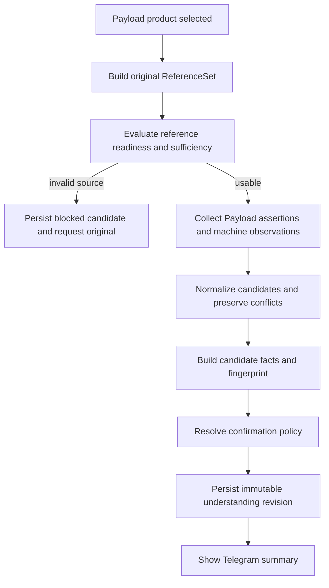
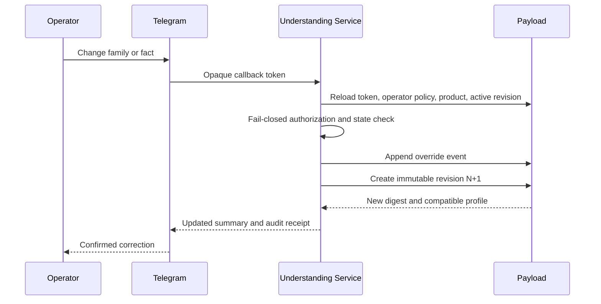
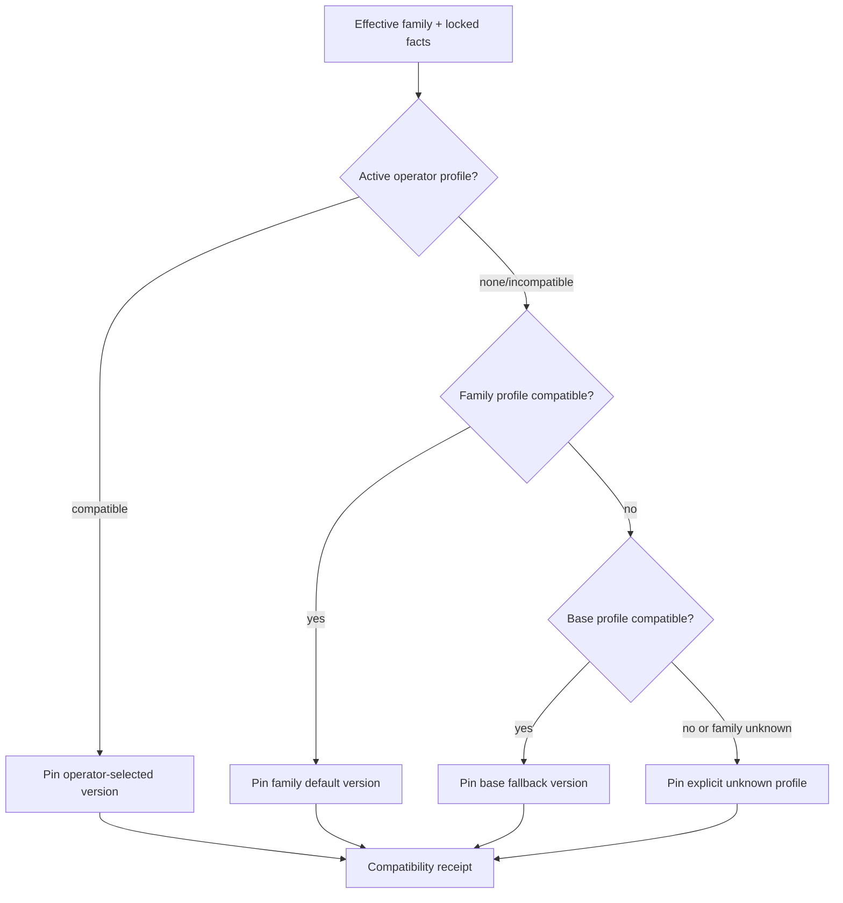
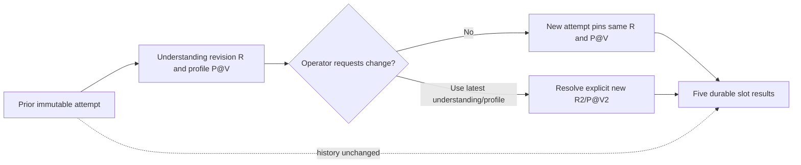
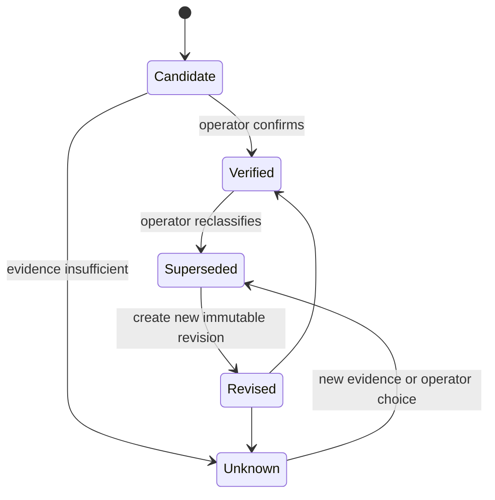
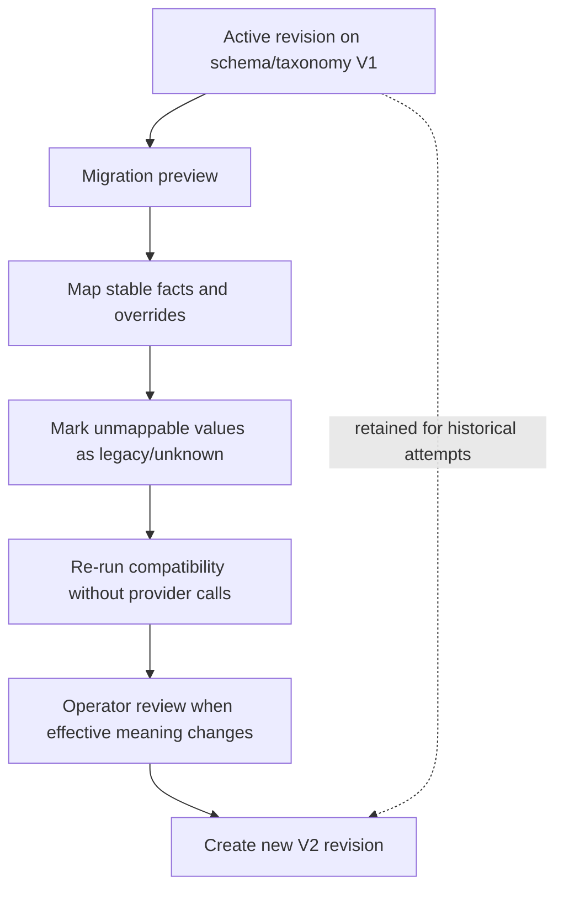
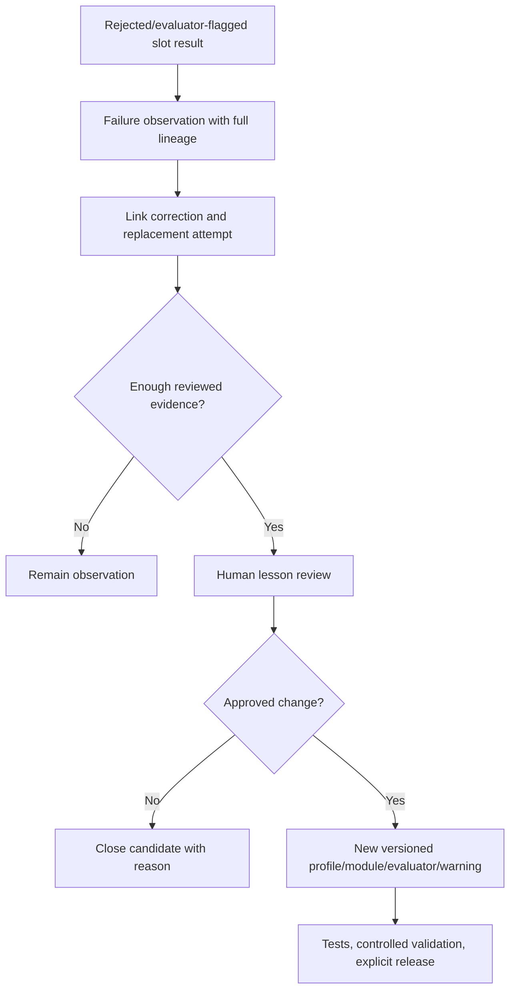

# Product Understanding Layer V1 — Canonical Design

Status: architecture specification; not implemented

Date: 2026-07-26
Scope: product understanding before prompt assembly, slot planning, or provider invocation

This document is the canonical specification for the Product Understanding Layer (PUL) within the target image platform defined by `project-control/IMAGE_GENERATION_BLUEPRINT_V1.md`. The blueprint remains authoritative for the wider image system. Current code and the dated audits remain authoritative for behavior that exists today.

The target invariant is:

> One product → one verified product identity → one compatible, version-pinned Generation Profile → five coherent slot attempts.

This document does not implement that invariant. It defines the inspectable, provider-neutral product identity foundation required before prompt, camera, slot, or provider work is attempted.

## Authority and reconciled decisions

The design uses the canonical blueprint, the image and Telegram audits, the repository audit, Source Pack documents 01/02/03/04/09, `AGENTS.md`, `CLAUDE.md`, and the inspected runtime as evidence.

Where those sources disagree:

- The operator's later decision and the canonical blueprint supersede the repository audit's earlier recommendation to restore a protected-brand image-generation gate. Protected-brand classification must never affect image-generation eligibility, understanding readiness, family selection, or profile selection.
- Current runtime behavior is evidence, not automatically a target contract. In particular, free-form classification, positional result compaction, generated-image intake fallback, unstructured `visualFacts`, and deterministic crop-window centering are not adopted by this layer.
- The required “no deterministic crop” principle applies to the target Product Understanding Layer: it may describe visibility and composition semantically, but must not calculate, select, or persist a crop. Existing post-generation centering behavior is outside this design and requires a separate architecture decision.
- The unknown-family fallback defined here is an explicit, inspectable profile. It must not be renamed or expanded into an “Identity Safe Mode.”

## 1. Purpose and boundaries

### 1.1 Purpose

The Product Understanding Layer creates a durable, versioned answer to five questions before generation:

1. What footwear family is this product, and what alternatives remain plausible?
2. Which product facts are observed, inferred, operator-verified, contradicted, or unknown?
3. Which parts of the product are actually supported by the reference set?
4. Which facts must remain locked across all five slots and later regenerations?
5. Which compatible Generation Profile and version should downstream orchestration resolve?

It converts current scattered inputs—Payload product metadata, original reference media, machine analysis, Telegram confirmation, D-355M material evidence, D-355N visual facts, and future operator corrections—into one provider-neutral, attempt-pinnable record.

### 1.2 Responsibilities

The layer:

- normalizes footwear family identifiers without replacing storefront categories;
- records evidence and confidence per dimension and per fact;
- models unknown and conflicting evidence explicitly;
- maintains a Product Identity Fingerprint and Reference Sufficiency Map;
- applies attributable operator confirmations and overrides;
- produces an effective Locked Fact Set for downstream serialization;
- resolves a compatible profile reference, not profile prompt text;
- exposes concise Telegram and Payload summaries;
- snapshots the exact understanding revision used by each immutable generation attempt;
- records classification and fact lineage needed by future evaluators and the Product Failure Library.

### 1.3 Non-responsibilities

The layer must not:

- generate or transform images;
- choose or call Gemini, OpenAI, or any provider;
- approve generated media or perform Image QC;
- decide activation, publishing, Shopier, advertising, claims, authenticity, or dispatch eligibility;
- define final prompt wording, camera angles, scene composition, or the five slot definitions;
- crop, center, resize, duplicate, or synthesize pixels;
- invent a product fact to fill an unknown field;
- use brand classification as generation eligibility or profile-selection input;
- replace operator judgment or turn confidence into implicit operator approval;
- update its own taxonomy, profiles, warnings, or rules from runtime outcomes;
- mutate an already-used understanding revision or generation attempt.

### 1.4 Architectural placement

```text
Payload product + original ReferenceSet + operator evidence
                          │
                          ▼
             Product Understanding Layer
      taxonomy · evidence · facts · overrides · readiness
                          │
                          ▼
       immutable understanding revision + locked facts
                          │
                          ▼
     profile resolution → prompt modules → fixed slot plan
                          │
                          ▼
      provider adapter → immutable attempt/slot results
```

Payload is the source of truth. Telegram is the primary operator workspace. Telegram actions call application services that persist to Payload; Telegram messages are not a second database.

## 2. Product taxonomy

### 2.1 Taxonomy model

The generation taxonomy is deliberately smaller and more structural than a merchandising taxonomy. Storefront `category` values such as `Klasik`, `Spor`, or `Günlük` are evidence, not canonical generation families. `productType` is currently free text and must be normalized before use.

The effective classification consists of:

- one `familyId` from the table below;
- optional structural variants such as `oxford`, `derby`, `penny`, `tassel`, `chelsea`, or `open_toe` only when evidenced;
- orthogonal attributes such as intended wearer, material, heel form, and closure;
- ranked alternative families when ambiguity remains.

Do not create a new family for every fashion label. A new specialized family is justified only when it changes identity-preservation risks, profile compatibility, or future evaluation checks.

### 2.2 Canonical V1 families

| Stable identifier | Turkish operator label | Definition and inclusion signals | Exclusion signals | Common confusion | Image-generation risks | Specialized profile? |
|---|---|---|---|---|---|---|
| `loafer` | Loafer / Mokasen | Closed toe and closed back; low shoe; slip-on opening; extended vamp; often apron/moc-toe seam, saddle/penny strap, tassels, or plain vamp. Include only when the heel counter is present and no primary lace closure exists. | Backless construction, open toe, primary laces, boot shaft, indoor slipper construction. | `mule`, `slipper`, `casual_closed`, moccasin styling, `formal_laceup`. | Vamp-length drift, opening-shape drift, toe/sole changes, invented penny strap/tassel/hardware, loss of apron stitching, conversion to mule or Oxford. | Yes; first specialized profile after operator-assisted foundation. |
| `sneaker_lifestyle` | Sneaker / Günlük Spor | Closed athletic-derived low or high-top footwear primarily styled for lifestyle use; rubber/EVA sole, lace/strap/slip-on closure, sneaker paneling. | Clear performance-specific cleats or technical sports construction; formal welted upper; boot shaft. | `sports_shoe`, `casual_closed`, high-top sneaker vs `ankle_boot`. | Panel/logo drift, sole geometry changes, lace count changes, left/right mismatch, performance features invented. | Yes, but may initially share a generic closed-shoe profile. |
| `sports_shoe` | Performans Spor Ayakkabı | Footwear whose visible construction supports an athletic function: running geometry, court structure, football studs, training sole, or other performance morphology. Storefront `Spor` alone is insufficient. | Lifestyle sneaker with no performance evidence; formal/casual leather shoe. | `sneaker_lifestyle`, `children_shoe`, specialist cleated footwear. | Sole technology invention, tread/stud count drift, mesh/panel changes, exaggerated cushioning, unsupported performance claims. | Yes when the reference evidence is adequate; otherwise use compatible generic profile. |
| `boot_generic` | Bot — Alt Tip Belirsiz | Closed footwear with a visible shaft above a low shoe, but reference evidence cannot reliably distinguish ankle-height from high shaft or a known subtype. This is an uncertainty-preserving family, not a catch-all. | Clearly low shoe; clearly evidenced ankle or high boot. | `ankle_boot`, `high_boot`, high-top sneaker. | Shaft height invention, opening and heel drift, cropped shaft, accidental sneaker conversion. | Fallback boot profile only; operator confirmation recommended. |
| `ankle_boot` | Bilek Botu | Boot whose shaft ends at or near the ankle; may be Chelsea, zip, lace-up, or pull-on when that closure is visible. | Low shoe with only a padded collar; shaft clearly well above ankle. | `boot_generic`, `high_boot`, high-top sneaker. | Shaft-height and gusset/zip invention, heel/sole drift, wrong opening circumference. | Yes or a versioned boot profile variant. |
| `high_boot` | Uzun Çizme | Boot with a shaft materially above the ankle toward calf/knee; the full shaft or reliable evidence must be visible. | Ankle-height boot; cropped source that cannot prove shaft height. | `boot_generic`, `ankle_boot`. | Shaft truncation, calf-width drift, zipper/seam invention, unstable full-product scale and framing. | Yes; it has distinct reference sufficiency and scale needs. |
| `sandal` | Sandalet | Open footwear retained by straps or structured upper; usually open toe and/or open sides, with a secured heel or ankle/foot straps. | Backless closed-toe mule; simple indoor/open slipper without securing structure. | `slipper`, open-toe `mule`. | Strap count/crossing drift, buckle invention, toe/heel opening changes, floating straps, wrong footbed. | Yes when volume justifies it; structured strap facts are mandatory. |
| `slipper` | Terlik | Easy-on, usually backless footwear with an open or simple upper, commonly a slide or indoor slipper; minimal retaining structure. | Closed-toe fashion mule with structured vamp; sandal with ankle/heel retention; closed-back loafer. | `mule`, `sandal`. | Upper-band geometry drift, invented buckles/logos, footbed thickness change, conversion to sandal. | Family profile justified; can initially inherit an open-footwear base. |
| `mule` | Mule / Arkası Açık Ayakkabı | Backless footwear with a structured fashion-shoe upper, frequently closed toe but possibly peep/open toe; may be flat or heeled. The absent heel counter is a locked structural fact. | Closed-back loafer; simple slide/slipper upper; retained-heel sandal. | `loafer`, `slipper`, `sandal`, `heel`. | Hallucinated heel counter, closed/open toe changes, loafer conversion, heel-height drift. | Yes; backless silhouette is identity-critical. |
| `heel` | Topuklu Ayakkabı | Dress shoe whose defining structure includes an evidenced raised heel; may be pump, slingback, or other subtype recorded as facts. | Platform/sole thickness without a distinct heel; low flat; heeled mule where `mule` remains the structural family and heel is an attribute. | `flat`, `mule`, dress sandal. | Heel height/shape invention, toe-form drift, instability, strap changes, unsafe cropping. | Yes, with heel geometry facts required. |
| `flat` | Babet / Düz Ayakkabı | Low-cut, low-heel dress/casual shoe with a simple opening and non-athletic construction, including ballet-flat morphology. | Loafer vamp/apron structure; athletic sole/paneling; distinct raised heel; backless mule. | `loafer`, `casual_closed`, `heel`. | Opening depth, toe form, sole thickness, bow/ornament invention. | A lightweight family profile is justified if evaluation shows distinct failures. |
| `formal_laceup` | Oxford / Derby Bağcıklı Klasik | Closed formal low shoe with a primary lace closure and dress-shoe construction. `lacingStyle` records `oxford`, `derby`, or `unknown`; it must not be guessed from an obscured facing. | Slip-on loafer; athletic sneaker; boot shaft. | Oxford ↔ Derby, `loafer`, `casual_closed`. | Open/closed lacing conversion, eyelet count drift, brogue invention/loss, welt/sole changes. | Yes; Oxford/Derby may share a profile while preserving subtype facts. |
| `casual_closed` | Günlük Kapalı Ayakkabı | Closed low shoe that is neither confidently athletic, formal lace-up, loafer, heel, nor flat. It preserves uncertainty for hybrid casual footwear. | Strong evidence for another structural family. | `sneaker_lifestyle`, `loafer`, `flat`, `formal_laceup`. | Genericization into a sneaker, closure invention, silhouette simplification. | Default closed-footwear profile; not a reason to invent casual details. |
| `children_shoe` | Çocuk Ayakkabısı | An operator/Payload-supported children’s product where child-specific proportions, sizing, or closure affect preservation. It requires `baseMorphologyFamily` when knowable (for example sneaker or sandal). | Adult product inferred as child-sized from perspective alone. | Small adult shoe, `sports_shoe`, `sneaker_lifestyle`. | Scale exaggeration, adult/child proportion drift, closure simplification, decorative invention. | No standalone camera/slot redesign in V1; use compatible base-family profile plus a versioned child-product constraint module. |
| `unknown` | Bilinmiyor / Belirsiz | Evidence is insufficient, contradictory, outside the footwear taxonomy, or cannot distinguish critical alternatives. Unknown is a truthful state, not an error and not permission to invent. | A family meeting the effective confidence and conflict rules. | Any close alternatives retained in `candidateFamilies`. | Generic substitution, unsupported closure/hardware/sole assumptions, silent confident misclassification. | Explicit provider-neutral unknown profile using verified facts only; never an “Identity Safe Mode.” |

### 2.3 Confusion matrix

The confusion matrix is versioned taxonomy metadata. It raises operator visibility and future evaluator coverage; it never silently changes an effective family.

| Pair | Deciding evidence | If evidence is missing |
|---|---|---|
| loafer ↔ mule | heel counter present vs structurally backless | require confirmation; lock back construction as unknown |
| loafer ↔ moccasin styling | durable sole/constructed low-shoe morphology vs soft wrap construction; apron seam alone is not decisive | keep `loafer` candidate and record moccasin construction as a variant/hypothesis, not a separate V1 family |
| slipper ↔ mule | simple slide/indoor upper vs structured fashion-shoe vamp/toe | show both candidates; do not infer fashion hardware |
| sandal ↔ open slipper | retaining heel/ankle/foot straps vs simple slip-on band | require confirmation if rear/strap path is not visible |
| sneaker ↔ casual shoe | athletic-derived panel/sole morphology vs generic closed-shoe construction | use `casual_closed` or confirmation, not storefront `Günlük` as proof |
| ankle boot ↔ high-top sneaker | boot shaft/sole/upper construction vs sneaker collar and athletic sole | require structural evidence or operator choice |
| Oxford ↔ Derby | closed vs open lacing facing | set `lacingStyle=unknown`; family can remain `formal_laceup` |
| heel ↔ flat/platform | distinct heel lift and form vs flat/platform sole | record heel geometry unknown; do not estimate centimeters from perspective |

### 2.4 Family rules versus product facts

- Family definitions describe structural inclusion/exclusion and profile compatibility.
- Profile defaults describe permissible downstream behavior; they are never observations about an individual shoe.
- Individual facts describe this exact product: toe shape, vamp proportion, hardware presence, stitching path, material finish, sole geometry, and so on.
- Product facts always override profile defaults when verified.
- A family change does not erase product facts. Compatibility is reevaluated and conflicting facts are surfaced.

## 3. Product Understanding Record

### 3.1 Persistence model

The target should use a Payload-owned, revisioned Product Understanding aggregate. A practical future shape is:

- `ProductUnderstanding` logical aggregate: stable identity for one product;
- `ProductUnderstandingRevision`: immutable snapshot of classification, evidence, effective facts, readiness, and resolved profile;
- `OperatorFactOverride`: append-only attributable event that creates a new revision;
- product pointer to the active revision for convenient reads;
- generation attempt references to the exact revision ID, revision number, digest, taxonomy version, and profile version.

An active revision may be superseded but never edited after an attempt uses it. “Reset machine understanding” creates a new revision without machine-derived facts; it does not delete history or operator facts.

### 3.2 Provider-neutral record sections

| Section | Contents |
|---|---|
| Identity | `productId`, stable understanding ID, revision, schema/taxonomy versions, status, digest |
| References | original `sourceMediaId`, `referenceSetId`, media roles, content hashes, Reference Sufficiency Map, readiness outcome |
| Classification | detected, confirmed, and effective family; ranked candidates; multidimensional confidence; evidence and conflicts |
| Facts | material, visual, silhouette, construction, sole, closure, hardware, color, pattern, warnings; each fact carries state and provenance |
| Fingerprint | normalized non-biometric Product Identity Fingerprint derived only from effective facts |
| Overrides | attributable confirm/change/reject/uncertain/lock/reset/profile-select events and their active/reverted status |
| Profile | resolved profile ID/version, selection reason, compatibility result, operator selection if any |
| Locks | Locked Fact Set, prohibited assumptions, and an explicit list of unknown identity-critical fields |
| Lineage | extractor identifiers/versions, timestamps, parents, superseding revision, attempts that consumed the revision |

### 3.3 Fact provenance layers

Every fact has exactly one current effective value but retains all assertions that competed to produce it.

1. `operator_locked`: explicitly verified and locked for this product.
2. `operator_verified`: confirmed by an attributable operator, but still reversible.
3. `payload_asserted`: present in operator-managed Payload metadata, with its own field and update provenance; not assumed verified merely because it exists.
4. `machine_inferred`: produced by a named analyzer/version from named reference evidence.
5. `profile_default`: a downstream constraint default, never promoted into a product observation.
6. `prohibited_assumption`: an explicit boundary such as “do not add hardware when presence is unknown or absent.”

The effective precedence is active operator lock → active operator verification/override → sufficiently supported Payload assertion → non-conflicting machine inference → unknown. A profile default may constrain handling of an unknown but may not fill it with a purported product fact.

### 3.4 Fact state

Each `ProductVisualFact` is one of:

- `verified`: supported by operator confirmation;
- `inferred`: machine-supported but not operator-confirmed;
- `contested`: assertions conflict;
- `uncertain`: operator explicitly marked uncertainty or evidence is weak;
- `unknown`: not visible or unsupported;
- `rejected`: a prior assertion explicitly rejected and retained for history;
- `not_applicable`: structurally irrelevant to the effective family.

Absence is a value, not missing data. For example, `hardware.presence=absent` is valid only when evidence or an operator supports absence. `unknown` must not be serialized as “absent.”

### 3.5 Product Identity Fingerprint

The fingerprint is a deterministic serialization of effective, identity-critical facts, not an image embedding and not biometric data. It contains:

- family and evidenced subtype;
- silhouette proportions;
- toe, heel, sole, opening, and shaft forms;
- upper construction and panel topology;
- closure and lacing facts;
- key stitching/apron paths;
- hardware presence/absence/type/location;
- material type, finish, and color relationships;
- distinctive elements and protected visible marks;
- unknown critical regions.

It produces a stable digest after canonical ordering. All five slots in one attempt must reference the same fingerprint digest. A new operator correction creates a new revision and digest; it does not rewrite prior attempts.

### 3.6 Reference Sufficiency Map

For each identity region—`toe`, `vamp`, `lateral`, `medial`, `opening`, `heel`, `sole_edge`, `outsole`, `shaft`, `hardware`, `markings`—record:

- visibility: `clear | partial | occluded | absent_from_frame | not_applicable`;
- source media IDs that support it;
- viewpoint limitations;
- whether absence can be established;
- confidence and conflicts.

This map prevents “not visible” from becoming “not present.” It contains no crop coordinates and must not drive deterministic cropping.

### 3.7 Locked Fact Set

The Locked Fact Set is the downstream contract for one attempt. It includes only operator-verified facts and high-confidence, non-conflicting facts allowed by policy. It also carries critical unknowns and prohibited assumptions so downstream prompt serialization and evaluators know what must not be invented.

The lock is stable across all five slots and default regeneration. A deliberate operator correction produces a new revision; the old lock remains attached to old attempts.

## 4. Evidence and confidence model

### 4.1 Evidence objects, not unexplained scores

Every classification and fact assertion cites evidence such as:

- Payload field/value and record revision;
- original media ID, hash, region, and visibility;
- operator user ID and Telegram/Payload action;
- machine analyzer ID/version and raw normalized observation;
- a conflict with another assertion;
- a profile/taxonomy rule, clearly marked as a rule rather than observation.

Machine provider names may appear in analyzer provenance, but the record contract cannot require provider-specific fields.

### 4.2 Confidence dimensions

Each dimension uses `0.00–1.00`, a band, reasons, evidence count, conflicts, and coverage—not just a number.

| Dimension | Question |
|---|---|
| `family` | Is the structural family distinguishable from its closest alternatives? |
| `material` | Are material type and finish supported? |
| `color` | Are primary/accent colors and their locations stable under lighting? |
| `structural` | Are silhouette, toe, heel, opening, shaft, and sole forms supported? |
| `closure` | Is the closure type and topology visible? |
| `hardware` | Can presence, absence, type, finish, and location be defended? |
| `markings` | Are logos, text, embossing, and distinctive zones visible enough to preserve without invention? |
| `referenceQuality` | Is the reference set usable and sufficiently representative? |

Confidence cannot cross dimensions. High color confidence does not imply high hardware or structural confidence.

### 4.3 Classification thresholds

Thresholds are policy defaults and must be versioned:

| Outcome | Conditions | V1 action |
|---|---|---|
| Safe automatic classification | family ≥ 0.90; top-vs-second margin ≥ 0.15; no critical conflict; reference readiness `ready`; at least two independent supporting signals | Record as high-confidence suggestion. In the first operator-assisted release, still show it for confirmation before the first generation. Later automation requires a separate approval. |
| Confirmation recommended | family 0.75–0.89, or margin 0.08–0.14, or a non-critical confusion pair remains | Show recommended family and alternatives; operator may accept. |
| Confirmation required | family 0.50–0.74; margin < 0.08; identity-critical conflict; child/base family unresolved; loafer/mule or slipper/mule ambiguity | Do not silently select a specialized family profile. Require operator confirmation or explicit use of `unknown`. |
| Insufficient evidence | family < 0.50; critical regions unavailable; contradictory product count; no defensible footwear family | Effective family `unknown`; show missing evidence. Generation may proceed only when reference readiness permits and the operator explicitly accepts the unknown profile. |

Operator verification sets the effective decision state to `verified`; it does not falsify the original machine score. The score remains in history.

### 4.4 Fact promotion thresholds

- `≥0.95` and no conflict: a non-critical fact may enter the attempt lock as machine-supported under a versioned policy.
- `0.80–0.94`: inferred and visible to the operator; not treated as verified.
- `0.50–0.79`: uncertain suggestion only.
- `<0.50`, no evidence, or critical conflict: unknown.
- Hardware presence/absence, logos/text, heel height, shaft height, strap topology, and other identity-critical facts require stricter evidence or operator confirmation even above a numerical threshold.

No confidence result authorizes generation spend, publishing, claims, or external dispatch. Those remain separate operator/policy gates.

## 5. Operator override model

### 5.1 Supported actions

Telegram and Payload must expose the same application-service actions:

- confirm detected family;
- choose a different family and optional subtype;
- add a product-specific fact;
- reject an inferred fact;
- mark a fact uncertain or unknown;
- verify or lock a fact;
- unlock or revert a prior override;
- reset machine-generated assertions while preserving operator assertions and history;
- select a compatible Generation Profile/version;
- return profile selection to automatic resolution;
- show the evidence and conflict explanation for any classification/fact.

### 5.2 Override event requirements

Every override records:

- stable event and understanding IDs;
- product and prior revision;
- actor type, operator user ID, Telegram chat/message or Payload request context;
- action, target fact path, previous effective assertion, requested assertion;
- optional reason and evidence media;
- timestamp and idempotency key;
- resulting revision and digest;
- reversal link when reverted.

Events are append-only. Reversal creates another event. A current projection can hide superseded assertions from the default view, but history remains auditable.

### 5.3 Preservation rules

- Default regeneration reuses the exact active understanding revision and profile version from the requested prior attempt unless the operator explicitly chooses “use latest understanding.”
- Retry of a failed slot always preserves the same understanding revision, profile version, prompt-module versions, and slot definition as its parent attempt.
- A new classification does not retroactively change old attempts.
- Resetting machine understanding cannot remove operator locks.
- Profile override is separate from family override. Selecting a profile cannot rewrite the product family.
- Operator changes are visible in attempt history as a snapshot plus the override-event references that produced it.

### 5.4 Authorization and callbacks

Conceptual callbacks use short opaque tokens. The server must reload the token, product, understanding revision, operator policy, and current state; authorize the current user/chat fail closed; enforce expiry and single-use/idempotency; then invoke the service. Callback data must not contain trusted user IDs, fact values, profile IDs, or authorization decisions.

## 6. Generation Profile selection

### 6.1 Resolution chain

```text
ProductUnderstandingRevision
  → effectiveProductFamily
  → compatible profile candidates
  → operator-selected compatible profile, if active
  → family-specific default, if available
  → generic base profile
  → explicit unknown profile
  → version pin + compatibility receipt
  → prompt modules + unchanged five-slot plan
```

The Product Understanding Layer resolves a `GenerationProfileReference`. The profile registry owns profile metadata and compatibility. Prompt assembly owns final wording. Slot planning owns the fixed five-slot definitions. Providers consume the already-compiled request.

### 6.2 Precedence

1. Active operator-selected profile version, if enabled and compatible.
2. Active family-specific profile version for the effective family.
3. Compatible base profile (for example generic closed footwear or open footwear).
4. Explicit `footwear.unknown` profile when the family remains unknown.

Product-specific fact overrides are applied after profile resolution as locked inputs; they do not create anonymous mutable profile variants.

### 6.3 Profile types

- `default`: provider-neutral baseline for broadly compatible footwear.
- `family-specific`: adds family preservation modules/evaluator expectations without changing the five slot identities.
- `operator-selected`: explicit pinned choice with actor/reason.
- `fallback`: a declared compatible base profile used when a specialized profile is unavailable.
- `unknown-product`: uses only verified/supported facts and carries uncertainty; it is not a product-fact generator.
- future `style pack`: orthogonal presentation module, never permitted to change product identity facts.

### 6.4 Version and compatibility rules

- Profiles have stable IDs, semantic/monotonic versions, status, compatible families, required fact coverage, required slot-contract version, and prompt-module references.
- Resolution pins the exact version; `latest` is resolved before an attempt is created and never stored as the attempt value.
- A profile may require facts such as `backConstruction`, `vampShape`, or `heelForm`. Missing requirements make it incompatible or trigger operator confirmation; the resolver cannot invent them.
- An operator may override to another compatible profile. Incompatible selection is rejected with an explanation, not coerced.
- Profile retirement prevents new selection but does not invalidate historical attempts.
- Retry pins the parent version. Regeneration defaults to the selected prior revision/version; an explicit “latest profile” action creates a new attempt with a visible version change.
- Protected-brand state is absent from compatibility and resolution logic.

## 7. Loafer failure profile

### 7.1 Repository-supported findings

The following are directly supported by the inspected repository and audits:

- Payload `category` is coarse (`Klasik`, `Spor`, `Günlük`, and others), while `productType` is free text. There is no canonical loafer identifier or structured loafer anatomy.
- Telegram wizard classification uses the coarse category list and only `Daily`, `Sneaker`, and `Classic` product-type buttons in a conditional path tied to the now-inactive `Erkek Ayakkabı` category. High-confidence wizard vision values can be written at `>=70` without a durable evidence record.
- `validateProductImage()` returns a free-form `productClass`; `extractIdentityLock()` independently returns another free-form `productClass`. There is no reconciliation or confusion matrix.
- The identity lock carries broad strings such as `toeShape`, `soleProfile`, `heelProfile`, `closureType`, and `distinctiveFeatures`, but no structured vamp length, back construction, opening shape, apron seam, strap/tassel topology, or proportional measurements.
- Identity extraction can fail and fall back to generic `shoe` / `as shown` values, weakening product-specific constraints.
- The five slot calls share references and prompt locks but do not consume one persisted, versioned Product Identity Fingerprint.
- D-355M and D-355N add useful cross-slot material/hardware language, but operator facts are a free-text job input truncated to 1,000 characters rather than a structured revision.
- The suede/nubuck directive includes “premium loafer material” even when the classified product is not a loafer, demonstrating prompt-family leakage.
- Current result arrays compact successful buffers; after a slot failure, positional metadata can describe the wrong slot. This contaminates family-specific failure learning.
- Current centering uses a deterministic crop-window normalizer. The new layer must not depend on or extend that mechanism.
- Current intake can fall back to generated media for classification if originals are unavailable. That risks feeding prior generation drift back into identity understanding.

### 7.2 Architectural inferences

These conclusions follow from the supported structure but need production examples for magnitude:

- Independent slot interpretation of a broad free-form identity description makes a loafer’s low-information silhouette vulnerable to five different plausible shoes.
- “Slip-on,” “apron seam,” “penny strap,” “tassel,” and “moccasin” are correlated fashion concepts. Without explicit presence/absence facts, a provider may add a conventional loafer detail that the exact product lacks.
- A partially visible heel can cause closed-back loafers to become mules or slippers; a hidden facing can cause a plain loafer to become an Oxford-like lace-up.
- Universal no-metal language is conservative for hardware-free loafers, but a genuinely buckled or horsebit loafer requires verified presence/type/location facts so one slot does not omit or reinvent the hardware.
- Global scale/composition controls cannot by themselves protect vamp-to-toe proportion, opening depth, apron seam path, sole thickness, or heel lift.
- Pair slots add left/right symmetry and duplicated-detail failure modes that are not represented in the current identity record.

### 7.3 Hypotheses requiring real attempt evidence

Do not promote these to profile rules until source/attempt pairs are reviewed:

- which provider/model most often converts loafers to mules, moccasins, slippers, or formal lace-ups;
- whether tassel/penny-strap invention clusters by slot;
- whether top/pair views drive more vamp and opening drift than other slots;
- whether current centering changes perceived vamp length or sole thickness;
- whether material-specific prompt density helps or harms silhouette fidelity;
- whether single-reference, multi-reference, or source-angle composition predicts failures;
- exact thresholds for toe/vamp/sole proportional evaluators.

### 7.4 Required loafer facts

A future loafer-capable revision should represent:

- `backConstruction`: `closed | backless | slingback | unknown`;
- `vampLengthClass`: `short | medium | long | unknown` plus evidence, not fabricated pixel precision;
- `openingShape` and `openingDepthClass`;
- `toeShape` and toe-volume description;
- `apronSeam`: presence, path/style, contrast, visibility;
- `vampAdornment`: `none | penny_saddle | tassels | bit | buckle | bow | other | unknown`;
- `hardware`: tri-state presence, count, type, material/finish, location;
- `heelForm` and qualitative lift; no centimeter claim without reliable evidence;
- `soleEdge`, thickness class, color, tread visibility;
- `stitchingPaths` and contrast;
- `leftRightSymmetryExpectations` and pair evidence;
- critical unknowns from the Reference Sufficiency Map.

### 7.5 Future loafer checks

Future evaluators should compare each slot to the locked fingerprint for back construction, vamp/toe proportion, opening, sole/heel, apron seam, adornment/hardware, and pair symmetry. Evaluator outputs remain advisory for generation approval unless a later policy explicitly assigns a gate. They must cite observable differences, not emit a single opaque “loafer quality” score.

## 8. D-355M and D-355N integration

### 8.1 D-355M Material Identity Lock

D-355M remains a mandatory downstream prompt module. The new layer supplies its structured inputs:

- material type and finish;
- color tone/undertone relationship;
- stitching color/density when visible;
- sole color/thickness class;
- evidence state and unknowns.

The current text is not redesigned here. Future modularization should serialize the same intent from the Locked Fact Set and pin the serializer/module version in the attempt.

### 8.2 D-355N Product Visual Fact Lock

D-355N remains the highest-priority downstream product-fact module, but its target input becomes structured facts rather than an unattributed text blob. A compatibility serializer may continue producing `visualFacts` text during migration, with these rules:

1. active operator-locked/verified facts first;
2. supported non-conflicting machine facts next;
3. explicit critical unknowns and prohibited assumptions;
4. profile defaults labeled as rules, never product observations;
5. deterministic ordering and versioned serialization;
6. the exact serialized digest stored on the attempt.

### 8.3 Hardware truth table

| Effective hardware fact | Downstream constraint |
|---|---|
| verified absent | prohibit hardware in every slot |
| verified present | preserve exact type/count/location/finish in every slot; do not add more |
| inferred present, strong evidence | show for operator confirmation; preserve cautiously only under versioned policy |
| unknown/ambiguous | do not add unsupported hardware; do not claim that a partially hidden real component is absent |
| contested | require operator resolution before a hardware-specific profile; otherwise retain unknown and warn |

Stitched fabric, thread loops, decorative stitching, embossed same-material marks, and shadows must never be converted to metal without positive evidence. “Shiny” alone is insufficient. A verified operator correction always overrides machine interpretation.

### 8.4 Future slot lock and evaluators

All slots receive the same understanding revision, fingerprint digest, locked-fact digest, material-lock version, visual-fact-lock version, and profile version. Future quality evaluators compare outputs to that snapshot. They cannot update the snapshot or profile automatically.

## 9. Product Failure Library

### 9.1 Purpose and scope

The Product Failure Library (PFL) is an evidence repository for reviewed generation failures and successful replacements. It is not online learning, autonomous prompt mutation, or a self-editing profile registry.

Each `ProductFailureObservation` records:

- product family and candidate confusion pair;
- source product and understanding revision/digest;
- immutable attempt and durable slot result;
- provider adapter/model metadata and usage receipt;
- profile, prompt-module, slot-contract, and evaluator versions;
- observed failure taxonomy and free-text operator reason;
- machine evaluator signals with evidence;
- corrected fact or reclassification, if any;
- replacement attempt/slot and whether the operator judged it successful;
- reusable lesson candidate, owner, review state, and links to supporting examples.

### 9.2 Failure taxonomy examples

`family_conversion`, `silhouette_drift`, `vamp_drift`, `toe_drift`, `heel_drift`, `sole_drift`, `closure_drift`, `hardware_invented`, `hardware_omitted`, `stitching_drift`, `material_drift`, `color_drift`, `marking_drift`, `left_right_inconsistency`, `scale_inconsistency`, `composition_noncompliance`, `reference_insufficient`, `slot_lineage_error`, and `other`.

### 9.3 Promotion workflow

```text
observation
  → linked evidence complete
  → lesson candidate
  → human technical review across multiple examples
  → proposed change with tests and version bump
  → operator/engineering approval
  → new profile/module/evaluator/taxonomy version
  → controlled validation and release
```

One rejected image never changes runtime behavior. Approved lessons create new immutable versions; historical attempts keep their original versions. Reusable outcomes may become:

- a profile constraint change;
- a prompt-module change;
- an evaluator rule;
- a category-specific warning;
- a reference-readiness rule.

Every promotion requires an owner, evidence set, explicit review decision, deterministic tests, version change, rollback target, and release note. Reverting activates a prior version for new attempts; it never rewrites history.

## 10. Reference image readiness

### 10.1 Outcome model

`ReferenceImageReadiness` returns:

- `ready`: adequate to create understanding;
- `ready_with_warnings`: generation may proceed, with explicit unknowns/constraints;
- `operator_confirmation_required`: operator must curate/confirm reference roles or accept limitations;
- `blocked_invalid_reference`: no safe generation input exists.

Readiness is about evidence usability, not protected-brand status or publishing eligibility.

### 10.2 Check matrix

| Issue | Default outcome | Effect |
|---|---|---|
| Missing source media, unreadable bytes, unsupported media, or fetch failure | block | No text-to-image substitution; request an original product photo. |
| Primary subject is not footwear or no product is visible | block | Explain classifier evidence; allow operator to replace the source, not bypass with brand/category metadata. |
| Product extremely small/unrecognizable or resolution cannot support identity | block when identity cannot be defended; otherwise confirmation | Record quality evidence and request a better source. |
| Multiple different products/models in frame | confirmation; block until a source product can be identified | Operator selects/curates the correct reference set. |
| Correct matched pair in frame | warning or ready | Record product count and pair relation; do not treat it as two product identities. |
| Heavy occlusion | confirmation or warning by critical region | Lower structural/fact confidence; critical facts remain unknown. |
| Severe perspective distortion | warning/confirmation | Lower structural confidence; do not infer quantitative proportions. |
| Background, reflection, or shadow confusion | warning | Lower affected material/hardware/edge confidence; never reinterpret a shadow as hardware. |
| Left/right ambiguity | warning | Record unknown side and prevent unsupported asymmetry claims. |
| Heel, toe, sole, shaft, or medial side missing | warning/confirmation | Mark those regions unavailable in the sufficiency map; do not invent them. |
| Conflicting original images | confirmation required | Preserve conflicts and let the operator remove/role-tag the wrong media. |
| Only generated media available | block for initial canonical identity | Generated media may support failure analysis, not establish product truth. Ask for an original. |
| Valid reference but family uncertain | readiness may still be ready | Classification becomes `unknown`/confirmation-required; brand never blocks generation. |

### 10.3 Reference-set rules

- Originals and operator-supplied evidence establish identity; generated outputs do not.
- Each media item has an explicit role and content hash.
- Duplicate bytes are deduplicated by hash, not array position.
- Conflicts are preserved until operator resolution.
- No check produces crop coordinates or requests deterministic cropping.
- A warning constrains certainty; it must not silently become a new visual rule.

## 11. Telegram operator UX

### 11.1 Future lifecycle

```text
Product selected
  → reference readiness receipt
  → understanding summary
  → confirm/correct family and critical facts
  → compatible profile receipt
  → explicit five-slot generation request
  → immutable task receipt and progress
```

This is a future design; command names are conceptual and do not replace current commands.

### 11.2 Concise summary

A first message should fit a mobile operator screen:

```text
Ürün Anlayışı · SN0421 · rev 3
Tür: Loafer / Mokasen — %86 (onay önerilir)
Alternatif: Mule %11
Kilitli: kapalı arka, süet/mat, yuvarlak burun, metal yok
Belirsiz: taban altı, iç yan, topuk yüksekliği
Referans: 2 özgün foto · uyarılı hazır
Profil: footwear.loafer@1.0.0
Uyarı: vamp ve apron dikişi yalnızca 1 fotoğrafta net
```

Then show one primary action and a short secondary menu:

- `Onayla ve devam et`
- `Türü değiştir`
- `Faktları incele`
- `Profili değiştir`
- `Referansları incele`
- `Neden?`
- `İptal`

### 11.3 Correction flow

- Family selection shows only canonical Turkish labels and close alternatives first.
- Fact review groups critical facts: structure, material/color, closure, hardware, markings, unknowns.
- “Reject” does not force the opposite value; the operator may choose `unknown`.
- “Lock” explains that the fact persists across all five slots and regeneration until deliberately changed.
- Reset offers a preview of what machine assertions will be removed and what operator locks remain.
- Profile selection shows compatibility, version, reason, and what is missing; it does not expose provider selection as part of understanding.

### 11.4 Long-running and stale-state behavior

- The confirmation receipt includes product, active revision, profile version, and expiry.
- After any action, the server reloads current Payload state and rejects stale tokens with a fresh summary.
- Duplicate taps return the prior idempotent result.
- A generation request creates a durable task receipt before queueing and shows the exact understanding/profile snapshot.
- Progress edits one receipt where practical and sends milestone/error messages when needed; the precise notification policy remains an open operator decision in the blueprint.

### 11.5 Fail-closed callback contract

Every callback must reauthorize the actual operator, chat, and current product state. Missing webhook secret, missing allowlist policy, invalid/expired token, mismatched revision, or unauthorized chat/user means no mutation and no queue. Callback payloads are routing hints only.

## 12. Proposed data contracts

These interfaces are specification examples. They do not prescribe a single Payload collection layout.

```ts
type ProductFamilyId =
  | 'loafer'
  | 'sneaker_lifestyle'
  | 'sports_shoe'
  | 'boot_generic'
  | 'ankle_boot'
  | 'high_boot'
  | 'sandal'
  | 'slipper'
  | 'mule'
  | 'heel'
  | 'flat'
  | 'formal_laceup'
  | 'casual_closed'
  | 'children_shoe'
  | 'unknown'

type EvidenceSource =
  | 'payload'
  | 'original_media'
  | 'operator_telegram'
  | 'operator_payload'
  | 'machine_analyzer'
  | 'taxonomy_rule'
  | 'profile_default'

type FactState =
  | 'verified'
  | 'inferred'
  | 'contested'
  | 'uncertain'
  | 'unknown'
  | 'rejected'
  | 'not_applicable'

interface ClassificationEvidence {
  id: string
  source: EvidenceSource
  assertionPath: string
  assertedValue: unknown
  supports: boolean
  weight?: number
  mediaId?: string | number
  mediaHash?: string
  region?: string
  visibility?: 'clear' | 'partial' | 'occluded' | 'absent_from_frame'
  payloadField?: string
  analyzer?: { id: string; version: string; providerReceiptId?: string }
  operator?: { userId: string; chatId?: string; messageId?: string }
  observedAt: string
  notes?: string
}

interface ConfidenceDimension {
  score: number // 0..1
  band: 'high' | 'medium' | 'low' | 'insufficient'
  evidenceIds: string[]
  conflictEvidenceIds: string[]
  coverage: 'adequate' | 'partial' | 'insufficient'
  reasons: string[]
}

interface ProductVisualFact<T = unknown> {
  factId: string
  path: string
  value: T | null
  state: FactState
  provenance: EvidenceSource
  confidence: ConfidenceDimension
  evidenceIds: string[]
  criticality: 'identity_critical' | 'important' | 'descriptive'
  lockState: 'unlocked' | 'verified' | 'locked'
  supersedesFactId?: string
  createdAt: string
  createdBy?: string
}

interface OperatorFactOverride {
  id: string
  productUnderstandingId: string
  baseRevision: number
  action:
    | 'confirm_family'
    | 'change_family'
    | 'set_fact'
    | 'reject_fact'
    | 'mark_uncertain'
    | 'lock_fact'
    | 'unlock_fact'
    | 'reset_machine_assertions'
    | 'select_profile'
    | 'clear_profile_selection'
    | 'revert_override'
  targetPath: string
  previousAssertion?: unknown
  requestedAssertion?: unknown
  reason?: string
  actor: { userId: string; surface: 'telegram' | 'payload'; chatId?: string; messageId?: string }
  idempotencyKey: string
  createdAt: string
  resultingRevision: number
  revertsOverrideId?: string
}

interface ProductIdentityFingerprint {
  family: ProductFamilyId
  subtype?: string
  baseMorphologyFamily?: ProductFamilyId
  silhouette: Record<string, ProductVisualFact>
  upperConstruction: Record<string, ProductVisualFact>
  toe: Record<string, ProductVisualFact>
  opening: Record<string, ProductVisualFact>
  heel: Record<string, ProductVisualFact>
  sole: Record<string, ProductVisualFact>
  closure: Record<string, ProductVisualFact>
  stitching: Record<string, ProductVisualFact>
  hardware: Record<string, ProductVisualFact>
  material: Record<string, ProductVisualFact>
  color: Record<string, ProductVisualFact>
  markings: Record<string, ProductVisualFact>
  criticalUnknownPaths: string[]
  digest: string
}

interface GenerationProfileReference {
  profileId: string
  profileVersion: string
  selection: 'operator' | 'family_default' | 'base_fallback' | 'unknown_fallback'
  compatibleFamilies: ProductFamilyId[]
  requiredFactPaths: string[]
  missingFactPaths: string[]
  compatibility: 'compatible' | 'confirmation_required' | 'incompatible'
  registryVersion: string
}

interface ReferenceRegionSufficiency {
  region: string
  visibility: 'clear' | 'partial' | 'occluded' | 'absent_from_frame' | 'not_applicable'
  mediaIds: Array<string | number>
  absenceCanBeEstablished: boolean
  confidence: ConfidenceDimension
  notes?: string[]
}

interface ReferenceImageReadiness {
  outcome: 'ready' | 'ready_with_warnings' | 'operator_confirmation_required' | 'blocked_invalid_reference'
  sourceMediaIds: Array<string | number>
  originalMediaOnly: boolean
  productCount: 'single' | 'matched_pair' | 'multiple_different' | 'unknown'
  regions: ReferenceRegionSufficiency[]
  warnings: string[]
  blockers: string[]
  evaluatedAt: string
  evaluatorVersion: string
}

interface ProductFamilyDefinition {
  id: ProductFamilyId
  turkishLabel: string
  taxonomyVersion: string
  inclusionRules: string[]
  exclusionRules: string[]
  confusedWith: ProductFamilyId[]
  identityCriticalFactPaths: string[]
  knownGenerationRisks: string[]
  defaultProfileId: string
  fallbackProfileId: string
}

interface ProductUnderstandingRecord {
  id: string
  productId: string | number
  revision: number
  understandingVersion: string
  taxonomyVersion: string
  status: 'candidate' | 'operator_review' | 'verified' | 'superseded'
  sourceMediaId: string | number
  referenceSetId: string
  referenceReadiness: ReferenceImageReadiness
  detectedProductFamily: ProductFamilyId
  operatorConfirmedProductFamily?: ProductFamilyId
  effectiveProductFamily: ProductFamilyId
  candidateFamilies: Array<{ family: ProductFamilyId; confidence: ConfidenceDimension }>
  classificationConfidence: ConfidenceDimension
  classificationEvidence: ClassificationEvidence[]
  conflictingEvidence: ClassificationEvidence[]
  materialFacts: ProductVisualFact[]
  visualFacts: ProductVisualFact[]
  silhouetteFacts: ProductVisualFact[]
  constructionFacts: ProductVisualFact[]
  soleFacts: ProductVisualFact[]
  closureFacts: ProductVisualFact[]
  hardwareFacts: ProductVisualFact[]
  colorFacts: ProductVisualFact[]
  patternFacts: ProductVisualFact[]
  productSpecificWarnings: string[]
  referenceSufficiencyMap: ReferenceRegionSufficiency[]
  fingerprint: ProductIdentityFingerprint
  lockedFactIds: string[]
  prohibitedAssumptions: string[]
  generationProfile: GenerationProfileReference
  operatorOverrides: OperatorFactOverride[]
  parentRevisionId?: string
  supersededByRevisionId?: string
  digest: string
  createdAt: string
  createdBy: string
  verifiedAt?: string
  verifiedBy?: string
}

interface ProductFailureObservation {
  id: string
  productId: string | number
  family: ProductFamilyId
  understandingRevisionId: string
  attemptId: string
  slotResultId: string
  providerReceipt: { adapterId: string; model: string; usageId?: string }
  profile: GenerationProfileReference
  observedFailure: string
  operatorRejectionReason?: string
  evaluatorSignals: Array<{ evaluatorId: string; version: string; signal: string; score?: number }>
  correctedFactId?: string
  replacementAttemptId?: string
  replacementSuccessful?: boolean
  reusableLessonCandidate?: string
  reviewStatus: 'observation' | 'candidate' | 'reviewed_rejected' | 'approved_for_versioned_change'
  reviewedBy?: string
  createdAt: string
}
```

## 13. Lifecycle and diagrams

### 13.1 Understanding creation



### 13.2 Operator correction



### 13.3 Profile selection



### 13.4 Regeneration reuse



### 13.5 Reclassification



### 13.6 Version migration



### 13.7 Failure-library feedback



## 14. Migration from the current system

No migration is executed by this specification.

### 14.1 Current-to-target map

| Current implementation | Target treatment |
|---|---|
| `products.category` coarse select | Reuse as `payload_asserted` merchandising evidence. Never map one-to-one without normalization/evidence. |
| `products.productFamily` (`shoes`, wallets, bags, etc.) | Reuse as top-level eligibility evidence that the item is footwear. It is not the generation family. |
| `products.productType` free text | Normalize into candidate family/subtype assertions; preserve raw value and provenance. |
| `products.gender` | Reuse as intended-wearer evidence. `cocuk` may support `children_shoe` but cannot prove it alone. |
| `products.color`, `material`, `brand` | Reuse as Payload assertions. Color/material require visual/operator reconciliation. Brand may support fidelity facts but never generation eligibility. |
| original `products.images` and Media metadata | Reuse to build the ReferenceSet with role/hash/provenance. |
| `generativeGallery` / generated Media | Preserve separate; never use to establish initial canonical identity. Use only as attempt output/failure evidence. |
| Telegram wizard `CATEGORY_OPTIONS` | Keep storefront intake semantics during compatibility period; add a separate understanding confirmation UI later. Do not silently replace existing category values. |
| wizard `tryAutofillFromVision` confidence | Preserve only as legacy analyzer evidence if reconstructable. Do not convert `>=70` auto-fill into verified truth. |
| `ValidationResult.productClass` | Legacy candidate evidence, not effective family. |
| `IdentityLock` fields | Map to candidate facts where field values and analyzer provenance are available; keep raw snapshot. Free-form strings need normalization and may remain uncertain. |
| D-355M static material block | Preserve as a downstream versioned prompt module; feed it structured locked facts in a later phase. |
| D-355N `visualFacts` string | Compatibility serializer target. Existing values may be imported only with known operator provenance; unattributed text remains legacy evidence, not locked truth. |
| `promptsUsed.identityLock` / `providerResults.identityLock` JSON | Extract as historical attempt metadata where parseable. Do not create current product truth from generated-attempt output alone. |
| current image job `stage`, `provider`, positional arrays | Do not place in Product Understanding. Future attempts/slot results own provider and slot lineage. |
| current fallback identity (`shoe`, `as shown`) | Map to unknown facts; never treat as confirmed values. |
| brand-sensitive/gate metadata | Do not migrate into understanding readiness or profile compatibility. Preserve only in downstream publishing/claims/approval contexts. |
| deterministic centering/crop-window metadata | Do not migrate into PUL. It is pixel-transform behavior outside this layer and conflicts with the target no-deterministic-crop principle. |

### 14.2 Missing structures

The runtime lacks:

- a canonical footwear taxonomy and confusion matrix;
- revisioned Product Understanding persistence;
- evidence objects and per-dimension confidence;
- Reference Sufficiency Map and original-only reference policy;
- structured facts with verified/inferred/unknown/contested states;
- append-only operator overrides and reversals;
- Product Identity Fingerprint and Locked Fact Set digest;
- profile registry/reference compatibility and version pinning;
- attempt references to an immutable understanding revision;
- a reviewed Product Failure Library.

### 14.3 Compatibility requirements

- Current product fields, commands, job records, and five-slot behavior remain readable during rollout.
- The first release runs in read-only/shadow mode and creates no generation behavior change.
- A compatibility serializer may emit the current D-355N string after structured facts are introduced, but current prompt text stays unchanged.
- Existing in-flight jobs must finish using their present inputs. They must not be retroactively attached to a newly inferred revision.
- Legacy attempts may have `understandingRevisionId=null` and a clearly labeled `legacySnapshot`; no fake lineage is backfilled.
- Current operator vocabulary remains available until a characterized replacement exists.

### 14.4 What must not be migrated

- generated-image pixels as source-of-truth identity evidence;
- inferred brand/product claims as verified facts;
- array position as durable slot identity;
- provider-specific raw fields in the canonical contract;
- fallback strings as confident facts;
- current automatic category choice as operator confirmation;
- a protected-brand generation block;
- crop coordinates or deterministic crop decisions;
- rejected facts without their rejected/history state.

### 14.5 Migration risks

- Coarse category and free-text type values can overclassify historical products.
- Current JSON strings may be malformed, truncated, or missing analyzer versions.
- Generated-media fallback can create circular evidence unless explicitly excluded.
- Existing visual facts may lack actor attribution.
- Changing effective family can change profile compatibility; it must create a reviewed new revision.
- In-flight positional image jobs cannot safely gain durable per-slot lineage retroactively.

## 15. Validation strategy

### 15.1 Deterministic unit assertions

At minimum, future tests must prove:

1. A closed-back slip-on with extended vamp and no laces classifies as a clear `loafer` candidate.
2. A source with a hidden heel retains `loafer` and `mule` candidates and requires confirmation rather than inventing a back construction.
3. An operator family override wins over machine and Payload assertions while retaining the original evidence.
4. An operator-verified fact wins over contradictory machine inference in the effective Locked Fact Set.
5. Low confidence cannot be serialized as a verified product fact.
6. Insufficient evidence resolves to `unknown` with an explicit unknown profile.
7. Profile resolution pins an exact compatible version and rejects incompatible operator selections.
8. Default regeneration preserves the same understanding revision and profile version.
9. A slot retry preserves the parent understanding, profile, prompt-module, and slot-contract versions.
10. Missing original source media returns `blocked_invalid_reference` without text-to-image fallback.
11. Poor readiness lowers the relevant dimensions and preserves unknown regions.
12. Provider-specific analyzer metadata can be swapped without changing the canonical record shape.
13. Protected-brand flags never affect reference readiness, classification acceptance, profile compatibility, or generation eligibility.
14. Generated media cannot become initial identity evidence.
15. Hardware unknown does not become hardware absent, while verified absence prevents unsupported metal.
16. Reversing an override creates a new revision and leaves history intact.
17. All five slots of an attempt share one fingerprint/locked-fact digest.
18. Failed slots remain durable slot results and cannot shift later slot identities.

### 15.2 Taxonomy fixtures

Maintain reviewed fixtures for each family, each confusion pair, sparse/occluded references, matched pairs, multiple-product frames, and adult/children ambiguity. Fixtures must include expected evidence, unknowns, alternatives, and policy outcome—not just a family label.

### 15.3 Contract and property tests

- Canonical serialization yields the same digest regardless of object insertion order.
- Every effective fact links to at least one assertion/evidence source or an operator override.
- Profile defaults never appear with `verified` provenance.
- Used revisions are immutable.
- An override idempotency key cannot create two revisions.
- A taxonomy/profile upgrade never rewrites an attempt snapshot.
- Callback services fail closed for absent/unauthorized/stale/expired context.
- No PUL contract contains provider request bodies, final prompt text, camera angles, slot redesign, or crop coordinates.

### 15.4 Characterization and integration tests

Before changing runtime behavior, characterize current Telegram intake, image job creation, D-355M/D-355N serialization, approval/regeneration, and legacy job reads. Then test shadow understanding against a curated non-production fixture set. Provider calls are not required for deterministic PUL tests.

### 15.5 Evaluation rollout

Measure classification disagreement, operator correction rate, critical unknown rate, profile compatibility failures, and later slot-failure correlation. These metrics inform reviewed changes; they cannot self-modify profiles or facts.

## 16. Implementation roadmap

Each phase is independently deliverable. No phase in this document is authorized for implementation by this task.

### Phase 0 — Canonical fixtures and decision registry

- **Goal:** Freeze V1 taxonomy IDs, confusion pairs, fact paths, confidence policy, and a small operator-reviewed fixture set.
- **Dependencies:** Approval of this specification; access to non-production or sanitized reference examples, especially loafers.
- **Likely files/subsystems:** New architecture/test fixture area under `src/lib` only when implementation is authorized; project-control test plan; no provider code.
- **Validation:** Schema/fixture lint, taxonomy uniqueness, confusion symmetry, requirement mapping.
- **Acceptance:** Every V1 family and required confusion case has a reviewed expected outcome and unknown/evidence annotations.
- **Risks:** Taxonomy overfitting to a few products; confusing merchandising categories with structural families.
- **Rollback:** Documentation/fixtures only; revert the proposed taxonomy version before any persisted revision uses it.

### Phase 1 — Read-only provider-neutral understanding builder

- **Goal:** Build pure types, normalizers, evidence aggregation, readiness, confidence, and profile-compatibility logic in shadow/read-only mode.
- **Dependencies:** Phase 0 fixtures; stable media/product read adapters.
- **Likely files/subsystems:** New `productUnderstanding` library modules; product/media read mapping; no Telegram mutations, queue calls, prompt changes, or provider replacement.
- **Validation:** Unit/property tests, provider-neutral analyzer fixtures, protected-brand non-effect assertion, no generated-media identity evidence.
- **Acceptance:** Given fixture inputs, the builder returns deterministic candidate records/digests without writing or calling providers.
- **Risks:** Reusing current fail-soft analyzer output as stronger evidence than justified.
- **Rollback:** Remove shadow builder registration; current intake and generation remain untouched.

### Phase 2 — Payload revisions and operator-assisted review

- **Goal:** Persist immutable candidate revisions, append-only overrides, active pointers, and concise Payload/Telegram read/confirm/correct flows.
- **Dependencies:** Phase 1 contracts; fail-closed Telegram message/callback authorization foundation; migration design approval.
- **Likely files/subsystems:** New Payload collection(s)/fields and migrations; understanding service; typed Telegram registry/handler slice; admin read/review panel; BotEvent audit.
- **Validation:** Schema smoke, authorization, callback expiry/idempotency, override/reversal, history, dirty/in-flight job compatibility.
- **Acceptance:** Operator can inspect, confirm, correct, lock, mark unknown, reset machine assertions, and reverse changes; no generation behavior changes yet.
- **Risks:** Schema drift, unauthorized callback mutation, accidentally treating confirmation as generation/publish approval.
- **Rollback:** Disable new commands/UI and active-pointer use; retain additive records for audit or reverse schema only through an approved migration.

### Phase 3 — Generation Profile registry and dry-run resolution

- **Goal:** Add versioned provider-neutral profile references, compatibility rules, and dry-run resolution without changing prompt text, cameras, slots, or providers.
- **Dependencies:** Verified Phase 2 revisions; blueprint profile/module contracts.
- **Likely files/subsystems:** Profile registry/config, resolver, Payload profile reference fields, Telegram profile receipt/override UI.
- **Validation:** exact-version pinning, compatibility, operator override/revert, unknown fallback, retired-version history.
- **Acceptance:** Every verified revision resolves deterministically to one exact compatible profile reference and explains why.
- **Risks:** Encoding prompt/camera details in the PUL or using profiles to fill unknown facts.
- **Rollback:** Return resolver to generic dry-run default; persisted understanding remains valid.

### Phase 4 — Attempt snapshot integration and D-355 compatibility

- **Goal:** Make new immutable attempts reference the exact understanding/profile/lock digests; serialize structured facts into the unchanged D-355M/D-355N-compatible input path.
- **Dependencies:** Blueprint attempt/slot foundation; durable per-slot results; Phases 2–3; characterized current prompts.
- **Likely files/subsystems:** Image orchestration, attempt/slot persistence, prompt input DTO, versioned compatibility serializer, Telegram generation receipt. Current provider remains.
- **Validation:** golden comparison proving no unapproved prompt wording change, same revision across five slots, retry/regeneration pinning, partial failure lineage.
- **Acceptance:** New attempts expose complete understanding lineage and no successful result can shift slot identity; current prompt/camera/slot/provider behavior is otherwise unchanged.
- **Risks:** Accidental prompt change, double-injecting locks, legacy/in-flight job incompatibility.
- **Rollback:** Feature flag back to legacy job inputs for new attempts while retaining additive snapshots; never mutate completed attempts.

### Phase 5 — Loafer profile candidate and failure-library capture

- **Goal:** Introduce structured failure observations and evaluate a versioned loafer profile/evaluator proposal without automatic promotion.
- **Dependencies:** Reliable slot lineage, attempt snapshots, reviewed loafer examples, operator rejection reasons.
- **Likely files/subsystems:** Failure observation persistence, Telegram rejection taxonomy, evaluator result contracts, profile candidate registry. Prompt content changes require a separate approval/task.
- **Validation:** observation lineage, review workflow, no automatic behavior mutation, loafer confusion/fact coverage tests.
- **Acceptance:** Reviewed failures and replacements can be traced end to end; a profile change cannot activate without explicit versioned review.
- **Risks:** Drawing general rules from one product/provider/slot; contaminating observations with slot mislabeling.
- **Rollback:** Disable capture/UI or candidate activation; historical observations remain non-executable evidence.

### Phase 6 — Controlled machine assistance

- **Goal:** After operator-assisted behavior is measured, allow policy-approved high-confidence non-critical classification/facts to reduce clicks while keeping critical ambiguity explicit.
- **Dependencies:** Correction-rate evidence, agreed thresholds, authorization, monitoring, rollback metrics.
- **Likely files/subsystems:** Classification policy registry, shadow/active feature flags, Telegram summary behavior, metrics.
- **Validation:** threshold boundaries, margin/conflict rules, operator override precedence, protected-brand non-effect, canary/shadow comparisons.
- **Acceptance:** Automation only applies within approved bands; operators can always inspect/reverse; critical loafer/mule/hardware uncertainty still requires confirmation.
- **Risks:** Confidence calibration drift and silent false certainty.
- **Rollback:** Set policy to operator-confirm-all without losing records or attempts.

### Phase 7 — Reviewed quality scoring and evaluation loops

- **Goal:** Correlate fingerprint/slot evaluator signals with human decisions and support reviewed profile/module improvements.
- **Dependencies:** Sufficient labeled failure history, immutable lineage, versioned evaluators and budget policy.
- **Likely files/subsystems:** Quality evaluator adapters, scorecards, evaluation datasets, failure-library review dashboard, release governance.
- **Validation:** reproducibility, evaluator version pinning, false-positive review, cost/latency limits, no self-modification.
- **Acceptance:** Quality signals are explainable and versioned; any behavior change follows the reviewed promotion workflow.
- **Risks:** Optimizing to evaluator scores instead of operator/product fidelity; cost escalation; provider bias.
- **Rollback:** Make evaluators advisory/disabled and reactivate prior versions; attempts and observations remain immutable.

## Final architectural decisions

1. Product Understanding is a revisioned Payload aggregate, not a transient provider response.
2. Storefront category, free-text product type, machine identity lock, and operator facts are evidence layers—not interchangeable truth.
3. Operator authority is append-only, attributable, reversible, and pinned into attempt history.
4. Unknown is a valid state. Missing visibility never becomes absence; low confidence never becomes a confident fact.
5. Product family selects a compatible versioned profile; profiles cannot invent individual-product facts.
6. The Locked Fact Set and Product Identity Fingerprint are shared by all five slots and preserved on retry/regeneration.
7. D-355M and D-355N remain downstream locks; structured facts become their future input without a prompt redesign in this task.
8. Generated media cannot establish canonical product identity. Original and generated media remain separate.
9. Protected-brand classification never affects generation eligibility, reference readiness, family classification acceptance, or profile selection.
10. Failure observations do not change runtime behavior. Only reviewed, tested, versioned promotions can do so.

## Open decisions before implementation

- Confirm whether `children_shoe` should remain a routing family with mandatory `baseMorphologyFamily` or become solely an orthogonal wearer/scale attribute in taxonomy V2.
- Select the first sanitized, operator-reviewed loafer fixture set and define evidence annotations.
- Decide the Payload persistence shape: separate revision/event collections versus one revision collection plus product active pointer.
- Decide which non-critical machine facts, if any, may enter the Locked Fact Set before operator confirmation; V1 should default conservative.
- Decide whether first generation always requires an understanding confirmation even at ≥0.90 family confidence; this design recommends yes for the operator-assisted release.
- Resolve the wider blueprint conflict between the target no-deterministic-crop principle and the current crop-window centering implementation in a separate task.
- Define generated-media and rejected-attempt retention before immutable attempts are implemented.

## Exact recommended next task

Create a documentation-and-fixture-only **Product Understanding V1 validation corpus plan**: select sanitized original footwear references (with a deliberate loafer-heavy set), annotate canonical family candidates, confusion pairs, Reference Sufficiency Map, critical facts/unknowns, and expected operator-confirmation outcomes. Do not implement classification, prompts, cameras, slots, providers, or runtime behavior in that task.
