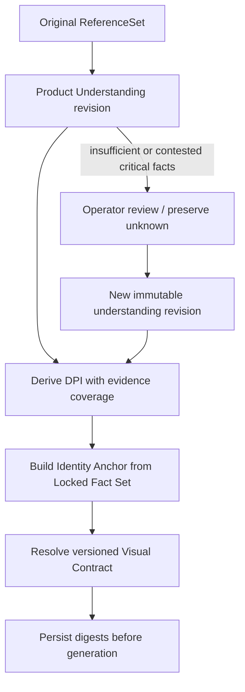
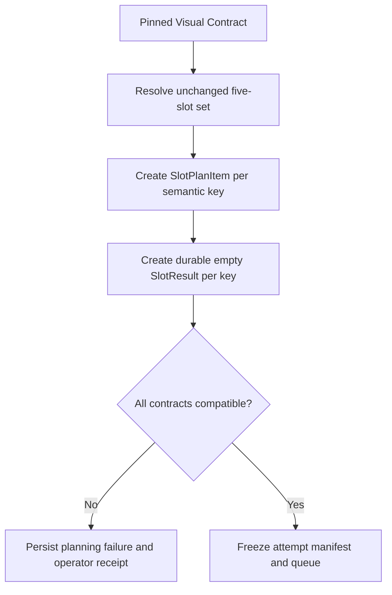
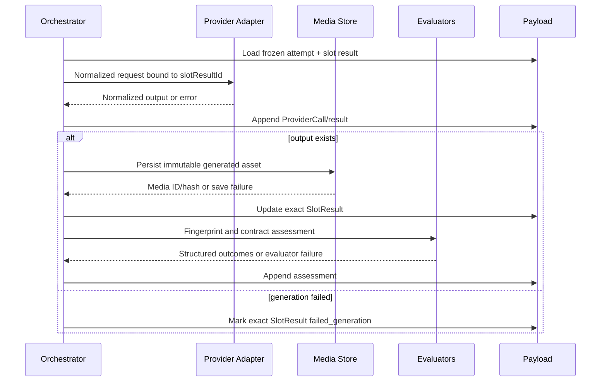
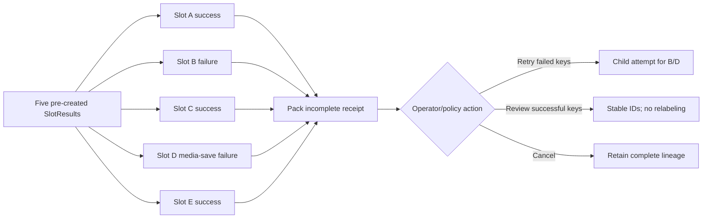
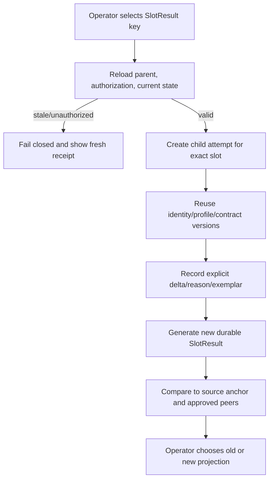
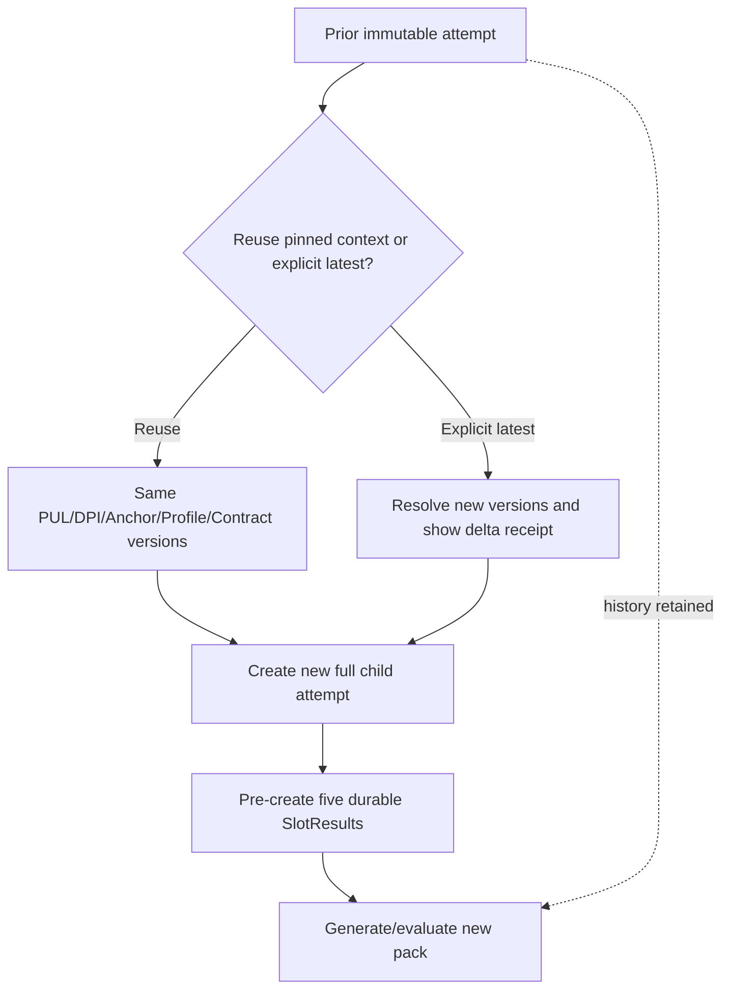
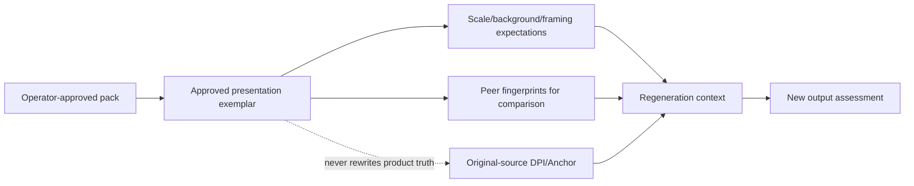
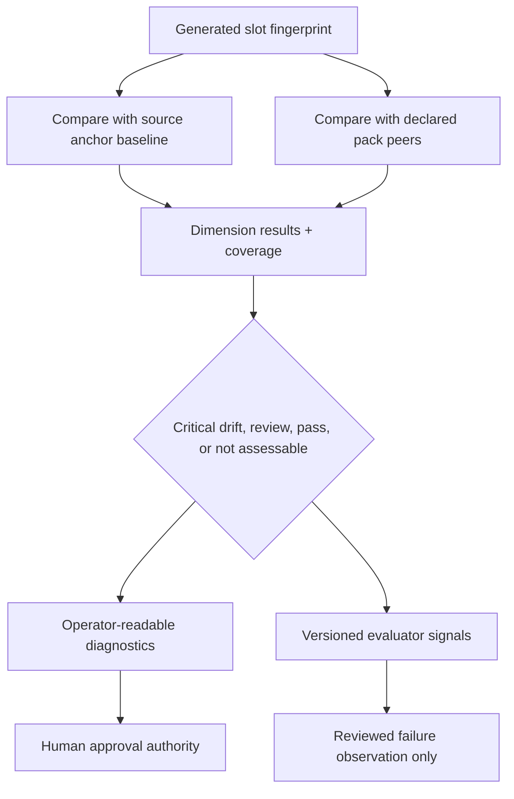
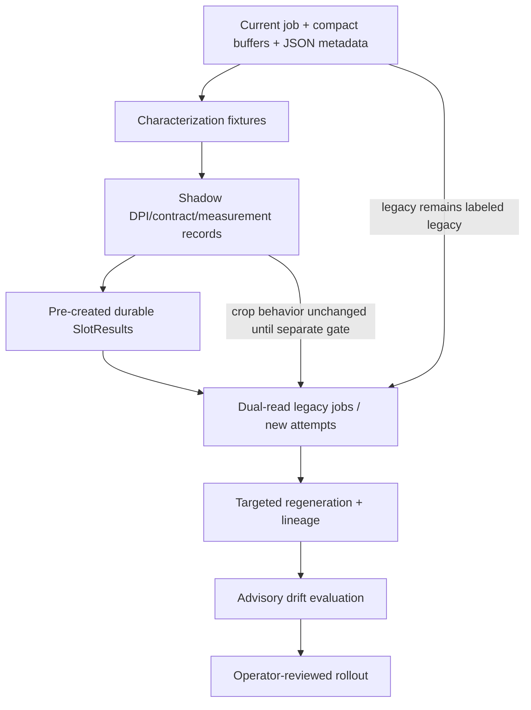

# Visual Consistency Engine V1 — Canonical Design

Status: architecture specification; not implemented

Date: 2026-07-26
Scope: provider-neutral visual identity and five-slot coherence contracts

This document is the canonical specification for visual consistency within the target image platform defined by `project-control/IMAGE_GENERATION_BLUEPRINT_V1.md`. It consumes the canonical Product Understanding design in `project-control/PRODUCT_UNDERSTANDING_LAYER_V1.md`; it does not replace that layer. Current runtime code and the dated audits remain authoritative for behavior that exists today.

The target chain is:

> One Product Understanding revision → one Digital Product Identity → one Identity Anchor → one Visual Contract → five durable slot results → one coherent pack.

This specification does not change prompts, cameras, slot angles, providers, runtime code, production state, or generated media. It defines the contracts required before those implementation changes can be evaluated safely.

## Authority and reconciled decisions

- Payload remains the source of truth and Telegram remains the primary operator workspace.
- The Image Generation Blueprint owns orchestration, attempts, provider adapters, prompt modules, slot planning, Media lifecycle, quality, Telegram task UX, and versioning.
- The Product Understanding Layer owns family classification, reference sufficiency, semantic product facts, operator overrides, the Product Identity Fingerprint, and the Locked Fact Set.
- The Visual Consistency Engine (VCE) owns the provider-neutral visual realization of those facts, pack/slot invariants, geometry and framing contracts, comparable fingerprints, and identity-drift assessments.
- The current five slot keys and meanings are migration inputs. This document does not choose new slot angles or redesign their purposes.
- The current deterministic crop-window centering implementation conflicts with the long-term no-deterministic-crop principle. VCE may measure bounding boxes and occupancy, but it must not use those measurements to crop output pixels.
- The earlier protected-brand generation-gate recommendation is superseded. Protected-brand status never changes VCE eligibility, contract selection, drift thresholds, or regeneration availability.
- The explicit unknown-product profile in Product Understanding remains the truthful fallback. VCE must not introduce or recreate an “Identity Safe Mode.”

## 1. Purpose and boundaries

### 1.1 Purpose

The Visual Consistency Engine answers four questions for every generation pack:

1. What visually defines this exact product, within the limits of the source evidence?
2. Which properties must remain identical, which may vary within bounds, and which remain unknown?
3. How must five semantically different slots remain recognizably one product and one controlled photography set?
4. How can the system describe drift, failure, regeneration, and approval without losing lineage or relying on array position?

VCE converts an immutable Product Understanding revision into four versioned artifacts:

- a `DigitalProductIdentity` (DPI);
- an `IdentityAnchor` derived from verified identity-critical facts;
- a `VisualContract` with product-, pack-, slot-, and regeneration-level invariants;
- comparable `VisualFingerprint` and drift-assessment contracts for source and generated assets.

### 1.2 Responsibilities

The engine:

- binds all five planned slots to the same understanding, DPI, anchor, profile, and contract versions;
- represents product geometry, topology, materials, color regions, seams, hardware, ornaments, and unknowns in provider-neutral structures;
- defines measurable framing, scale, bounding, occupancy, distance, and edge-clearance bands without cropping;
- distinguishes product invariants from presentation variation;
- pre-creates durable slot identities so failure cannot compact or relabel later results;
- defines cross-slot and slot-pair consistency checks;
- produces structured per-slot and pack-level drift diagnostics;
- preserves stable contracts on retry, targeted regeneration, provider fallback, and full regeneration;
- allows approved generations to contribute presentation expectations without becoming product truth;
- exposes concise Telegram summaries and operator decisions while keeping Payload authoritative.

### 1.3 Non-responsibilities

VCE must not:

- classify a product family from scratch;
- reinterpret or overwrite a Product Understanding fact;
- fill an unknown with an inferred visual convention;
- write final prompt wording or concatenate prompt modules;
- select or call a provider;
- choose actual camera angles or degree values;
- redesign the canonical five slot purposes;
- crop, center, mirror, resize, or otherwise transform pixels;
- approve images, publishing, activation, advertising, claims, authenticity, Shopier, or dispatch;
- use protected-brand status as a generation or consistency gate;
- replace operator judgment;
- modify its contracts, thresholds, profiles, or evaluators from runtime outcomes automatically.

### 1.4 Relationship to downstream systems

VCE outputs are inputs to slot planning, prompt-module resolution, provider requests, post-generation evaluators, Telegram review, and future failure-library observations. Provider and prompt systems serialize the contract; they do not own it. Evaluators assess it; they do not mutate it. Human approval remains authoritative.

## 2. Core principles

1. **One product, one visual identity.** Every slot in a pack references one DPI and one Identity Anchor digest.
2. **Identity before prompting.** No prompt or slot request is compiled until the exact Product Understanding, DPI, anchor, profile, and contract versions are pinned.
3. **Provider-neutral consistency.** Contracts describe outcomes and evidence, not Gemini/OpenAI request fields.
4. **Evidence before visual assumptions.** Unsupported regions remain unknown; a conventional shoe detail is not evidence that this shoe has it.
5. **Explicit geometry contracts.** Geometry is expressed as normalized observations, qualitative topology, and tolerance bands with evidence/coverage.
6. **Deterministic metadata, not deterministic crop hacks.** IDs, versions, hashes, plans, measurements, and assessments are deterministic. Generated pixels remain nondeterministic; VCE does not crop them into compliance.
7. **Per-slot contracts, not free-form generation.** Every requested slot has a stable key, purpose, contract, result record, and evaluation context.
8. **Immutable attempt lineage.** Request manifests and version pins do not change after attempt creation. Regeneration creates descendants, not rewritten history.
9. **Durable results, including failure.** Every requested slot yields one durable result record even when generation or Media persistence fails.
10. **No compaction.** Success arrays cannot define slot identity. Slot result IDs and keys do.
11. **Operator authority.** Machine and heuristic assessments are advisory until an explicit policy says otherwise; human approval is final.
12. **Stable regeneration.** Retry and regeneration explicitly declare which identity/contract versions are reused and what changed.
13. **Original/generated separation.** Original/operator evidence establishes product identity. Generated media may become an approved presentation exemplar but cannot rewrite product facts.
14. **Unknown is preserved.** `unknown`, `not_visible`, and `not_assessable` are valid outcomes, not invitations to invent.
15. **Version everything that changes meaning.** DPI schema, anchor policy, visual contract, geometry contract, distance contract, slot contract, fingerprint extractor, and drift policy are independently versioned.
16. **No autonomous runtime self-modification.** Outcomes may create reviewed failure observations; only an approved versioned release changes behavior.

## 3. Digital Product Identity (DPI)

### 3.1 Definition

Digital Product Identity is the provider-neutral visual model of one exact physical product as supported by one immutable Product Understanding revision and original reference set. It is non-biometric. It is not an embedding owned by a provider, a prompt, a generated image, a product claim, or a merchandising description.

DPI answers “what must still look like this product from another permissible presentation?”

### 3.2 Relationship to Product Understanding

Product Understanding supplies:

- product ID and understanding revision/digest;
- effective family and candidate ambiguity;
- source ReferenceSet and Reference Sufficiency Map;
- semantic Product Identity Fingerprint;
- material, color, silhouette, construction, sole, closure, hardware, pattern, and marking facts;
- fact state/provenance/confidence;
- Locked Fact Set and prohibited assumptions;
- operator overrides and profile reference.

VCE does not reclassify or “improve” these facts. It derives a DPI revision by normalizing supported facts into visual comparison structures and adding source-derived visual observations where Product Understanding deliberately stops, including:

- dimensionless proportion relationships when the reference supports them;
- region and topology relationships;
- normalized silhouette/landmark observations with confidence;
- visible material-zone and color-zone layout;
- source framing observations separated from product geometry;
- explicit comparison coverage and tolerances;
- contract-ready unknown/contested regions.

Any new observation is evidence with extractor/version/media provenance. It is not automatically a verified product fact. If a derived observation conflicts with Product Understanding, it is marked contested and returned for operator review; DPI cannot override the source record.

### 3.3 DPI components

| Component | Meaning | Typical state |
|---|---|---|
| `silhouette` | Supported outer shape/topology descriptors across visible orientations | verified, inferred, partial, unknown |
| `toeForm` | Shape, volume class, taper/roundness relationship, supported toe landmarks | inherited plus derived observation |
| `heelForm` | Back/heel topology, lift class, counter shape, supported landmarks | inherited; unknown if obscured |
| `soleGeometry` | Thickness class, edge/profile continuity, toe/heel relation, outsole visibility | inherited/derived with source coverage |
| `upperHeight` | Low/ankle/high qualitative structure and supported relative relationships | inherited; never estimated from perspective alone |
| `openingShape` | Topline/opening/back construction and continuity | inherited plus topology normalization |
| `vampGeometry` | Qualitative length class, width/shape relation, adornment zones | especially critical for loafers |
| `collarLine` | Opening/collar path and relation to heel/quarters | unknown when not visible |
| `seamTopology` | Named key seams, apron paths, facing/panel boundaries, continuity | source evidence and operator corrections |
| `hardwareTopology` | Presence/absence/unknown, count, type, position, connected regions | locked only with evidence |
| `ornamentTopology` | Penny saddle, tassels, bow, bit, overlays, badges, or explicit none/unknown | exact topology, not fashion assumption |
| `dominantProportions` | Dimensionless relations with confidence and viewpoint limitations | bounded observations, never fabricated precision |
| `asymmetries` | Deliberate medial/lateral or left/right differences supported by evidence | unknown unless reference shows them |
| `colorLayout` | Region-to-color relationships, accents, edge colors, uncertainty under lighting | inherited facts plus normalized zones |
| `materialZones` | Region-to-material/finish relationships and boundaries | D-355M-compatible source |
| `markings` | Visible text/logo/embossed zones as fidelity facts, not brand eligibility | inherited/protected evidence |

### 3.4 Observation classes

DPI uses four distinct kinds of values:

- `locked_fact`: inherited from operator-verified Product Understanding facts;
- `supported_observation`: derived from original references with evidence and confidence;
- `contract_default`: a presentation rule, never a statement about product anatomy;
- `unknown_or_contested`: unavailable or conflicting, carried forward without invention.

### 3.5 Operator confirmation

Operator-confirmable DPI components include silhouette class, back construction, toe/heel form, vamp class, opening line, seam paths, hardware/ornament topology, material/color zones, and characteristic asymmetry. Confirming a component creates a Product Understanding override/revision when it changes product truth, then derives a new DPI revision. VCE must not create an untracked second source of operator facts.

### 3.6 Unknown preservation

Each DPI component carries:

- state: `locked | supported | uncertain | contested | unknown | not_applicable`;
- evidence IDs and visible regions;
- comparison coverage;
- confidence/reasons;
- permitted downstream behavior when unknown.

Unknown geometry is excluded from strict drift scoring. The contract may prohibit unsupported invention, request confirmation, or mark the dimension `not_assessable`; it cannot replace it with a family convention.

### 3.7 Version and digest

A DPI revision pins:

- Product Understanding revision/digest;
- DPI schema and derivation policy versions;
- source media IDs/hashes;
- extractor versions;
- operator-confirmed fact references;
- canonical serialization digest.

Used DPI revisions are immutable. New evidence or operator correction creates a new Product Understanding revision first and then a new DPI revision.

## 4. Identity Anchor

### 4.1 Definition

The Identity Anchor is the smallest explicit subset of DPI that is both identity-critical and sufficiently supported to be non-negotiable across every slot in an attempt. It prevents five slot requests from becoming five independent interpretations.

It is not a generated “hero” image, an image embedding, a prompt paragraph, or the entire DPI. It is a structured, versioned constraint set with a stable digest.

### 4.2 Anchor contents

An anchor may include:

- effective family/subtype and back construction;
- primary silhouette topology;
- toe, heel, opening, vamp, upper, and sole relationships;
- closure/lacing topology;
- key seam/apron/panel paths;
- material and finish by zone;
- color layout and accent positions;
- hardware presence/absence/type/count/location;
- ornament topology;
- characteristic visible markings and asymmetries;
- prohibited assumptions and critical unknowns;
- the exact Locked Fact Set and Product Identity Fingerprint digests.

### 4.3 Fixed, bounded, flexible, and unknown

| Constraint mode | Meaning | Example category |
|---|---|---|
| `exact` | Must not change semantically across slots | hardware count/type/location, backless vs closed, seam topology |
| `bounded` | May vary only within a versioned tolerance envelope | measured occupancy, normalized proportion observation under viewpoint limits |
| `role_dependent` | Varies only because the slot purpose requires it | visible face, detail emphasis, product count/layout if already part of slot contract |
| `flexible` | Presentation variation is allowed and does not affect identity | soft shadow shape within pack background rules |
| `unknown` | Not supported; cannot be asserted or strictly compared | unseen outsole pattern |

Identity-critical product facts cannot be downgraded to flexible by a profile or slot. A slot contract may expose a different face but cannot alter the anchor.

### 4.4 Locked Fact Set relationship

The Product Understanding Locked Fact Set is the authoritative semantic input. The Identity Anchor references it unchanged and adds only VCE-specific comparison modes, normalized visual relationships, evidence coverage, and tolerances. It cannot contradict, remove, or silently strengthen a locked fact.

When an operator changes a locked fact:

1. Product Understanding appends the operator override;
2. a new understanding revision and Locked Fact Set digest are created;
3. a new DPI and Identity Anchor are derived;
4. future attempts may select the new revisions explicitly;
5. historical attempts remain pinned to the old anchor.

### 4.5 D-355M and D-355N

- D-355M Material Identity Lock serializes anchor material type, finish, undertone relationships, stitching, and sole/material-zone constraints.
- D-355N Product Visual Fact Lock serializes operator-verified product facts, hardware/ornament truth, critical unknowns, and prohibited assumptions.
- Both module versions and serialized digests are stored on the attempt.
- The Identity Anchor is the data contract; D-355M/D-355N are downstream prompt-module representations. Prompt text is not redesigned here.

### 4.6 False hardware prevention

The anchor uses an explicit hardware state:

- verified absent → hardware addition is forbidden;
- verified present → exact type/count/location/finish is preserved;
- supported but unverified → visible as a confirmation candidate;
- unknown/ambiguous → no unsupported hardware may be added, and hidden hardware may not be declared absent;
- contested → operator resolution or a warning-bearing unknown constraint.

Stitched loops, thread, decorative seams, same-material embossing, shadows, glare, and reflections are separate visual primitives. “Shiny,” “loop-shaped,” or “bridge-like” does not promote them to hardware. Positive evidence or an operator decision is required.

## 5. Visual Contract

### 5.1 Definition

The Visual Contract is the immutable, versioned manifest governing one pack. It binds product identity to measurable presentation constraints without containing final prompts or provider payloads.

It contains four scopes.

### 5.2 Product-level contract

Applies to every slot and includes:

- understanding, DPI, Identity Anchor, Locked Fact Set, and profile references;
- identity-critical exact/bounded/unknown rules;
- material/color/hardware/ornament/seam topology;
- silhouette and geometry-preservation requirements;
- source sufficiency warnings and not-assessable dimensions;
- permitted transformations policy, including no deterministic crop.

### 5.3 Pack-level contract

Applies across the complete five-slot set and includes:

- exactly one product identity and one anchor digest;
- pack slot-set/version and completeness policy;
- background neutrality and consistency class;
- lighting-family consistency assumptions;
- product scale-band families for comparable full-product slots;
- shared color-management expectations;
- left/right/mirroring policy;
- material-zone, hardware, ornament, seam, toe, heel, sole, and color-block consistency;
- pair/single relationships and cross-slot comparison groups;
- pack-level drift policy and human-review requirements.

Pack consistency does not require five identical images. It requires role-appropriate diversity inside one identity and one controlled presentation system.

### 5.4 Slot-level contract

Each planned slot inherits the product and pack contracts, then adds:

- stable slot ID/key/purpose/version;
- expected subject count/layout class;
- orientation-family intent without degrees;
- camera-distance/framing class;
- product bounding/occupancy/edge-clearance bands;
- role-specific visibility goals and allowed occlusion;
- identity regions that must be assessable;
- allowed and forbidden variation;
- evaluator definitions and severity policy;
- timeout/retry/failure behavior owned by orchestration.

### 5.5 Regeneration contract

The regeneration contract states:

- parent attempt/result IDs;
- whether regeneration is retry, targeted slot, full pack, provider fallback, or corrected-identity reattempt;
- versions carried forward unchanged;
- explicit deltas and operator reason;
- approved pack exemplar references, if any;
- which assessment baselines apply;
- whether “latest” understanding/profile/contract was explicitly requested.

No implicit “latest” value is stored. All versions resolve before the new attempt is created.

### 5.6 Invariant categories

| Category | Examples | Default behavior |
|---|---|---|
| Product identity | family, silhouette topology, back construction | exact/anchor-bound |
| Geometry | toe/heel/sole/opening relationships | exact semantic form plus bounded measurable observations |
| Scale/framing | occupancy, bbox center, edge clearance, distance class | slot- and comparison-group bands |
| Material/color | material-zone type/finish and color layout | exact semantic relationships; appearance tolerances evaluated separately |
| Pack presentation | background/lighting family | consistent within versioned tolerance |
| Slot role | purpose, subject count, visibility goal | fixed by Slot Contract |
| Allowed diversity | viewpoint family, role-specific emphasis | allowed only where declared |
| Forbidden variation | new hardware, missing seam, family conversion, crop truncation | major/critical drift |

## 6. Geometry Lock

### 6.1 Purpose

Geometry Lock is the VCE contract for preserving shape, proportion, framing, and spatial presentation without using post-generation cropping as a correction mechanism. “Lock” means constraints and evaluation, not forced pixel manipulation.

### 6.2 Product Bounding Contract

For each slot, a bounding contract may specify versioned normalized bands for:

- subject bounding box center (`centerX`, `centerY`);
- box width/height relative to canvas;
- longer-side occupancy;
- subject pixel/area occupancy when segmentation is reliable;
- top/right/bottom/left edge clearance;
- full-product visibility and truncation policy;
- expected product-count grouping box for pair layouts;
- measurement confidence and segmentation method/version.

Numeric values belong to versioned future Slot Contracts/profiles, not this architecture document. VCE defines the language and lineage, not the final bands.

### 6.3 Scale Contract

Scale is defined through comparable normalized measures, not physical centimeters:

- occupancy class/band;
- longer-side box ratio;
- reference baseline group (full-product, pair, detail, or another slot role);
- allowed pack variance by comparison group;
- measurement method/version and confidence.

A detail slot can legitimately use a different scale class. It is compared against its contract, not forced into the full-product band.

### 6.4 Centering Contract

Centering specifies a tolerance region for the measured subject center and optional baseline alignment. It does not command a crop. Out-of-band generation is retained, assessed, and shown to the operator or regenerated through a new attempt according to policy.

### 6.5 Canvas Occupancy Contract

Canvas occupancy distinguishes:

- bounding-box occupancy;
- estimated subject-area occupancy;
- group occupancy for pair layouts;
- detail-region occupancy;
- not-assessable outcomes when segmentation/background is unreliable.

The contract never treats a failed measurement as compliance.

### 6.6 Rotation and orientation constraints

VCE uses provider-neutral semantic values such as:

- dominant axis class;
- upright/baseline expectation;
- left/right/medial/lateral visibility state;
- orientation-family consistency group;
- mirroring permitted/forbidden/unknown;
- characteristic asymmetry protection.

It does not specify actual camera degrees. Automatic horizontal flipping is forbidden when it can reverse text, branding, buckles, medial/lateral construction, or other asymmetry. An evaluator may identify orientation drift; a transform policy is a separate future decision.

### 6.7 Aspect-ratio normalization

Preferred strategy order:

1. request the contract aspect ratio through a capable provider adapter;
2. retain the provider output and measure compliance;
3. if a later approved transform stage is necessary, use full-content scale-to-fit plus background extension/padding with complete transform lineage;
4. never crop product pixels into compliance under V1’s long-term principle.

VCE itself produces metadata and assessments only.

### 6.8 Silhouette preservation

Silhouette rules compare supported topology and normalized observations while accounting for viewpoint and source sufficiency. They must distinguish:

- true product shape drift;
- expected viewpoint-dependent contour change;
- occlusion/not-assessable regions;
- pair overlap;
- segmentation failure.

No strict check is generated for an unknown source region.

### 6.9 Responsibility split

| Concern | Owner |
|---|---|
| Product geometry truth | Product Understanding + DPI/Anchor |
| Contract bands and comparison groups | Visual Contract / Slot Contract |
| Final instruction wording | versioned prompt modules |
| Provider size/aspect capabilities | provider adapter |
| Measurements | versioned geometry evaluator |
| Pixel transforms | separately governed transform pipeline; no deterministic crop |
| Compliance decision | Quality Policy plus operator authority |

### 6.10 Current crop-window conflict

`src/lib/imageCentering.ts` currently detects a foreground box, computes a centered square window from target `frameCoverage`, edge-extends when necessary, extracts that window, and resizes it. The task applies this by default before overlay. This can improve apparent consistency but it is still a deterministic crop-window operation and depends on background/segmentation assumptions.

Target migration must first run geometry measurement in shadow mode, compare measurements and operator outcomes, and then remove crop dependence behind an explicit reversible rollout. The current transform must not be silently relabeled as Geometry Lock.

## 7. Camera Distance Contract

### 7.1 Distance versus angle

Camera distance describes framing scale and subject prominence. Camera angle describes viewing direction and orientation. They are independent:

- a near and a medium shot may use the same orientation family;
- two slots may share a distance class while showing different product faces;
- VCE defines distance/framing language but not actual viewing angles.

### 7.2 Provider-neutral distance classes

Candidate contract language:

- `near_detail`: a supported product region is emphasized; whole-product visibility is not expected;
- `medium_product`: the whole product/group is visible with balanced edge clearance;
- `far_context`: the product/group is fully visible with greater context; not automatically allowed for the current fixed pack;
- `custom_bounded`: a versioned profile defines occupancy/clearance bands without provider-specific units.

These are schema concepts, not assignments to current slots. Final mappings require a separate slot/profile decision.

### 7.3 Framing contract fields

- distance class;
- whole-product, group, or detail framing mode;
- bounding/occupancy band reference;
- edge-clearance band;
- truncation allowance;
- detail region/purpose when applicable;
- perspective-distortion tolerance class;
- comparison group and expected pack variance;
- measurement coverage and `not_assessable` policy.

### 7.4 Tolerances

Tolerance bands are versioned profile/slot data. They may vary by product family when justified by evidence, but cannot weaken identity invariants. Camera-distance compliance is a presentation dimension, not proof of product identity.

## 8. Slot Contract System

### 8.1 Slot identity

A slot is identified by a stable semantic key plus version, never by array position. Display order is metadata only. The target retains the existing five semantic keys until a separate operator decision changes them, but all storage, buttons, comparisons, and regeneration actions use slot/result IDs.

### 8.2 Slot Contract contents

Each `SlotContract` includes:

- stable `slotDefinitionId`, `slotKey`, and version;
- operator label and purpose;
- slot-set membership and display order;
- product/pack contract references;
- subject count/layout class;
- orientation-family intent without final degrees;
- Camera Distance Contract reference;
- Geometry/Bounding Contract reference;
- required/optional identity regions;
- allowed variation and forbidden drift;
- cross-slot comparison groups;
- evaluator definitions and severity mapping;
- provider capability requirements, described abstractly;
- prompt-module references owned downstream;
- fallback/failure behavior and completeness policy.

### 8.3 Durable planning

Before provider work begins, the orchestrator creates one `SlotPlanItem` and one durable `SlotResult` shell per requested slot:

```text
planned → running → generated → media_persisted → evaluated → previewed
                    ↘ failed_generation
                                      ↘ failed_media
                                                   ↘ evaluation_failed
```

Terminal states remain queryable. A failed slot does not disappear.

### 8.4 Result identity

Every provider call receives `attemptId` and `slotPlanItemId`. It returns a normalized result bound to those IDs. The provider adapter cannot return a bare compacted buffer list. Media persistence updates the same SlotResult. Telegram review actions carry an opaque token that resolves to the SlotResult ID.

### 8.5 Missing and failed slots

- A generation failure leaves `status=failed_generation`, provider error, call lineage, and no Media ID.
- A Media-save failure leaves `status=failed_media`, retained recoverable artifact reference when possible, and exact slot identity.
- Later slots keep their own keys and results.
- Pack completeness is calculated from requested slot IDs and terminal statuses.
- Retry/targeted regeneration creates a child result/attempt linked to the failed slot; it never fills the hole by shifting another result.

### 8.6 Versioning

Slot definition, contract, and slot-set versions are separate. A wording-only prompt module change does not silently change the Slot Contract. Any semantic purpose, layout, required region, geometry, distance, or evaluator-policy change requires the appropriate version bump.

### 8.7 Current-slot compatibility

The existing `imageSlotContract.ts` supplies stable keys, labels, order, purpose text, `frameCoverage`, and layout. Reusable pieces are keys and semantic purpose. `frameCoverage` becomes legacy contract evidence, not automatically the target band. Contradictory pair-generation comments, prompt composition freedom, and runtime behavior must be characterized before migration.

## 9. Cross-slot consistency rules

### 9.1 Pack invariants

Every comparable output in a pack must share:

- understanding, DPI, Identity Anchor, Locked Fact Set, profile, and Visual Contract digests;
- product family and structural identity;
- material-zone topology and finish identity;
- hardware/ornament truth;
- toe, heel, sole, opening, closure, seam, and color-block identity;
- marking/asymmetry truth where visible;
- versioned background/lighting family expectations;
- slot identity and lineage.

### 9.2 Dimension rules

| Dimension | Required consistency | Allowed diversity |
|---|---|---|
| Silhouette | same anchored topology and supported proportions | viewpoint-dependent contour change within evaluator coverage |
| Scale | within each slot/comparison-group band | detail or pair roles may use different declared groups |
| Material zones | same region/material/finish relationships | lighting appearance within bounded pack tolerance |
| Hardware | same presence/absence/type/count/location | viewpoint may hide a component; hidden is not omitted if not visible |
| Toe/heel | same form and structural relationship | foreshortening when the slot orientation requires it |
| Seam paths | same supported paths and connections | partial visibility/occlusion |
| Left/right | correct matched handedness and preserved asymmetries | role-specific side visibility |
| Outsole | same edge/profile/color/tread facts | underside may be not assessable in some slots |
| Ornament | same type/count/topology/location | visibility changes with orientation, not identity |
| Color blocks | same region/color mapping | bounded lighting/white-balance differences |

### 9.3 Slot-pair constraints

Slot Contracts may declare comparison pairs/groups such as:

- full-product slots for scale and silhouette consistency;
- pair/single views for product identity and handedness;
- side/rear views for heel/sole continuity;
- top/side views for opening/vamp/seam continuity;
- detail/full-product views for material-zone provenance.

This specification does not assign actual angles. Pair constraints operate on semantic regions and slot purposes.

### 9.4 Detail behavior

A detail slot may depart from full-product scale, bounding, and whole-product visibility. It must:

- identify a source-supported detail region;
- preserve the material/color/seam/hardware truth of that region;
- declare which global geometry dimensions are not assessable;
- avoid introducing a novel ornament or texture;
- remain linked to the same anchor and pack.

### 9.5 Coherent diversity

Permissible diversity includes role-specific viewpoint, visible surface, controlled framing, and detail emphasis. It does not include different shoes, family conversion, changed proportions, new/missing components, arbitrary scale drift, incompatible backgrounds, or inconsistent handedness.

## 10. Visual Fingerprint

### 10.1 Definition and relationship

The terms form a deliberate hierarchy:

```text
Product Understanding Record
  └─ semantic Product Identity Fingerprint + Locked Fact Set
       └─ Digital Product Identity
            └─ Identity Anchor
                 └─ source Visual Fingerprint baseline
                      └─ generated Slot Visual Fingerprints
                           └─ drift assessments
```

The Product Understanding fingerprint expresses semantic identity truth. DPI normalizes it for visual comparison. The Identity Anchor selects non-negotiable supported invariants. A Visual Fingerprint is a versioned, asset-specific comparison representation used by evaluators.

### 10.2 Fingerprint contents

A fingerprint may contain:

- asset/media and source/slot role;
- anchor/contract versions;
- comparison coverage by identity region;
- normalized silhouette descriptor and landmarks;
- bounded geometry/ratio observations;
- seam/material/color/hardware/ornament region topology;
- orientation, product-count, bbox, occupancy, and edge-clearance measurements;
- confidence, extractor versions, and not-assessable dimensions;
- canonical digest.

No provider-owned opaque embedding may be the only representation. Embeddings may be one optional evaluator signal with provider/model/version lineage.

### 10.3 Source and generated fingerprints

- `source_baseline`: derived only from original/operator evidence and DPI; operator-correctable through Product Understanding/DPI revision.
- `generated_slot`: derived from one immutable SlotResult and compared to source/anchor and relevant pack peers.
- `approved_pack_exemplar`: a projection of operator-approved generated results describing accepted presentation, not product truth.

### 10.4 Approved-generation reuse

Approved generations may contribute:

- accepted scale/framing/background relationships;
- pack-level presentation tolerance evidence;
- a comparison exemplar for targeted regeneration;
- operator-approved visibility/emphasis choices.

They must not:

- add product anatomy, hardware, markings, seams, material, or color facts;
- override original-source evidence;
- become provider reference inputs automatically;
- silently tighten/relax a contract;
- modify the source baseline or anchor.

Any provider input reuse of an approved generation is a separate explicit future policy with operator visibility, lineage, and feedback-loop safeguards.

### 10.5 Reuse and versioning

Source fingerprints are reusable across attempts pinned to the same DPI/anchor revision. Generated fingerprints stay with their SlotResults. Extractor or schema changes create new fingerprint versions; historical assessments retain old versions.

## 11. Identity Drift Score

### 11.1 Architecture

“Identity Drift Score” is a structured assessment vector, not one opaque number. It has:

- per-slot comparison to source baseline/anchor;
- pair/group comparisons to other pack slots;
- pack aggregation showing worst critical dimension and incomplete coverage;
- operator-readable findings and evidence;
- evaluator-readable normalized signals and version lineage.

### 11.2 Drift dimensions

At minimum:

- silhouette;
- structural geometry and dominant proportions;
- toe form;
- heel/back form;
- sole/outsole form;
- opening/vamp/collar topology;
- closure, seam, panel, and marking topology;
- hardware and ornament presence/count/location;
- material-zone layout and finish;
- color-block layout;
- scale, bounding, occupancy, centering, and edge clearance;
- left/right orientation, handedness, and asymmetry;
- product identity confidence/coverage.

Geometry/framing compliance remains distinguishable from semantic identity drift. A centered wrong shoe is still wrong; an off-center correct shoe is a presentation violation, not necessarily identity drift.

### 11.3 Outcomes and thresholds

Each dimension returns:

- normalized drift magnitude or categorical signal;
- `within_contract | review | major_drift | critical_drift | not_assessable`;
- baseline and compared asset IDs;
- evidence/measurement coverage;
- reasons and affected regions;
- evaluator/method/version;
- threshold policy/version.

Profile-specific threshold values are not chosen here. Missing/unknown evidence yields `not_assessable`, never an automatic pass.

### 11.4 Per-slot assessment

Per-slot assessment combines:

- deterministic metadata/geometry checks;
- topology and rule-based checks;
- optional model/evaluator outputs;
- source/peer fingerprint comparison;
- operator findings and rejection reasons as separate evidence.

### 11.5 Pack aggregation

Pack aggregation reports:

- requested, completed, failed, assessable, and approved slot counts;
- worst critical dimension and affected slots;
- comparison-group consistency;
- maximum/median drift where meaningful;
- missing comparisons and evaluator failures;
- overall outcome based on versioned Quality Policy;
- human decision separately.

It must not average away one critical hardware, silhouette, or family-conversion failure.

### 11.6 Evidence authority

| Signal | Authority |
|---|---|
| Deterministic metadata/geometry heuristic | reproducible advisory evidence |
| Machine evaluator | versioned advisory evidence with provider/model lineage |
| Operator feedback | authoritative human observation/rejection reason |
| Approval decision | final authority for asset/pack approval, separate from publishing |

No score automatically changes Product Understanding, DPI, profile, prompt module, or contract. It may create a reviewed Product Failure Library observation.

### 11.7 Operator diagnostics

Diagnostics should say what changed:

```text
Slot 4 · major drift
- heel/back form differs from anchor
- sole edge appears thicker than the supported band
- hardware: not assessable from this view
- framing: within slot contract
Compare: source regions heel + lateral · Anchor A@3
```

Avoid “quality 62” without dimensions, coverage, and evidence.

## 12. Regeneration consistency

### 12.1 Immutable lineage model

An attempt’s request manifest is immutable after creation. Provider retries append ProviderCall records; generated artifacts and evaluations append durable records. Targeted or full regeneration creates a new descendant attempt, never clears/reuses the parent job’s evidence.

### 12.2 Carried-forward data

Retry and default regeneration preserve:

- Product Understanding revision/digest;
- DPI revision/digest;
- Identity Anchor and Locked Fact Set digests;
- Generation Profile/version;
- Visual, Geometry, Camera Distance, Slot Set, and Slot Contract versions;
- prompt-module manifest versions/hash policy;
- ReferenceSet IDs/hashes;
- relevant operator-confirmed facts and regeneration reason;
- parent attempt/result lineage;
- approved-pack exemplar reference when explicitly selected.

### 12.3 Recalculated data

For a new output, recalculate:

- provider call/result/usage/timing;
- Media/artifact lineage;
- output Visual Fingerprint;
- geometry measurements;
- slot and pack drift assessments;
- current task progress/receipt;
- provider capability/availability receipt when selection occurs.

The versions and baselines used for those calculations remain pinned.

### 12.4 Operation types

| Operation | Lineage rule | Contract behavior |
|---|---|---|
| Provider retry | New ProviderCall under the same still-running slot/attempt policy | identical manifest; retry reason recorded |
| Targeted slot regeneration | New child attempt/SlotResult for explicit slot key | same anchor/profile/contracts by default; operator delta explicit |
| Full regeneration | New child attempt with complete slot plan | same pinned versions by default |
| Provider fallback | Explicit provider-selection event/call; never hidden | identity and visual contracts unchanged; capability differences recorded |
| Later reattempt | New attempt from historical or current baseline | operator chooses historical pinned context or explicit latest context |
| After operator correction | New PUL/DPI/anchor revisions and new attempt | change receipt explains identity delta |

### 12.5 Stable approved expectations

An approved pack may become a presentation exemplar. Targeted regeneration can compare the new slot to the source anchor and the approved peer pack. The source anchor always wins on product truth. If the approved pack contains undetected identity drift, it must not propagate that drift as a new fact.

### 12.6 Targeted regeneration

The operator selects a stable slot result, not “image 3” in a compact array. The child attempt contains:

- target slot key/result;
- parent pack and approved peers;
- reason/dimension(s) to improve;
- unchanged pinned identity/contract versions;
- any operator regeneration note as a versioned delta module;
- new durable result and assessment.

Replacing a presentation projection never deletes or mutates the prior result.

### 12.7 Full regeneration

Default full regeneration reuses the exact prior identity/profile/contract context. “Use latest understanding/profile/contract” is an explicit separate action and produces a before/after version receipt. Provider fallback alone cannot change product identity or loosen consistency rules.

## 13. Loafer-specific consistency analysis

### 13.1 Repository-supported findings

Direct repository/audit evidence shows:

- current family/identity classification is free-form and lacks canonical loafer anatomy;
- Product Understanding V1 identifies back construction, vamp length, opening, apron seam, adornment, hardware, heel, sole, stitching, and symmetry as missing structured facts;
- the five provider generations use shared references and prompt locks but no persisted DPI/Identity Anchor/Visual Contract;
- outputs are generated independently; previously generated anchors were removed because they caused extra/ghost shoes;
- current checks focus on color and optional visible marking zones, not vamp/toe/opening/heel/sole consistency;
- slot buffers compact on failure, corrupting reliable loafer failure attribution;
- current crop-window centering and fixed coverage can change perceived framing but cannot guarantee loafer anatomy;
- pair slots are model-generated, while comments still describe deterministic duplication in places;
- horizontal side flipping can reverse genuine asymmetry, markings, or hardware;
- D-355M and D-355N provide material/hardware intent but `visualFacts` is unstructured and regeneration currently does not carry it forward explicitly;
- current regeneration clears and reuses the same job, loses prior job relationships, and forces Gemini.

### 13.2 Architectural inferences

- Loafers have a compact low-shoe silhouette where small vamp, opening, heel, and sole changes create a visibly different product even when color/material remain correct.
- Independent slot interpretation lets “typical loafer” conventions fill missing facts differently across slots.
- A hidden heel/back increases loafer↔mule/slipper conversion risk; a weak closure fact increases Oxford-like drift.
- Apron seams, saddles, tassels, bits, buckles, and thread loops require topology, not keyword presence, to remain stable.
- Model-generated pairs can disagree internally on tassel count, penny strap geometry, seam path, and left/right construction.
- Post-generation scale normalization can make a pack appear aligned while masking identity drift; geometry compliance and identity drift must remain separate.

### 13.3 Hypotheses requiring real sample validation

- which slots/providers most often change vamp length or opening depth;
- whether certain source viewpoints increase mule/moccasin/Oxford conversion;
- which geometry descriptors best correlate with operator rejection;
- whether current crop-window centering materially changes perceived sole/vamp ratios;
- whether pair slots produce more ornament and seam inconsistency than single slots;
- appropriate drift thresholds for toe, vamp, opening, apron seam, heel, and sole;
- whether approved-pack exemplars improve targeted regeneration without propagating prior drift.

### 13.4 Loafer anchor requirements

When supported, the anchor should lock:

- closed/backless/slingback construction;
- toe shape and volume class;
- vamp length/shape relationship;
- opening/topline path and depth class;
- apron/moc seam presence and path;
- adornment topology: none, saddle, tassels, bit, buckle, bow, other;
- hardware truth, count, finish, and position;
- heel form/lift class;
- sole thickness/edge/color relationship;
- material/color zones and stitching paths;
- characteristic asymmetries and pair expectations.

Unknown components remain unknown and excluded from strict comparison.

### 13.5 Loafer-specific drift diagnostics

Future assessments should detect and describe:

- toe/vamp/opening geometry drift;
- apron seam loss, rerouting, or invention;
- heel collapse or backless conversion;
- mule/slipper/moccasin/formal-lace-up family conversion;
- hardware or tassel/penny-strap invention/omission;
- sole thickness/profile drift;
- silhouette flattening;
- pair asymmetry and ornament-count mismatch;
- scale/framing violations separately from identity violations.

No loafer-specific rule becomes active from one failure. Golden-set and Product Failure Library review are required.

## 14. Telegram operator UX

### 14.1 Future flow

```text
Product selected
  → Product Understanding summary
  → Visual Consistency summary
  → profile + five-slot plan summary
  → explicit generation action
  → durable job receipt/progress
  → complete or partial preview pack
  → approve / reject / targeted regenerate / compare / drift diagnostics
```

### 14.2 Pre-generation summary

```text
Görsel Tutarlılık · SN0421
Ürün: Loafer / Mokasen · Understanding rev 3
Profil: footwear.loafer@1.0.0
Kimlik: DPI 1.0 · Anchor A3 · Contract VC1
Kilitli: kapalı arka, uzun vamp, süet/mat, metal yok
Belirsiz: taban altı, iç yan
Referans: 2 özgün foto · uyarılı hazır
Plan: 5 sabit slot · aynı kimlik · crop yok
```

Primary action: `5 slot üret`. Secondary actions: `Kimliği incele`, `Kontratı gör`, `Profili değiştir`, `Referansları gör`, `İptal`.

### 14.3 Progress receipt

The receipt shows exact job/attempt, slot statuses by key, elapsed stage, retry/failure state, and the pinned anchor/profile/contract versions. It must not claim completion from only successful-buffer count.

### 14.4 Preview pack

Preview shows:

- requested/completed/failed slot matrix;
- pack consistency outcome and worst dimensions;
- each slot’s stable label/key and status;
- warnings such as identity drift, geometry band, hardware uncertainty, or evaluator unavailable;
- selected approved-pack comparison when relevant.

Conceptual actions:

- `Tüm uygun slotları onayla`;
- `Slotu onayla`;
- `Slotu reddet` with structured reason;
- `Bu slotu yeniden üret`;
- `Tüm paketi yeniden üret`;
- `Öncekiyle karşılaştır`;
- `Drift ayrıntısı`;
- `Kimlik düzelt` (returns to Product Understanding, then creates a new revision/attempt).

Approval remains image approval only. It does not approve publishing, claims, activation, advertising, Shopier, or dispatch.

### 14.5 Targeted regeneration receipt

The message states target slot, parent result, versions reused, explicit delta, selected exemplar, and new child attempt. It never says “replace image 3” without a slot key/result ID.

### 14.6 Callback security

Callbacks carry short opaque tokens only. The server reloads token, operator policy, chat/user, product, attempt, slot result, current state, expiry, and idempotency record. Missing or stale authorization fails closed. Callback payload ownership is not authorization.

## 15. Proposed data contracts

These are specification examples, not runtime implementations.

```ts
type VisualFactState = 'locked' | 'supported' | 'uncertain' | 'contested' | 'unknown' | 'not_applicable'
type ConstraintMode = 'exact' | 'bounded' | 'role_dependent' | 'flexible' | 'unknown'
type AssessmentOutcome = 'within_contract' | 'review' | 'major_drift' | 'critical_drift' | 'not_assessable'

interface VisualIdentityComponent<T = unknown> {
  path: string
  value: T | null
  state: VisualFactState
  mode: ConstraintMode
  evidenceIds: string[]
  sourceMediaIds: Array<string | number>
  confidence: { score: number; reasons: string[]; coverage: 'adequate' | 'partial' | 'insufficient' }
  toleranceRef?: string
  criticality: 'critical' | 'important' | 'descriptive'
}

interface DigitalProductIdentity {
  id: string
  productId: string | number
  revision: number
  schemaVersion: string
  derivationPolicyVersion: string
  productUnderstandingRevisionId: string
  productUnderstandingDigest: string
  referenceSetId: string
  sourceMediaHashes: string[]
  effectiveFamily: string
  semanticFingerprintDigest: string
  silhouette: VisualIdentityComponent[]
  toe: VisualIdentityComponent[]
  heel: VisualIdentityComponent[]
  sole: VisualIdentityComponent[]
  upper: VisualIdentityComponent[]
  openingAndVamp: VisualIdentityComponent[]
  seamsAndPanels: VisualIdentityComponent[]
  closure: VisualIdentityComponent[]
  hardwareAndOrnaments: VisualIdentityComponent[]
  materialZones: VisualIdentityComponent[]
  colorZones: VisualIdentityComponent[]
  markingsAndAsymmetries: VisualIdentityComponent[]
  dominantProportions: VisualIdentityComponent[]
  criticalUnknownPaths: string[]
  conflicts: string[]
  extractorVersions: string[]
  digest: string
  createdAt: string
}

interface LockedFactSet {
  productUnderstandingRevisionId: string
  factIds: string[]
  prohibitedAssumptions: string[]
  criticalUnknownPaths: string[]
  materialLockVersion: string
  visualFactLockVersion: string
  serializedCompatibilityDigest?: string
  digest: string
}

interface IdentityAnchor {
  id: string
  version: string
  dpiRevisionId: string
  dpiDigest: string
  lockedFactSet: LockedFactSet
  components: Array<VisualIdentityComponent & { anchorRuleId: string }>
  comparisonCoverage: Record<string, 'required' | 'optional' | 'not_assessable'>
  unknownPolicyVersion: string
  digest: string
  createdAt: string
}

interface NormalizedBand {
  min?: number
  max?: number
  target?: number
  unit: 'canvas_ratio' | 'subject_ratio' | 'categorical'
  tolerancePolicyId: string
}

interface GeometryContract {
  id: string
  version: string
  bboxCenterX?: NormalizedBand
  bboxCenterY?: NormalizedBand
  bboxWidth?: NormalizedBand
  bboxHeight?: NormalizedBand
  longerSideOccupancy?: NormalizedBand
  subjectAreaOccupancy?: NormalizedBand
  edgeClearance?: { top: NormalizedBand; right: NormalizedBand; bottom: NormalizedBand; left: NormalizedBand }
  fullProductVisibility: 'required' | 'role_dependent' | 'not_required'
  truncation: 'forbidden' | 'role_dependent'
  productCount: 'single' | 'matched_pair' | 'role_defined'
  rotationPolicy: 'upright' | 'slot_family' | 'unconstrained'
  mirroringPolicy: 'forbidden' | 'allowed_if_symmetric' | 'operator_confirmed'
  aspectRatioPolicy: { requested: string; cropAllowed: false; extensionPolicy?: string }
  measurementPolicyVersion: string
}

interface CameraDistanceContract {
  id: string
  version: string
  distanceClass: 'near_detail' | 'medium_product' | 'far_context' | 'custom_bounded'
  framingMode: 'whole_product' | 'group' | 'detail_region'
  geometryContractId: string
  comparisonGroup: string
  perspectiveToleranceClass: string
  detailRegionPath?: string
}

interface VisualContract {
  id: string
  version: string
  productId: string | number
  productUnderstandingRevisionId: string
  dpiRevisionId: string
  identityAnchorId: string
  generationProfile: { id: string; version: string }
  productInvariants: string[]
  packInvariants: string[]
  slotContractIds: string[]
  regenerationPolicyVersion: string
  driftPolicyVersion: string
  noDeterministicCrop: true
  protectedBrandAffectsEligibility: false
  digest: string
}

interface SlotContract {
  id: string
  slotDefinitionId: string
  slotKey: string
  version: string
  slotSetVersion: string
  displayOrder: number
  purpose: string
  subjectLayout: 'single' | 'matched_pair' | 'detail' | 'role_defined'
  orientationFamily: string
  cameraDistanceContractId: string
  geometryContractId: string
  requiredIdentityRegions: string[]
  optionalIdentityRegions: string[]
  allowedVariation: string[]
  forbiddenDrift: string[]
  comparisonGroups: string[]
  evaluatorDefinitionIds: string[]
  promptModuleRefs: Array<{ id: string; version: string }>
}

interface VisualFingerprint {
  id: string
  version: string
  role: 'source_baseline' | 'generated_slot' | 'approved_pack_exemplar'
  mediaId: string | number
  mediaHash: string
  dpiRevisionId: string
  identityAnchorId: string
  slotResultId?: string
  regionCoverage: Record<string, 'clear' | 'partial' | 'occluded' | 'not_visible' | 'not_assessable'>
  geometryMeasurements: Record<string, number | string | null>
  topologySignals: Record<string, unknown>
  visualSignals: Record<string, unknown>
  extractorVersions: string[]
  digest: string
}

interface DriftDimensionResult {
  dimension: string
  outcome: AssessmentOutcome
  driftMagnitude?: number
  baselineFingerprintId: string
  comparedFingerprintIds: string[]
  affectedRegions: string[]
  coverage: 'adequate' | 'partial' | 'insufficient'
  reasons: string[]
  evaluator: { id: string; version: string; providerReceiptId?: string }
  thresholdPolicyVersion: string
}

interface IdentityDriftAssessment {
  id: string
  version: string
  slotResultId: string
  identityAnchorId: string
  sourceFingerprintId: string
  peerFingerprintIds: string[]
  dimensions: DriftDimensionResult[]
  overall: AssessmentOutcome
  worstDimensions: string[]
  evaluatorFailures: string[]
  humanDecisionId?: string
  createdAt: string
}

interface SlotConsistencyResult {
  slotResultId: string
  slotKey: string
  status: 'planned' | 'running' | 'generated' | 'media_persisted' | 'evaluated' | 'previewed' | 'approved' | 'rejected' | 'failed_generation' | 'failed_media' | 'evaluation_failed' | 'cancelled' | 'superseded'
  mediaId?: string | number
  visualFingerprintId?: string
  driftAssessmentId?: string
  geometryOutcome?: AssessmentOutcome
  identityOutcome?: AssessmentOutcome
  warnings: string[]
  error?: { code: string; message: string; retryable: boolean }
}

interface PackConsistencyResult {
  attemptId: string
  visualContractId: string
  requestedSlotKeys: string[]
  slots: Record<string, SlotConsistencyResult>
  completedCount: number
  failedCount: number
  assessableCount: number
  comparisonGroupResults: Record<string, AssessmentOutcome>
  worstDimensions: string[]
  overall: AssessmentOutcome | 'incomplete'
  humanApprovalDecisionId?: string
}

interface RegenerationConsistencyContext {
  operation: 'provider_retry' | 'targeted_slot' | 'full_pack' | 'provider_fallback' | 'later_reattempt' | 'corrected_identity'
  parentAttemptId: string
  parentSlotResultId?: string
  targetSlotKeys: string[]
  productUnderstandingRevisionId: string
  dpiRevisionId: string
  identityAnchorId: string
  generationProfile: { id: string; version: string }
  visualContractId: string
  slotContractIds: string[]
  referenceSetId: string
  approvedExemplarPackId?: string
  operatorReason?: string
  explicitDeltas: Array<{ path: string; previous: unknown; next: unknown }>
  useLatestRequested: boolean
}
```

## 16. Lifecycle and diagrams

### 16.1 Source image → Product Understanding → DPI → Visual Contract



### 16.2 Slot planning



### 16.3 Generation execution



### 16.4 Partial failure and recovery



### 16.5 Targeted regeneration



### 16.6 Full regeneration



### 16.7 Approved-pack reuse



### 16.8 Drift evaluation



### 16.9 Current-system migration



## 17. Migration from the current system

No migration is executed by this specification.

### 17.1 Current-to-target mapping

| Current structure/behavior | Target treatment |
|---|---|
| `imageSlotContract.ts` stable keys, labels, purpose, layout, version | Reuse semantic keys/purposes as legacy SlotDefinition input; separate display order from identity and version every contract. |
| `frameCoverage` values | Preserve as legacy behavior evidence; do not automatically adopt as canonical Geometry Contract bands. |
| `IdentityLock` and `promptsUsed.identityLock` | Map to historical candidate evidence where parseable; canonical identity comes from Product Understanding/DPI. |
| D-355M Material Identity Lock | Preserve as versioned downstream serializer/module fed by anchor material-zone facts. |
| D-355N `visualFacts` | Preserve through a compatibility serializer; require attribution and structured Locked Fact Set in target. |
| `SlotLog` | Reuse concepts such as attempts/provider/check warnings, but persist per durable SlotResult/ProviderCall rather than JSON arrays. |
| provider `buffers: Buffer[]` plus `slotLogs` | Replace with normalized per-slot outputs bound to `slotPlanItemId`; no bare compact success array. |
| `sceneIndices`, names, labels, metadata arrays | Use only to read legacy jobs; target keyed maps/relationships use stable slot IDs. |
| current centering bbox detector | Potentially reuse measurement logic in a pure versioned evaluator after validation; do not use its crop-window output as Geometry Lock. |
| `normalizeProductCentering()` crop-window | Explicit migration conflict; remove dependence only after shadow measurement and a separately approved rollout. Do not migrate crop as a contract. |
| `normalizeBackground()` | Treat as current pixel transform; future background consistency belongs to an explicit transform policy and evaluator lineage, outside PUL/VCE metadata. |
| side-slot horizontal `flop()` | Do not adopt as a default consistency transform; it can reverse text/hardware/asymmetry. Characterize and gate separately. |
| `ImageGenerationJobs.generatedImages` ordered relationship | Legacy projection only. Target slot/result relationship carries stable semantic identity. |
| `promptsUsed` / `providerResults` JSON strings | Parse for historical display when possible; target structured attempts, calls, results, contracts, fingerprints, and assessments. |
| Media `type` and `product` | Reuse original/generated separation and product relation. Add attempt/slot/contract/lineage references in future schema. |
| approval by 1-based relationship index | Replace with opaque callback resolving a SlotResult ID; display order remains presentation only. |
| partial approval narrows job relationships | Preserve decisions and all SlotResults; use separate ProductMediaAttachment/ApprovalDecision projections. |
| raw relationship SQL fallback | Retain only for legacy compatibility until structured repository reads replace it. |
| rejection retains generated public Media | Resolve through blueprint Media retention/lifecycle policy; VCE only references lineage. |
| regeneration clears/reuses the same job and forces Gemini | Replace with child immutable attempt; preserve prior results and provider-neutral policy. |
| regeneration omits prior `visualFacts` input | Target regeneration pins the Locked Fact Set/anchor digest, preventing silent fact loss. |
| collection hook plus route both attach approved Media | Consolidate under the blueprint approval service; keep original/generated separation. |
| generated-anchor reuse removed due ghost shoes | Preserve “no automatic generated asset as product truth/reference” boundary; approved exemplar comparison is metadata-only by default. |

### 17.2 Positional and compaction failures

Current providers push only successful buffers, while task code indexes `sceneIndices`, slot names/labels, post-processing, Media filenames, Telegram captions, and slot metadata by compacted buffer position. A middle generation failure relabels later outputs. A Media-save failure introduces another mismatch. Approval then selects the ordered saved relationship, not a durable semantic result.

Migration requires pre-created SlotResults and per-slot outputs before any geometry/drift feature can be trusted. Golden-set failure observations are invalid if slot lineage is uncertain.

### 17.3 Generated Media limitations

Current Media records distinguish `original`, `enhanced`, and `generated` and relate to a product, but lack structured attempt, slot key/version, anchor, contract, prompt manifest, provider call, transform, fingerprint, evaluation, and approval lineage. Those fields belong to future blueprint entities/relationships; they should not be packed into filenames or one JSON blob.

### 17.4 Provider abstraction limitations

Gemini/OpenAI paths resemble one another but return compacted arrays and contain provider-specific preparation, retry, and evaluator logic. Target adapters accept a normalized slot-bound request and return a normalized slot-bound result. Provider choice does not alter the Visual Contract.

### 17.5 Temporary compatibility

- Existing jobs remain readable and labeled `legacy` with possible unknown slot lineage.
- In-flight jobs finish under current behavior; no retroactive fake SlotResults are invented.
- New structures begin shadow/read-only and dual-read.
- A D-355 compatibility serializer can keep current prompt content unchanged.
- Current approval/gallery views continue until stable result-ID actions are characterized.
- Current crop-window behavior remains feature-flagged/current until a separate, measured migration decision; VCE does not depend on it.

### 17.6 What should not migrate

- array position as slot identity;
- compacted success buffers;
- mutable job reuse as attempt history;
- generated pixels as product identity evidence;
- provider-specific request bodies in DPI/Visual Contracts;
- final prompt wording or camera degrees;
- crop coordinates or crop-window correction as canonical Geometry Lock;
- unverified `visualFacts` as operator-locked truth;
- automatic mirroring when asymmetry/marks may reverse;
- protected-brand status as consistency eligibility;
- a single opaque drift/quality score;
- current job JSON as the sole long-term lineage store.

### 17.7 Eventual runtime risks

- incorrect legacy slot backfill can create false regression data;
- changing approval IDs can break operator callbacks if dual-read is incomplete;
- geometry segmentation may fail on background drift, shadows, pairs, or detail slots;
- removing crop-window normalization can initially expose provider framing variability;
- strict drift checks can produce false positives under viewpoint/occlusion;
- approved exemplars can amplify prior drift if treated as product truth;
- provider fallback may vary framing while still satisfying identity;
- added evaluators can increase latency/cost and need budgets/timeouts;
- schema rollout must preserve in-flight job and Media relationships.

## 18. Validation strategy

### 18.1 Deterministic contract assertions

Future tests must prove:

1. Five planned slots pin the same Product Understanding, DPI, Identity Anchor, Locked Fact Set, profile, and Visual Contract digests.
2. A middle-slot failure remains a durable failure and later results retain correct semantic keys.
3. A Media-save failure cannot relabel or hide a generated result.
4. Targeted regeneration selects a SlotResult ID/key and preserves its Slot Contract.
5. Approved operator-locked facts remain unchanged across retry, fallback, targeted regeneration, and full regeneration.
6. A loafer toe/vamp/opening/heel/sole/hardware drift fixture produces dimension-specific diagnostics.
7. Geometry-band and bounding-contract violations remain separate from identity drift.
8. Drift assessment schemas preserve outcome, coverage, baseline, evidence, evaluator version, and threshold version.
9. Missing source coverage yields `not_assessable`, not pass.
10. Two provider adapters can satisfy the same normalized contract without provider fields leaking into canonical DPI/contract schemas.
11. Canonical serialization produces deterministic digests regardless of object insertion order.
12. Default regeneration reuses the same anchor/profile/contract versions.
13. Explicit “latest” regeneration records every version delta.
14. Approved pack exemplars cannot rewrite source facts or anchor components.
15. Protected-brand status does not affect VCE eligibility, contract selection, thresholds, or regeneration.
16. Original/generated Media separation remains intact.
17. No VCE contract or evaluator emits a crop decision or camera degree.
18. Callback actions fail closed for missing, unauthorized, stale, expired, or mismatched context.
19. One critical dimension cannot be hidden by a favorable average.
20. No failure observation changes runtime contracts automatically.

### 18.2 Geometry fixtures

Use synthetic metadata fixtures plus sanitized images covering:

- centered/off-center single products;
- scale above/below bands;
- edge truncation;
- pair grouping and overlap;
- light/dark/nonuniform backgrounds;
- shadows/reflections contaminating segmentation;
- detail slots where whole-product geometry is not assessable;
- orientation/asymmetry and mirrored text/hardware;
- aspect-ratio mismatch with no crop.

### 18.3 Identity and cross-slot fixtures

Fixtures should include deliberate changes to one dimension at a time: toe, heel, sole, opening, seam, hardware, ornament, material region, color block, pair handedness, and product family. Expected output includes both outcome and evidence coverage.

### 18.4 Regeneration and lineage tests

- provider retry creates a new call but the same frozen manifest;
- targeted regeneration creates a child attempt/result and retains the prior projection;
- full regeneration creates five new durable results;
- corrected identity requires a new understanding/DPI/anchor revision;
- legacy jobs remain readable without fabricated lineage;
- idempotent duplicate callback/queue delivery does not create duplicate attempts or approval decisions.

### 18.5 Human/evaluator separation

Tests assert that heuristic/machine results do not approve assets, publish, change profiles, or modify facts. Operator approval is a separate record with actor/time/scope. Evaluator failure is visible and cannot silently pass.

### 18.6 Validation rollout

Run in order:

1. pure schema/property tests;
2. golden metadata fixtures;
3. read-only/shadow measurements on sanitized originals and retained non-production outputs;
4. operator review of false positives/negatives;
5. controlled dual-write/dual-read characterization;
6. separately approved execution changes.

No live provider call is needed to validate core VCE contracts.

## 19. Golden Product Set proposal

### 19.1 Purpose

The Golden Product Set (GPS) is a sanitized, operator-reviewed documentation/test corpus that gives future contract, provider, profile, and evaluator changes a stable regression baseline. It is not a production catalog mirror and not a runtime self-learning system.

It supports:

- Product Understanding/DPI/anchor contract validation;
- slot lineage and partial-failure fixtures;
- geometry/bounding/occupancy checks;
- cross-slot and drift evaluator regression;
- provider comparison under identical pinned contracts;
- loafer-focused failure analysis;
- blueprint/profile evolution with before/after evidence.

### 19.2 Proposed initial distribution

An initial 36-product corpus:

| Group | Count | Coverage intent |
|---|---:|---|
| Loafers | 12 | plain, penny, tassel, verified bit/buckle, hardware-free, suede, smooth leather, contrasting seam, sparse-reference, loafer↔mule, loafer↔moccasin, loafer↔formal confusion |
| Lifestyle sneakers | 4 | low/high top, panel/color blocks, visible/absent markings |
| Sports shoes | 3 | running/training/specialized sole morphology |
| Formal lace-ups | 3 | Oxford/Derby evidence and brogue/no-brogue topology |
| Boots | 3 | generic/ambiguous, ankle, high shaft |
| Open footwear | 3 | sandal, slipper, mule confusion |
| Heels/flats | 2 | heel/flat geometry and opening differences |
| Casual closed shoes | 2 | hybrid/ambiguous structures |
| Children’s shoes | 2 | child routing plus base morphology and scale ambiguity |
| Unknown/adversarial references | 2 | occlusion, multiple products, inadequate regions, reflection/shadow confusion |

The loafer-heavy distribution is intentional because loafers are the operator’s known high-failure family and exercise most anchor/topology risks.

### 19.3 Required annotation package

Each product should include:

- sanitized original reference media and hashes;
- explicit rights/usage and no customer PII;
- Product Understanding expected revision/fixtures;
- Reference Sufficiency Map;
- DPI and Identity Anchor expected facts/unknowns;
- Visual/Geometry/Distance/Slot Contract fixture references;
- expected comparison coverage;
- approved/rejected synthetic or historical non-production output examples when available;
- dimension-specific expected drift findings;
- operator annotation/review identity and date;
- dataset/schema/version.

### 19.4 Sanitization and governance

- remove EXIF/GPS/device/customer data and unrelated backgrounds where permitted without changing product evidence;
- avoid secrets, Telegram IDs, production URLs, order/lead data, and supplier/customer information;
- use original media only for product truth; generated outputs are separately labeled;
- store hashes and license/permission notes;
- require operator review for labels and unknowns;
- version additions/corrections; do not rewrite prior benchmark results;
- keep the corpus out of production runtime paths unless separately approved.

### 19.5 Provider comparison

Provider comparison pins the same ReferenceSet, PUL/DPI/anchor/profile/contract/prompt-module/slot versions, budget, and evaluation definitions. Differences are reported by dimension, latency, cost, failures, and human preference. Provider scores cannot alter the canonical identity.

### 19.6 Blueprint evolution

Every proposed profile, slot-contract, evaluator, or transform change should declare which golden fixtures it targets, expected improvements, protected invariants, regressions, cost/latency impact, and rollback version. One passing provider/model is not enough to redefine the contract.

No dataset is created in this task.

## 20. Implementation roadmap

Each phase is independently deliverable and requires separate implementation authorization.

### Phase 0 — Golden-set and contract decision registry

- **Goal:** Approve VCE terminology, stable IDs, comparison dimensions, unknown policy, and the documentation plan for the 36-product Golden Product Set.
- **Dependencies:** Approval of Product Understanding V1 and this specification; sanitized/operator-review policy.
- **Likely subsystems/files:** Project-control corpus plan, fixture schema documentation, no runtime/provider code.
- **Validation:** Requirement mapping, taxonomy/identity terminology consistency, privacy/right-to-use checklist.
- **Acceptance criteria:** Every required family/confusion/geometry/drift case has a planned fixture and owner; no actual production data copied.
- **Risks:** Overfitting and ambiguous annotations.
- **Rollback considerations:** Revise the documentation version before any persisted VCE records use it.

### Phase 1 — Pure metadata contracts and canonical serialization

- **Goal:** Implement provider-neutral TypeScript contracts, canonical serialization/digests, compatibility rules, and pure fixture builders in shadow mode.
- **Dependencies:** Phase 0 decisions and Product Understanding pure contracts.
- **Likely subsystems/files:** New future `src/lib/visualConsistency/*`, contract registries, no provider calls or pixel transforms.
- **Validation:** Unit/property tests, deterministic hashes, unknown propagation, provider-field exclusion, protected-brand non-effect.
- **Acceptance criteria:** Fixture inputs produce deterministic DPI/anchor/contract records without writes or runtime behavior change.
- **Risks:** Duplicating Product Understanding truth or embedding provider/prompt details.
- **Rollback considerations:** Remove shadow registration; no production records or behavior depend on it.

### Phase 2 — Drift-safe durable slot identity

- **Goal:** Pre-create SlotPlanItems/SlotResults and carry stable slot IDs through generation, Media persistence, preview, and failure without compaction.
- **Dependencies:** Blueprint attempt/slot schemas, Phase 1 IDs/contracts, characterization tests for current five slots.
- **Likely subsystems/files:** Payload attempt/slot collections, orchestrator DTO, provider return types, Media lineage, Telegram read projection.
- **Validation:** middle-slot/provider/Media failure, ordering, idempotency, dual-read legacy jobs, no relabeling.
- **Acceptance criteria:** Every requested slot has one durable semantic result regardless of outcome; no array index is authoritative.
- **Risks:** In-flight compatibility, relationship migration, callback mismatch.
- **Rollback considerations:** Feature-flag new attempts back to legacy reads while retaining additive records; never rewrite completed records.

### Phase 3 — Immutable regeneration lineage

- **Goal:** Replace mutable job reuse with child attempts for targeted/full regeneration and explicit provider fallback context.
- **Dependencies:** Phase 2 durable results; blueprint approval and Media retention decisions; fail-closed callback foundation.
- **Likely subsystems/files:** Regeneration service, attempt lineage, approval decisions, Telegram targeted actions, task receipts.
- **Validation:** retry/fallback/full/targeted/corrected-identity paths, version reuse, stale callbacks, prior-result preservation.
- **Acceptance criteria:** Regeneration never clears history; exact carried-forward versions and deltas are inspectable.
- **Risks:** Duplicate queue delivery, operator confusion between old/new projections, retained Media growth.
- **Rollback considerations:** Disable new mutation actions and keep read-only lineage; prior legacy commands remain only under characterized compatibility.

### Phase 4 — Read-only DPI, Identity Anchor, and Visual Contract projection

- **Goal:** Persist or compute shadow VCE artifacts from verified Product Understanding revisions without affecting prompts or generation.
- **Dependencies:** Product Understanding persistence/revisions, Phases 1–3, approved schema shape.
- **Likely subsystems/files:** DPI derivation service, anchor/contract registries, Payload/admin read views, Telegram consistency summary.
- **Validation:** override precedence, unknown preservation, D-355 compatibility digest, exact version pinning, no independent fact mutation.
- **Acceptance criteria:** Operator can inspect why each invariant is fixed/bounded/unknown before generation; no provider/runtime behavior changes.
- **Risks:** Treating derived geometry as verified truth and schema sprawl.
- **Rollback considerations:** Disable shadow projection/UI and retain Product Understanding as the sole active input.

### Phase 5 — Shadow geometry and fingerprint evaluators

- **Goal:** Measure bbox/occupancy/clearance, source/generated fingerprints, and contract compliance without cropping or gating.
- **Dependencies:** Golden fixtures, Phase 4 contracts, immutable Media/slot lineage.
- **Likely subsystems/files:** Pure geometry measurement library, evaluator adapters, fingerprint/evaluation records, comparison tooling.
- **Validation:** background/shadow/pair/detail/adversarial fixtures, `not_assessable`, repeatability, no crop output.
- **Acceptance criteria:** Measurements are reproducible, evidence-bearing, and advisory; false-positive review is documented.
- **Risks:** Segmentation error, viewpoint overconstraint, evaluator cost/latency.
- **Rollback considerations:** Disable individual evaluator versions; generation and approval remain unchanged.

### Phase 6 — Advisory Identity Drift and Telegram diagnostics

- **Goal:** Produce per-slot/pack drift vectors and concise Telegram compare/diagnostic views while human approval remains authoritative.
- **Dependencies:** Phase 5 calibration, fail-closed Telegram registry, Quality Policy definitions.
- **Likely subsystems/files:** Drift aggregator, quality policy, Telegram receipts/compare views, Product Failure Library capture.
- **Validation:** critical-dimension aggregation, evaluator failure visibility, no automatic approval/profile/fact mutation.
- **Acceptance criteria:** Operators can understand what drifted and target a stable slot ID for regeneration.
- **Risks:** Alert fatigue and opaque model evaluator output.
- **Rollback considerations:** Make all drift diagnostics hidden/advisory; preserve versioned assessment records.

### Phase 7 — Controlled contract-aware execution

- **Goal:** Feed pinned VCE manifests into existing versioned prompt/provider orchestration without changing slot purposes, final angles, or provider by default.
- **Dependencies:** Phases 2–6, prompt-module versioning, provider adapters, golden regression evidence, operator approval.
- **Likely subsystems/files:** Normalized generation request, prompt input DTO/serializer, provider adapter conformance, orchestration policies.
- **Validation:** golden comparison, unchanged D-355 intent, contract lineage, cost/latency budgets, provider independence.
- **Acceptance criteria:** Every new attempt records the exact contract it asked providers to satisfy; no silent crop or identity assumption.
- **Risks:** Prompt behavior regression, double constraints, provider capability mismatch.
- **Rollback considerations:** Feature-flag contract serialization off and revert to the prior prompt manifest while keeping durable lineage.

### Phase 8 — Loafer-focused improvement and crop-window retirement decision

- **Goal:** Use reviewed golden/production-safe evidence to propose loafer-specific contract/profile/evaluator versions and decide how to retire crop-window dependence.
- **Dependencies:** Sufficient operator-reviewed outcomes, Phases 5–7, separate prompt/transform authorization.
- **Likely subsystems/files:** Loafer profile/contract candidates, evaluator policies, transform feature flags, migration runbook.
- **Validation:** loafer-heavy golden set, A/B/shadow framing evidence, identity versus geometry diagnostics, rollback rehearsal.
- **Acceptance criteria:** Any deeper execution change is versioned, evidence-backed, reversible, and does not redesign slots/cameras/providers implicitly.
- **Risks:** Optimizing one family/provider, exposed framing variance after crop removal, cost growth.
- **Rollback considerations:** Reactivate prior profile/contract/transform version for new attempts; historical results remain immutable.

## Final architectural decisions

1. VCE consumes Product Understanding; it never becomes a second classifier or fact store.
2. DPI is the provider-neutral visual realization of one Product Understanding revision.
3. The Identity Anchor references the authoritative Locked Fact Set and adds comparison modes/tolerances, not new truth.
4. The Visual Contract has product, pack, slot, and regeneration scopes and is pinned per attempt.
5. Geometry Lock means measured contracts and diagnostics, not deterministic crop correction.
6. Camera distance/framing is separate from angle; no final angles are chosen here.
7. Stable slot/result IDs replace array position. Every failure remains durable.
8. Visual Fingerprints are asset-specific comparison records; approved generations can be presentation exemplars but never product truth.
9. Identity Drift is a dimension vector with evidence/coverage, not an opaque score and not approval authority.
10. Retry/regeneration preserve explicit versions and immutable lineage; operator correction creates new identity revisions.
11. D-355M and D-355N remain mandatory downstream locks under versioned serialization.
12. Protected-brand status never changes consistency eligibility or generation access.
13. Original and generated Media remain separate.
14. No contract, evaluator, rejection, or approved exemplar may modify runtime behavior autonomously.

## Contradictions and unresolved decisions

### Resolved by this specification

- Current positional arrays versus durable slot identity: target uses stable pre-created SlotResults.
- Current mutable job regeneration versus immutable attempt lineage: target uses child attempts.
- Product Understanding fingerprint versus Visual Fingerprint: the former is semantic product truth; the latter is asset-specific comparison data.
- Protected-brand audit recommendation versus operator decision: protected-brand generation blocking remains rejected.

### Still requiring future decisions/evidence

- Final numeric geometry, occupancy, edge-clearance, and distance bands by slot/profile.
- Whether any pixel transform remains after crop-window retirement; VCE itself forbids deterministic crop.
- Whether and under what policy approved generated media may become provider reference input; default is no.
- Which drift dimensions, if any, may block preview versus remain advisory; human approval remains final.
- Provider/evaluator latency and cost budgets.
- Pack completeness policy for preview/approval when some slots fail.
- How pair handedness and asymmetry should be evaluated without automatic mirroring.
- Whether current `normalizeProductCentering` bbox detection is reliable enough to reuse only as a measurement extractor.
- The exact Payload collection split for DPI, anchors, contracts, fingerprints, and assessments.
- Retention/recovery windows for rejected, superseded, failed-save, and partial-pack Media.

## Exact recommended next task

Create a documentation-and-fixture-only **Golden Product Set V1 Corpus and Annotation Plan**. Define the sanitized 36-product manifest, loafer-heavy selection criteria, reference rights/privacy rules, Product Understanding/DPI/Anchor annotations, geometry and drift expectations, partial-failure fixtures, reviewer workflow, and versioning. Do not create the dataset, call providers, change prompts/cameras/slots, implement evaluators, or alter runtime behavior in that task.
